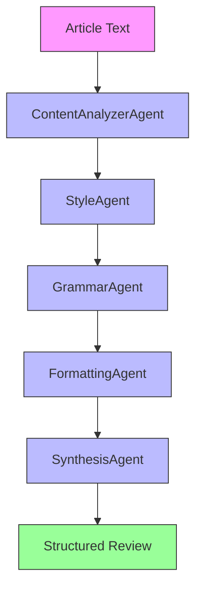

# ArticleReviewer

`ArticleReviewer` reviews article text and returns structured editing suggestions. It is intended for users who want machine-readable feedback rather than an unstructured chat-style critique.

## Agentic Approach

**Multi-agent system for comprehensive article review**

#### Agent Pipeline:


#### Agent Roles:

1. **ContentAnalyzerAgent** - Examines the article's content and structure
   - Role: Content analyst
   - Responsibilities: Analyzes the main ideas, arguments, and logical flow
   - Output: Content analysis with strengths and weaknesses

2. **StyleAgent** - Evaluates writing style and clarity
   - Role: Style editor
   - Responsibilities: Assesses tone, voice, sentence structure, and readability
   - Output: Style feedback with specific suggestions for improvement

3. **GrammarAgent** - Checks grammar, spelling, and mechanics
   - Role: Proofreader
   - Responsibilities: Identifies grammatical errors, spelling mistakes, and punctuation issues
   - Output: List of mechanical errors with corrections

4. **FormattingAgent** - Reviews formatting and presentation
   - Role: Formatting specialist
   - Responsibilities: Checks headings, lists, citations, and visual presentation
   - Output: Formatting recommendations

5. **SynthesisAgent** - Combines feedback into structured suggestions
   - Role: Review synthesizer
   - Responsibilities: Integrates feedback from all agents into categorized suggestions (deletions, modifications, insertions)
   - Output: Structured review with severity labels and overall score

## What It Does

- Reads article text from a file path or directly from the command line.
- Produces structured suggestions in three categories: deletions, modifications, and insertions.
- Assigns severity labels and an overall score.
- Saves the review as JSON and prints a readable console report.

## Why It Matters

Many LLM review tools return free-form prose that is difficult to compare, sort, or post-process. This app uses Pydantic models so downstream scripts can work with a consistent schema.

## What Distinguishes It

- Schema-based output rather than plain-text commentary.
- Support for both direct JSON responses and Pydantic objects from the model client.
- A CLI and a Python API in the same folder.

## Files

- `article_reviewer.py`: review engine and file export helpers.
- `article_reviewer_cli.py`: command-line entrypoint.
- `article_reviewer_models.py`: Pydantic schemas.
- `article_reviewer_prompts.py`: review prompt construction.
- `test_article_reviewer_mock.py`: tests.

## Installation

This app depends on the local `lite` package and `pydantic`. `pytest` is required for the test file.

```bash
pip install pydantic pytest
```

## Usage

```bash
python article_reviewer_cli.py "path/to/article.txt"
python article_reviewer_cli.py "Draft text to review" -m "openai/gpt-4"
python article_reviewer_cli.py "article.md" -o custom_review.json
```

Default model: `ollama/gemma3`

Programmatic use:

```python
from lite.config import ModelConfig
from article_reviewer import ArticleReviewer

reviewer = ArticleReviewer(ModelConfig(model="ollama/gemma3", temperature=0.3))
review = reviewer.review("Example article text")
reviewer.print_review(review)
```

## Output

- Default output location: `outputs/`
- Default filename: derived from the input filename when available, otherwise timestamped

## Testing

```bash
pytest test_article_reviewer_mock.py
```

## Limitations

- The score and suggestions reflect model output; schema validation does not guarantee editorial correctness.
- The tool reviews text quality, not factual accuracy.
- Recommended changes may still require human judgment for domain-specific writing.
