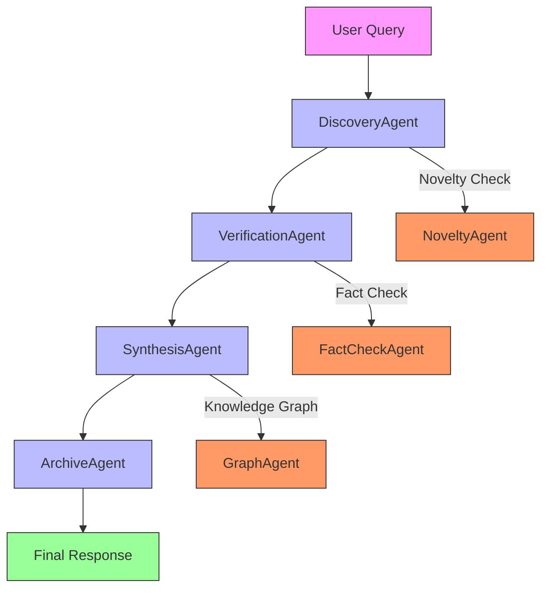
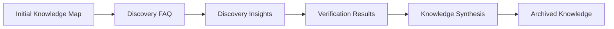

# DeepDeliberation Application

## Overview

DeepDeliberation is an advanced multi-agent system for complex problem analysis and knowledge synthesis. It employs multiple specialized agents working collaboratively to explore, verify, and synthesize information.

## Structure

```
DeepDeliberation/
├── agentic/                  # Multi-agent system
│   ├── __init__.py
│   ├── deep_deliberation.py  # Main orchestration
│   ├── deep_deliberation_agents.py # Specialized agents
│   ├── deep_deliberation_archive.py # Knowledge archive
│   ├── deep_deliberation_cli.py  # CLI interface
│   ├── deep_deliberation_models.py # Data models
│   └── deep_deliberation_prompts.py # Prompt templates
│
├── noagentic/                # Single-agent approach
│   ├── __init__.py
│   ├── deep_deliberation.py  # Simplified analysis
│   ├── deep_deliberation_archive.py # Archive
│   ├── deep_deliberation_cli.py  # CLI interface
│   ├── deep_deliberation_models.py # Data models
│   └── deep_deliberation_prompts.py # Prompt templates
│
└── tests/                    # Test suite
    └── test_deep_deliberation_mock.py
```

## Approaches

### 1. Non-Agentic Approach

**Single-agent knowledge exploration**

- Single `DeepDeliberation` class handles all operations
- Direct analysis without agent collaboration
- Suitable for straightforward knowledge exploration
- Faster execution with simpler architecture

**Use Case:** Quick knowledge probes, simple analysis tasks

### 2. Agentic Approach

**Multi-agent deliberation system**

#### Agent Roles and Pipeline:



**Detailed Agent Roles:**

1. **DiscoveryAgent** - Initial exploration
   - Role: Primary researcher
   - Responsibilities: Initial knowledge probe, topic mapping
   - Output: Initial knowledge map and FAQ

2. **VerificationAgent** - Fact checking and validation
   - Role: Quality assurance
   - Responsibilities: Verify facts, check sources, validate claims
   - Output: Verification results and confidence scores

3. **SynthesisAgent** - Knowledge integration
   - Role: Knowledge integrator
   - Responsibilities: Combine findings, resolve conflicts, create synthesis
   - Output: Integrated knowledge synthesis

4. **ArchiveAgent** - Knowledge preservation
   - Role: Archivist
   - Responsibilities: Store results, maintain knowledge base, enable retrieval
   - Output: Archived knowledge for future reference

5. **NoveltyAgent** - Innovation detection
   - Role: Innovation spotter
   - Responsibilities: Identify novel insights, detect unique patterns
   - Output: Novelty assessment and insights

6. **FactCheckAgent** - Detailed verification
   - Role: Truth validator
   - Responsibilities: Cross-reference facts, check consistency
   - Output: Fact-checking results

7. **GraphAgent** - Knowledge mapping
   - Role: Knowledge cartographer
   - Responsibilities: Create knowledge graphs, map relationships
   - Output: Visual knowledge representations

**Use Case:** Complex problem analysis, comprehensive research, knowledge synthesis

## Data Models

### Knowledge Synthesis Pipeline



### Key Models

1. **InitialKnowledgeMap**: Initial topic exploration
2. **DiscoveryFAQ**: Frequently asked questions about the topic
3. **DiscoveryInsight**: Key insights and findings
4. **VerificationResult**: Fact-checking outcomes
5. **KnowledgeSynthesis**: Integrated knowledge output

## Usage Examples

### Non-Agentic Usage

```python
from DeepDeliberation.noagentic.deep_deliberation import DeepDeliberation
from lite.lite_client import ModelConfig

# Initialize
config = ModelConfig(model="gemma3", temperature=0.3)
deliberation = DeepDeliberation(config)

# Simple probe
result = deliberation.execute_single_probe("quantum computing")
print(f"Initial findings: {result.knowledge_map}")
```

### Agentic Usage

```python
from DeepDeliberation.agentic.deep_deliberation import DeepDeliberation
from lite.lite_client import ModelConfig

# Initialize
config = ModelConfig(model="gemma3", temperature=0.3)
deliberation = DeepDeliberation(config)

# Comprehensive analysis
synthesis = deliberation.run_full_analysis("climate change solutions")
print(f"Key insights: {synthesis.key_insights}")
print(f"Knowledge graph: {synthesis.graph_representation}")
```

## Testing

Run the test suite:

```bash
# From the DeepDeliberation directory
python -m pytest tests/test_deep_deliberation_mock.py
```

## Performance Characteristics

| Metric | Non-Agentic | Agentic |
|--------|-------------|---------|
| Speed | ⚡ Fast | 🐢 Slow |
| Depth | Basic | Comprehensive |
| Agents | 1 | 7 |
| Use Case | Quick probes | Deep analysis |

## Advanced Features

### Knowledge Archiving
- Automatic storage of analysis results
- Retrieval for future reference
- Knowledge base accumulation

### Novelty Detection
- Identifies innovative insights
- Highlights unique patterns
- Flags breakthrough concepts

### Knowledge Graphing
- Visual relationship mapping
- Conceptual connections
- Semantic networking

## When to Use Which Approach

**Use Non-Agentic when:**
- Quick knowledge probes are needed
- Simple topic exploration is sufficient
- Performance is critical

**Use Agentic when:**
- Comprehensive analysis is required
- Multiple perspectives are valuable
- Knowledge synthesis is needed
- Complex problem-solving is the goal

## CLI Usage

```bash
# Non-agentic CLI
python deep_deliberation_cli.py --topic "artificial intelligence"

# Agentic CLI
python deep_deliberation_cli.py --agentic --topic "renewable energy"
```

## Limitations

- Complex analysis can be time-consuming
- Agentic approach has higher computational requirements
- Knowledge synthesis quality depends on base model capabilities
- Large-scale analysis may require significant resources

## Best Practices

1. **Start simple**: Use non-agentic for initial exploration
2. **Scale up**: Move to agentic for comprehensive analysis
3. **Archive results**: Build knowledge base over time
4. **Review outputs**: Validate agentic synthesis results
5. **Monitor performance**: Adjust based on complexity needs
