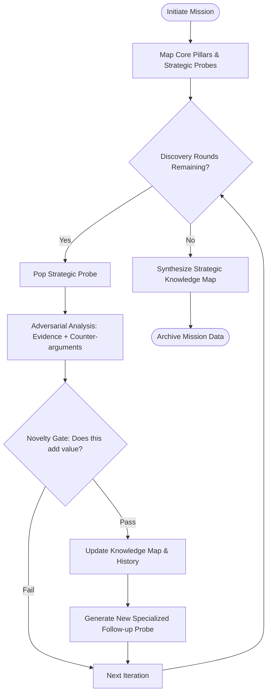

# Knowledge Discovery Engine (KDE)

A high-fidelity, adversarial research tool designed to probe the boundaries of established knowledge, uncover hidden connections, and map research frontiers using Large Language Models (LLMs).

## 🧠 The Philosophy

Most AI tools are designed for **content generation**. The Knowledge Discovery Engine is designed for **Knowledge Synthesis**. It moves beyond surface-level summaries by employing an iterative, "adversarial" loop that specifically hunts for:
*   **Contradictions** in current theories.
*   **Evidence-based** insights with forced counter-arguments.
*   **Non-obvious connections** between seemingly unrelated sub-topics.
*   **Knowledge Gaps** where human understanding currently ends.

## 🚀 The Discovery Mission Workflow

1.  **Pillar Mapping**: Identifies the core established facts of a topic.
2.  **Strategic Probing**: Generates targeted probes (FAQs) designed to test the limits of those pillars.
3.  **Adversarial Iteration**: For each round, the engine:
    *   Synthesizes the **Strategic Context** (history of all previous rounds).
    *   Provides deep analysis backed by **Evidence**.
    *   Forcibly identifies **Counter-arguments**.
    *   **Adversarial Gate (Novelty Check)**: An independent evaluation scores the insight. If it's merely descriptive or repetitive, it is rejected to prevent "information bloat."
4.  **Strategic Synthesis**: Wove all discovered insights into a **Strategic Knowledge Map**, identifying hidden links and the "Bleeding Edge" of the field.

## 🛠 Project Structure

- `deep_deliberation_cli.py`: The Mission Command interface.
- `deep_deliberation.py`: The core engine managing the discovery loop and novelty gating.
- `deep_deliberation_models.py`: Pydantic models (DiscoveryInsight, DiscoveryCheck, KnowledgeSynthesis).
- `deep_deliberation_prompts.py`: Strategic adversarial prompt architecture.
- `outputs/`: JSON archives of every probe, analysis, and piece of evidence discovered.

## 💻 Usage

### CLI Discovery Mission

```bash
python deep_deliberation_cli.py --topic "The Origin of Consciousness" --num-rounds 5 --num-faqs 5
```

**Arguments:**
- `-t`, `--topic`: The field of inquiry (Required).
- `-n`, `--num-rounds`: Number of iterative discovery rounds (Default: `3`).
- `-f`, `--num-faqs`: Number of initial strategic probes to seed the mission (Default: `5`).
- `-m`, `--model`: The LLM to use (Default: `ollama/gemma3`).

## 📊 Logic Flow



## 🛡 Advanced Features
- **Novelty Scoring**: Every insight is scored 1-10 on its density of new information.
- **Evidence-First**: Models are prompted to cite theoretical frameworks or evidence for every discovery.
- **Strategic Context**: The engine maintains a dense, summarized history to ensure follow-up probes move *deeper*, not *sideways*.

---
*Developed for rigorous academic inquiry and deep technical analysis.*
