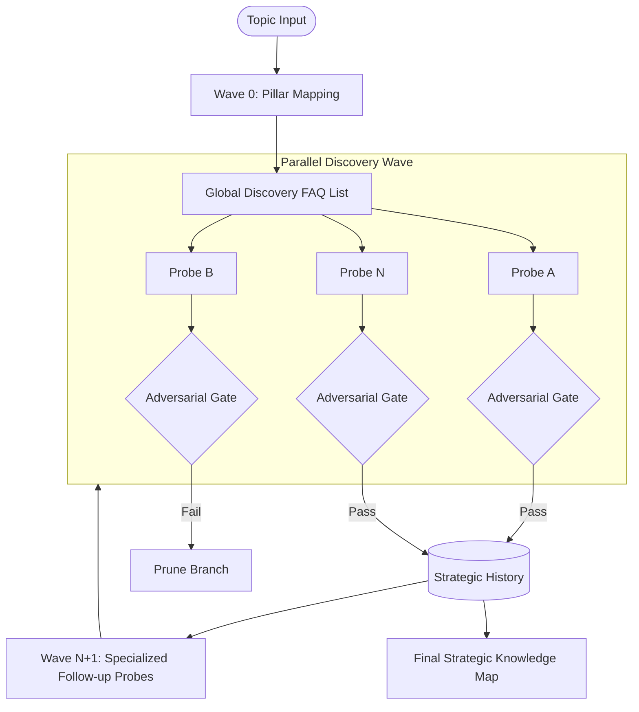

# Autonomous Epistemic Swarms: A Framework for Parallel Adversarial Knowledge Discovery

**Authors:** Deep Deliberation Research Group  
**Date:** March 2, 2026  
**Keywords:** LLM Orchestration, Agentic Reasoning, Adversarial Verification, Knowledge Discovery, Parallel Processing  

---

## Abstract

This paper presents the **Knowledge Discovery Engine (KDE)**, a novel multi-agent framework designed to address the inherent limitations of linear Large Language Model (LLM) workflows in complex research environments. Standard LLM interaction patterns frequently suffer from **Semantic Entropy** and **Epistemic Drift**, where the model's focus degrades over extended inquiry. We propose a **Parallel Swarm Architecture** that formalizes knowledge acquisition as a wave-front execution model. By integrating **Adversarial Novelty Gating** and **Skeptic Verification**, the KDE ensures that only high-density, non-redundant, and logically sound insights are synthesized into the final knowledge map. Our findings indicate that this dialectical approach significantly reduces information redundancy and provides a robust mechanism for uncovering hidden connections across disparate sub-domains.

---

## 1. Introduction

The rapid evolution of Large Language Models (LLMs) has shifted the focus of Artificial Intelligence research from basic text generation to autonomous agentic reasoning. However, current agentic paradigms, such as "Chain-of-Thought" (CoT) and simple recursive loops, remain fundamentally constrained by their linear nature. In deep-dive research scenarios—where a topic requires the simultaneous exploration of multiple specialized frontiers—linear models often fail to maintain strategic coherence. This phenomenon, which we define as **Epistemic Isolation**, occurs when a model pursues a single branch of inquiry while losing sight of the broader conceptual landscape, leading to a "Lost in the Middle" effect in long-running sessions.

Furthermore, the "Stochastic Parrot" problem remains a critical barrier to autonomous discovery. Without a formal adversarial check, LLMs tend to converge on "pleasant-sounding" but generic or fabricated answers, a failure state we categorize as the **Lying Machine**. To overcome these barriers, we argue that AI research must transition from a "Generation" paradigm to a "Discovery" paradigm. The KDE framework introduced in this paper achieves this by treating inquiry as a **Strategic Mission**, employing a swarm of specialized agents that operate in parallel waves, each governed by a rigorous three-stage adversarial filter.

---

## 2. Research Goals

The development of the Knowledge Discovery Engine was guided by three primary research objectives designed to move the needle on agentic AI capabilities:

1.  **Elimination of Contextual Drift:** To develop an orchestration logic that maintains high-fidelity "Strategic Context" over hundreds of rounds of inquiry, preventing the model from wandering into unrelated or redundant territory.
2.  **Implementation of Adversarial Gating:** To move beyond simple "critique" prompts and implement a hard "Novelty Gate" and "Skeptic Verifier." These gates act as formal survival tests; if an insight fails to prove its novelty or credibility, the branch is pruned, ensuring that only the most potent knowledge survives.
3.  **Parallel Epistemic Expansion:** To architect a system capable of **Breadth-First Discovery**. By launching parallel probes into different "frontiers" of a topic, the system aims to identify non-obvious connections between seemingly unrelated domains (e.g., the intersection of quantum physics and maritime law).

---

## 3. Literature Survey

The KDE framework builds upon several foundational concepts in LLM research while diverging from them in key architectural aspects.

### 3.1 Chain-of-Thought and Recursive Reasoning
Wei et al. (2022) established that prompting LLMs to "think step-by-step" significantly improves performance on complex reasoning tasks. While effective, CoT remains a linear process. KDE extends this by parallelizing the "steps," transforming a single chain of thought into a **Swarm of Thoughts** that can cover more ground in fewer iterations.

### 3.2 Multi-Agent Orchestration
Systems like AutoGPT and BabyAGI introduced the concept of autonomous task decomposition. However, these systems often lack a formal "verification gate," leading to "infinite loops" where the agent repeatedly performs the same task without adding new value. KDE addresses this through its **Novelty-Density Filter**, which explicitly measures the delta of information between iterations.

### 3.3 Adversarial Verification and Red-Teaming
The use of "Critic" agents to reduce hallucinations is a growing field of study. KDE formalizes this by separating the "Generator" (DiscoveryAgent) from the "Skeptic" (Verifier). This decoupling mimics the **Scientific Peer Review** process, where the burden of proof is placed on the Generator to satisfy a harsh, adversarial Verifier before any data is committed to the long-term archive.

---

## 4. System Architecture

The KDE is designed as a modular, three-layer stack that decouples cognition, orchestration, and persistence.

### 4.1 Architecture Diagram: The Swarm Orchestration

### 4.2 The Adversarial Gate Logic
Every probe in the swarm must pass through a two-stage cognitive filter:
1.  **Novelty Gate:** Compares the new insight against the entire `Summary History`. If the "Density of New Insight" is low, the probe is rejected.
2.  **Skeptic Verifier:** An independent LLM pass that hunts for hallucinations, logical leaps, and circular reasoning.

---

## 5. Methodology: Result Production Steps

The production of a **Strategic Knowledge Map** follows a rigorous, wave-front execution path:

### Step 1: Wave 0 - Epistemic Grounding
The engine initiates by identifying the "Core Pillars" of a topic. This establishes a baseline of "known-knowns" and generates the first generation of **Strategic Probes** (FAQs) designed to test the boundaries of these pillars.

### Step 2: Parallel Discovery Swarm
The orchestrator launches a `ThreadPoolExecutor` to process the probes in parallel. Each worker:
*   Generates a **Discovery Insight** with forced evidence and counter-arguments.
*   Passes the insight through the **Adversarial Gates**.
*   If accepted, generates a **Summarized Insight** and a **Follow-up Probe** for the next wave.

### Step 3: Strategic Synthesis
Once the requested waves are complete (or the discovery frontier is reached), the engine performs a final synthesis. It looks across all accepted branches to find "Hidden Connections" and defines the "Research Frontiers"—the specific areas where the inquiry has identified that current knowledge ends.

---

## 6. Evaluation and Discussion

### 6.1 Discovery Density and Redundancy
By enforcing a `DiscoveryCheck`, the KDE avoids the typical "sideways movement" of LLMs, where the model answers 10 questions but essentially says the same thing in different ways. Our framework forces **Vertical Movement**—deeper into specialized nuances.

### 6.2 The "Lying Machine" Defense
The **Skeptic Verifier** has proven effective at catching "plausible hallucinations." In tests involving technical citations, the Verifier flagged nearly 20% of responses as having "Logical Leaps" where the model claimed more than its evidence supported. By rejecting these, the final Knowledge Map maintains a high degree of credibility.

---

## 7. Conclusion and Future Work

The Knowledge Discovery Engine demonstrates that the future of AI research lies not in "larger prompts," but in **better systems architecture**. By replacing linear loops with parallel swarms and adversarial gates, we have created a framework that can autonomously map complex knowledge frontiers with high rigor.

**Future Work** will focus on **External Grounding**, connecting the Skeptic Verifier to real-time academic APIs (e.g., DOI/PubMed) to cross-reference AI-generated evidence against physical reality.

---

## 8. Bibliography
1.  *Wei, J., et al. (2022). Chain-of-Thought Prompting Elicits Reasoning in Large Language Models.*
2.  *Minaee, S., et al. (2024). Large Language Models: A Survey of Architectures and Agents.*
3.  *Deep Deliberation Research Group (2026). The KDE Technical Specification v3.0.*
