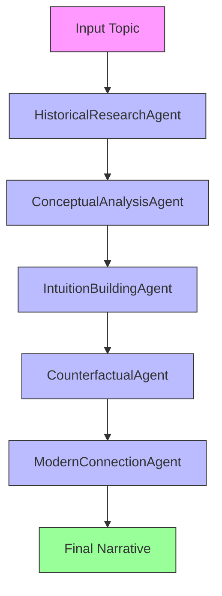

# DeepIntuition

`DeepIntuition` generates long-form explanatory narratives about mathematical or technical ideas. Its emphasis is historical framing and intuition-building rather than formal proof.

## Agentic Approach

**Multi-agent system for comprehensive explanatory narratives**

#### Agent Pipeline:


#### Agent Roles:

1. **HistoricalResearchAgent** - Investigates the historical background of the idea
   - Role: Historian of mathematics/technical ideas
   - Responsibilities: Researches the origin, development, and historical context of the concept
   - Output: Historical background including key figures, timeline, and initial motivations

2. **ConceptualAnalysisAgent** - Breaks down the core ideas and principles
   - Role: Conceptual analyst
   - Responsibilities: Analyzes the fundamental principles, definitions, and logical structure of the idea
   - Output: Clear explanation of what the concept means and how it works

3. **IntuitionBuildingAgent** - Develops intuitive explanations and mental models
   - Role: Intuition specialist
   - Responsibilities: Creates analogies, visualizations, and intuitive approaches to grasp the concept
   - Output: Intuitive explanations that make the idea accessible

4. **CounterfactualAgent** - Explores alternative scenarios and "what if" questions
   - Role: Counterfactual thinker
   - Responsibilities: Examines how things might have been different if key assumptions or discoveries changed
   - Output: Counterfactual scenarios that highlight the significance of actual developments

5. **ModernConnectionAgent** - Links the idea to contemporary applications and significance
   - Role: Contemporary analyst
   - Responsibilities: Connects the historical idea to modern applications, current research, and ongoing relevance
   - Output: Explanation of how the idea matters today and where it's headed

## What It Does

- Accepts a topic such as a theorem, theory, or foundational idea.
- Produces a structured narrative with sections such as historical struggle, "aha" moment, counterfactual framing, and modern resonance.
- Saves the result to `outputs/story_<topic>.json`.

## Why It Matters

Many technical explanations focus on final results and omit the reasoning path that made the result intelligible. This app is useful when the learning goal is conceptual understanding rather than direct problem solving.

## What Distinguishes It

- Narrative structure rather than terse summary.
- Explicit historical and counterfactual sections.
- Structured JSON output despite the long-form format.

## Files

- `deep_intuition.py`: core generator.
- `deep_intuition_cli.py`: CLI entrypoint.
- `deep_intuition_models.py`: response schema.
- `deep_intuition_prompts.py`: prompt logic.
- `deep_intuition_archive.py`: archive support.

## Usage

```bash
python deep_intuition_cli.py --topic "Galois Theory"
python deep_intuition_cli.py --topic "Lambda Calculus" --model "openai/gpt-4"
```

Default model: `$DEFAULT_LLM_MODEL` or `ollama/gemma3`

## Testing

This folder contains mock tests and a live test file.

## Limitations

- Historical narratives produced by an LLM may compress, omit, or misstate details.
- The app is not designed to provide formal proofs or source citations.
- Users should verify historical claims when accuracy is important.
