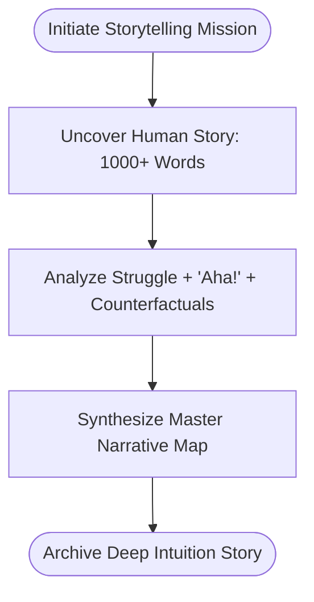

# Deep Intuition: The Story of Fundamental Ideas

A narrative-driven engine designed to bridge the gap between abstract academic concepts and human intuition. Deep Intuition provides the "story" behind fundamental ideas in Computer Science and Mathematics—explaining not just *what* a theorem is, but the historical context, the intellectual struggle, and the "aha!" moments that led to its discovery.

## 🧠 The Philosophy

Most educational tools treat fundamental discoveries as if they were plucked from thin air by "superhuman" geniuses. Deep Intuition shatters this myth. We believe that true understanding comes from seeing the **systematic human process** behind the breakthrough:

*   **The Systematic Exploration**: How thinkers methodically poked at the boundaries of what was known.
*   **The Archive of Failures**: The dead ends and incorrect hypotheses that paved the way for the eventual "Aha!" moment.
*   **Demystifying Genius**: Showing that these discoveries are human triumphs born of persistence, not just innate "super intelligence."
*   **The Intellectual Lineage**: How one person's "failed" attempt became another's foundation.
*   **Counterfactual Reality**: What things would look like today if this specific human struggle had never succeeded.

## 🚀 The Intuition Mission Workflow

1.  **Story Discovery**: The engine generates a comprehensive, human-centric narrative of the fundamental discovery.
2.  **The Human Journey**: Uncovers the systematic exploration, failed attempts, and historical struggles that preceded the "Aha!" moment.
3.  **The "Aha!" Moment**: Provides a clear, intuitive analogy that makes the concept click for a non-expert.
4.  **Counterfactual Reality**: Explores how our world would be fundamentally stalled or different if this human triumph had never occurred.
5.  **Master Synthesis**: Delivers the final story as a "Master Narrative Map," connecting the historical struggle to modern resonance.

## 🛠 Project Structure

- `deep_intuition_cli.py`: The Storyteller interface.
- `deep_intuition.py`: The core storytelling engine.
- `deep_intuition_models.py`: Pydantic models (DeepIntuitionStory).
- `deep_intuition_prompts.py`: Comprehensive storytelling prompt architecture.
- `outputs/`: JSON archives of every uncovered human story.

## 💻 Usage

### Start an Intuition Story

```bash
python deep_intuition_cli.py --topic "Galois Theory"
```

**Arguments:**
- `-t`, `--topic`: The fundamental idea to explore (Required).
- `-m`, `--model`: The LLM to use (Default: `ollama/gemma3`).

## 📊 Logic Flow



## 🛡 Features
- **Narrative Depth**: Every story is a deep, rich narrative of at least 1000 words.
- **Human-First Discovery**: Explicitly demystifies 'genius' by showing the systematic struggle and failed attempts.
- **Counterfactual Exploration**: Provides a detailed 'what-if' scenario for every fundamental discovery.
- **Historical Anchors**: Strictly anchors the story in real historical events and intellectual lineages.

---
*Bridging the gap between the abstract and the intuitive.*
