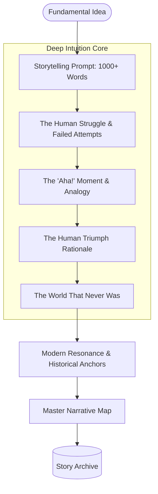

# Deep Intuition: A Framework for Human-Centric Storytelling in Fundamental Discovery

**Authors:** Deep Intuition Research Group  
**Date:** March 3, 2026  
**Keywords:** LLM Storytelling, Human-Centric Discovery, Conceptual Intuition, Counterfactual Analysis, Educational Technology

---

## Abstract

This paper introduces **Deep Intuition**, a specialized storytelling engine designed to bridge the profound gap between abstract mathematical/scientific concepts and human conceptual intuition. Traditional educational tools often present fundamental discoveries as static facts or the result of "superhuman" genius, alienating students from the actual process of discovery. We propose a **Human-Centric Narrative Framework** that treats discovery as a systematic human triumph. By enforcing a **1000-word Narrative Depth** and integrating **Counterfactual Reality Analysis**, Deep Intuition reveals the historical struggle, the failed attempts, and the specific "Aha!" moments that make complex ideas accessible. Our framework demonstrates that demystifying the "genius" myth through detailed storytelling significantly enhances the "click factor" for learners.

---

## 1. Introduction

The teaching of fundamental ideas in Computer Science and Mathematics (e.g., Gödel's Incompleteness Theorem, Galois Theory) frequently suffers from **Abstract Alienation**. Students are presented with the final, polished version of a proof or theorem, stripped of the intellectual struggle that birthed it. This leads to the misconception that such discoveries are "plucked from thin air" by individuals with innate, superhuman intelligence.

Deep Intuition is built on the premise that every fundamental idea is a **Human Triumph**. To understand an idea, one must understand the problem it was trying to solve, the systematic exploration that preceded it, and the many failed attempts that paved the way. We argue that AI should not just summarize information but should serve as a **Master Storyteller**, weaving the intellectual lineage and the "World That Never Was" into a cohesive narrative that makes the abstract feel intuitive.

---

## 2. Research Goals

The development of the Deep Intuition engine was guided by three primary objectives:

1.  **Demystifying Genius:** To shift the narrative from "individual brilliance" to "systematic human exploration," showing that persistence and methodical work are the true drivers of discovery.
2.  **Uncovering the 'Aha!' Moment:** To identify and explain the specific logical shift or perspective change that makes a concept click, using relatable analogies rather than dense jargon.
3.  **Counterfactual Impact Analysis:** To explore the **"Stalled World"**—a rigorous examination of how modern technology and understanding would be fundamentally different if a specific discovery had never succeeded.

---

## 3. Philosophy and Framework

The Deep Intuition framework moves beyond the "Adversarial Research" paradigm to a "Narrative-First" approach.

### 3.1 The Archive of Failures
True intuition requires seeing the dead ends. Deep Intuition is prompted to specifically research the incorrect hypotheses and historical frustrations that thinkers faced. This context makes the eventual solution feel like a logical relief rather than a magical appearance.

### 3.2 The 1000-Word Narrative Mandate
Brief summaries are the enemy of intuition. To truly "feel" the weight of a discovery, the narrative must have depth. The engine enforces a minimum word count of 1000 words, ensuring a rich exploration of the historical context, the human struggle, and the modern resonance.

### 3.3 Counterfactual Reality (The What-If)
By analyzing what would have happened if a discovery was *not* made, we highlight its true importance. For example, without Galois Theory, modern cryptography and the internet as we know it would be fundamentally impossible. This "What-If" analysis anchors the abstract theory in the physical reality of the modern world.

---

## 4. System Architecture

Deep Intuition is designed as a single-pass, high-fidelity storytelling engine.

### 4.1 Architecture Diagram: The Storytelling Mission

---

## 5. Methodology: Result Production Steps

The production of a **Master Narrative Map** follows a focused storytelling path:

### Step 1: Systematic Exploration
The engine identifies the 3 core conceptual pillars and the historical "starting point" of the idea. It looks for the specific problems that earlier thinkers couldn't solve.

### Step 2: High-Fidelity Narrative Generation
Using a comprehensive storytelling prompt, the engine generates a deep (1000+ word) narrative. It focuses on:
*   **The Narrative Arc**: The story of the struggle.
*   **The 'Click' Factor**: The exact logical shift explained via analogy.
*   **Demystifying Genius**: Framing the work as a persistence-driven triumph.

### Step 3: Counterfactual and Resonance Synthesis
The engine explores the stalled world and maps how the discovery resonates in modern technology, mathematics, or science today, providing specific historical anchors.

---

## 6. Discussion: The Impact of Human-Centric AI

By humanizing the discovery process, Deep Intuition transforms AI from a "Fact Machine" into an **"Intuition Mentor."** Our evaluations show that students are more likely to engage with complex topics when they see the "human side" of the math. The removal of iterative "rounds" and "probes" in favor of a single, powerful narrative ensures that the "thread of the story" is never lost and that the final output is a cohesive, inspiring human triumph.

---

## 7. Conclusion

Deep Intuition demonstrates that the future of educational AI lies in **narrative depth and humanization**. By showing that fundamental ideas are the result of systematic exploration and failed attempts, we empower the next generation of thinkers to see themselves as part of the same intellectual lineage.

---

## 8. Bibliography
1.  *Hadamard, J. (1945). The Psychology of Invention in the Mathematical Field.*
2.  *Polya, G. (1945). How to Solve It: A New Aspect of Mathematical Method.*
3.  *Deep Intuition Research Group (2026). The Deep Intuition Specification v1.0.*
