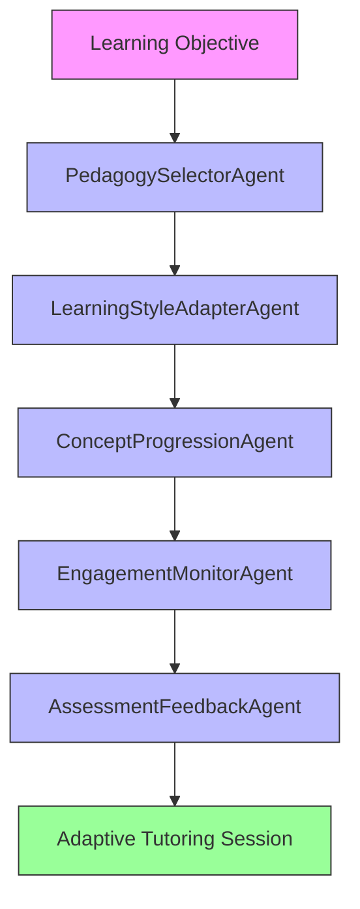

# DigiTeacher

`DigiTeacher` groups three tutorial-style CLI applications that use different pedagogical strategies for interactive learning.

## Agentic Approach

**Multi-agent system for adaptive tutoring strategies**

#### Agent Pipeline:

#### Agent Roles:

1. **PedagogySelectorAgent** - Chooses the appropriate tutoring strategy based on learning objectives
   - Role: Instructional designer
   - Responsibilities: Analyzes the learning goal to determine whether Socratic, Hadamard, or Feynman approach is most suitable
   - Output: Selected tutoring strategy with rationale

2. **LearningStyleAdapterAgent** - Adapts the tutoring approach to individual learner preferences
   - Role: Learning specialist
   - Responsibilities: Adjusts questioning pace, complexity, and style based on user responses and preferences
   - Output: Personalized tutoring parameters

3. **ConceptProgressionAgent** - Manages the logical flow of concepts during tutoring
   - Role: Curriculum designer
   - Responsibilities: Ensures concepts are introduced in an optimal sequence for understanding
   - Output: Concept progression map

4. **EngagementMonitorAgent** - Tracks user engagement and adjusts tutoring style accordingly
   - Role: Engagement specialist
   - Responsibilities: Monitors for signs of confusion, frustration, or disengagement and modifies approach
   - Output: Engagement-adjusted tutoring parameters

5. **AssessmentFeedbackAgent** - Provides formative feedback throughout the tutoring session
   - Role: Formative assessor
   - Responsibilities: Offers constructive feedback on user reasoning and understanding without formal grading
   - Output: Ongoing feedback and suggestions for improvement

## Included Tutors

- `SocratesTutor`: question-driven exploration using a Socratic dialogue pattern.
- `HadamardTutor`: staged discovery around preparation, incubation, illumination, and verification.
- `FeynmanTutor`: simplification-oriented tutoring based on iterative explanation and refinement.

## Why It Matters

These tools address a different use case from the reference-style apps in this repository. They are designed for guided learning conversations rather than one-shot summaries.

## What Distinguishes It

- Each tutor uses a different instructional method.
- All three are interactive CLI workflows rather than static generators.
- The folder organizes related educational interfaces under a shared theme.

## Subfolders

- `SocratesTutor/`
- `HadamardTutor/`
- `FeynmanTutor/`

See the README in each subfolder for command details.

## Limitations

- These tutors depend on the model maintaining the intended conversational style.
- They do not assess correctness independently.
- They are best suited to guided exploration, not grading or formal instruction.
