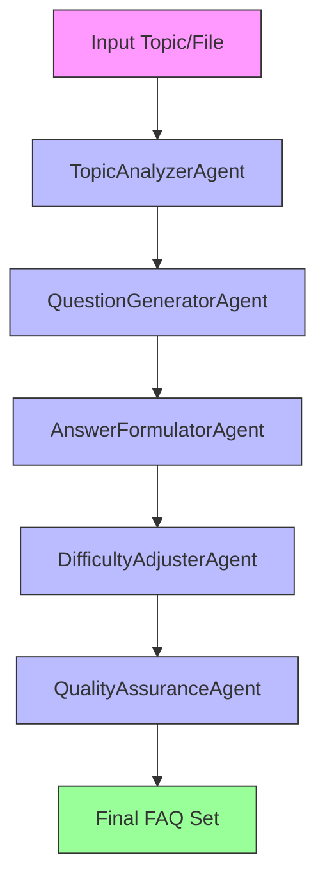

# FAQGenerator

`FAQGenerator` produces structured question-answer pairs from either a short topic string or a local text file. It is intended for users who need reusable FAQ data rather than an ad hoc explanation.

## Agentic Approach

**Multi-agent system for comprehensive FAQ generation**

#### Agent Pipeline:


#### Agent Roles:

1. **TopicAnalyzerAgent** - Analyzes the input topic or source text
   - Role: Content analyst
   - Responsibilities: Examines the input to identify key concepts, themes, and areas that typically generate questions
   - Output: Topic analysis with key points and potential question areas

2. **QuestionGeneratorAgent** - Creates relevant questions based on the analysis
   - Role: Question specialist
   - Responsibilities: Generates clear, concise questions at the specified difficulty level
   - Output: List of questions covering different aspects of the topic

3. **AnswerFormulatorAgent** - Develops accurate answers to the generated questions
   - Role: Answer specialist
   - Responsibilities: Researches and formulates correct, informative answers to each question
   - Output: Detailed answers with explanations and examples

4. **DifficultyAdjusterAgent** - Adjusts complexity based on specified difficulty level
   - Role: Difficulty calibrator
   - Responsibilities: Modifies question and answer complexity to match the requested difficulty (simple, medium, hard, research)
   - Output: Difficulty-appropriate questions and answers

5. **QualityAssuranceAgent** - Reviews and refines the generated FAQs
   - Role: Quality checker
   - Responsibilities: Ensures accuracy, relevance, and proper formatting of the FAQ pairs
   - Output: Final polished FAQ set in JSON format

## What It Does

- Accepts a topic or local file as input.
- Generates a configurable number of FAQs.
- Supports four difficulty levels: `simple`, `medium`, `hard`, and `research`.
- Saves the result as JSON.

## Why It Matters

FAQ generation is often used for documentation, study materials, and content seeding. A structured output format is useful when the result needs to be reviewed, filtered, or imported into another system.

## What Distinguishes It

- Can treat the same CLI argument as either topic text or a file path.
- Uses Pydantic schemas for validation.
- Includes file-size checks and filename sanitization in the generation pipeline.

## Files

- `faq_generator.py`: generation logic and export helpers.
- `faq_generator_cli.py`: command-line interface.
- `faq_generator_models.py`: schemas and constants.
- `faq_generator_prompts.py`: prompt construction.
- `test_faq_generator_mock.py`: tests.

## Installation

This app depends on the local `lite` package and its model providers. Install any required Python packages in your environment before running it.

## Usage

```bash
python faq_generator_cli.py --input "Distributed Systems" --num-faqs 10 --difficulty research
python faq_generator_cli.py --input assets/machine_learning.txt --num-faqs 5 --difficulty medium
python faq_generator_cli.py --input documentation.md --difficulty simple --output ./results
```

Defaults:

- `--num-faqs`: `5`
- `--difficulty`: `medium`
- `--model`: `ollama/gemma3`
- `--temperature`: `0.3`
- `--output`: current directory

## Testing

```bash
python -m unittest test_faq_generator_mock.py
```

## Limitations

- FAQ quality depends on the underlying model and the quality of the source text.
- The `research` difficulty label affects prompting, not independent scholarly verification.
- Generated answers should be reviewed before publication.
