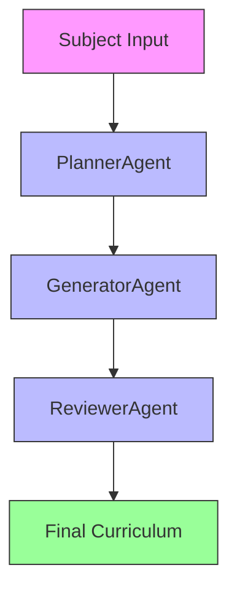

# GenerateBook

`GenerateBook` creates chapter plans for a subject across one or more education levels. The output is a curriculum scaffold, not a finished textbook.

## What It Does

- Accepts a subject, optional education level, and chapter count.
- Generates chapter structures for one level or for all supported levels.
- Runs a 3-agent workflow: planner, generator, reviewer.
- Saves the reviewed result through the generator's export path.

## Agentic Approach

**Multi-agent system for curriculum planning**

#### Agent Pipeline:


#### Agent Roles:

1. **PlannerAgent** - Creates the overall chapter structure and sequencing
   - Role: Curriculum designer
   - Responsibilities: Determines the number of chapters, their logical sequence, and high-level topics based on the subject and education level
   - Output: Chapter outline with titles and brief descriptions

2. **GeneratorAgent** - Develops detailed content for each chapter
   - Role: Content specialist
   - Responsibilities: Expands each chapter outline into detailed sections, learning objectives, and key concepts to cover
   - Output: Detailed chapter plans with subtopics and teaching points

3. **ReviewerAgent** - Evaluates and improves the generated curriculum
   - Role: Quality assurance specialist
   - Responsibilities: Reviews the generated chapters for coherence, difficulty progression, and educational soundness
   - Output: Refined chapter plan with improvements and validation notes

## Why It Matters

Curriculum planning often starts with a level-appropriate sequence of topics rather than full prose. This app is useful when the immediate goal is scope, progression, and chapter organization.

## What Distinguishes It

- Works across several education levels from a single CLI.
- Uses typed input and output models rather than raw text only.
- Separates planning, drafting, and review into distinct model calls.
- Produces a reusable structure that can be refined later.

## Files

- `bookchapters_cli.py`: CLI entrypoint.
- `bookchapters_generator.py`: 3-agent orchestration and save logic.
- `bookchapters_models.py`: typed planner, draft, review, and final output models.
- `bookchapters_prompts.py`: prompts for planner, generator, and reviewer agents.
- `test_bookchapters_mock.py`: tests.

## Usage

```bash
python bookchapters_cli.py "Quantum Physics"
python bookchapters_cli.py "Climate Change" --level "High School" --chapters 8
python bookchapters_cli.py "AI" --level "Post-Graduate" --model "openai/gpt-4"
```

Defaults:

- all supported levels when `--level` is omitted
- `--chapters`: `12`
- `--model`: `ollama/gemma3`

## Testing

```bash
python -m unittest test_bookchapters_mock.py
```

## Limitations

- The generated curriculum reflects model judgment rather than an accredited syllabus.
- Difficulty progression and sequencing should be reviewed by a subject-matter expert.
- The tool generates chapter plans, not complete instructional content.
- The 3-agent flow improves consistency, but it also increases latency and token usage because it performs three model calls per request.
