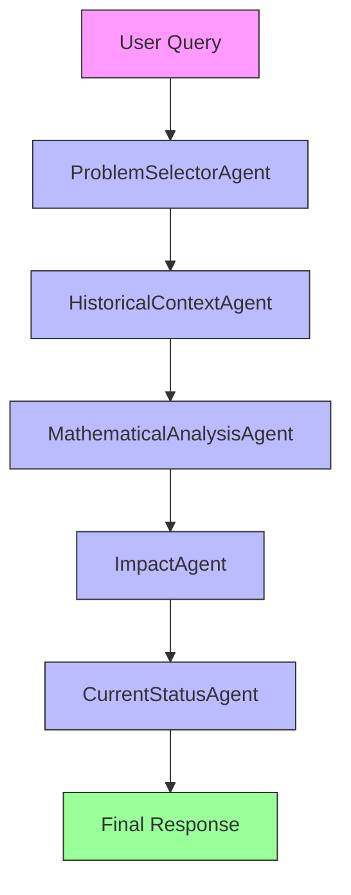

# HilbertProblems

`HilbertProblems` provides a CLI for generating structured descriptions of Hilbert's 23 problems. It is intended as a study and reference aid.

## Agentic Approach

**Multi-agent system for comprehensive Hilbert problem analysis**

#### Agent Pipeline:


#### Agent Roles:

1. **ProblemSelectorAgent** - Chooses which Hilbert problem to analyze
   - Role: Initial problem selector
   - Responsibilities: Parses user input to determine which of the 23 problems to focus on
   - Output: Selected problem number and title

2. **HistoricalContextAgent** - Provides background on the problem's origin
   - Role: Historical researcher
   - Responsibilities: Researches when and why David Hilbert proposed this problem
   - Output: Historical context and motivation

3. **MathematicalAnalysisAgent** - Breaks down the problem's mathematical content
   - Role: Mathematical analyst
   - Responsibilities: Analyzes the core mathematical question or conjecture
   - Output: Detailed explanation of the problem's mathematical content

4. **ImpactAgent** - Assesses the problem's influence on mathematics
   - Role: Impact evaluator
   - Responsibilities: Examines how the problem has influenced mathematical research
   - Output: Analysis of the problem's impact and solutions

5. **CurrentStatusAgent** - Reports on the problem's current resolution status
   - Role: Status reporter
   - Responsibilities: Determines whether the problem has been solved, partially solved, or remains open
   - Output: Current status and any known solutions or partial results

## What It Does

- Shows a summary of the 23 problems or generates a detailed view for one selected problem.
- Uses typed models for the generated result.
- Supports model selection from the CLI.

## Why It Matters

Hilbert's problems remain a useful way to organize major themes in modern mathematics. This app provides a consistent format for that material.

## What Distinguishes It

- Focused on a fixed historical set of 23 problems.
- Supports both whole-set summary and single-problem detail.
- Uses structured models rather than loose narrative output.

## Files

- `hilbert_problems.py`: core guide logic.
- `hilbert_problems_cli.py`: CLI interface.
- `hilbert_problems_models.py`: schemas.
- `hilbert_problems_prompts.py`: prompt builder.
- `test_hilbert_problems_mock.py`, `test_hilbert_problems_cli_mock.py`: tests.

## Usage

```bash
python hilbert_problems_cli.py
python hilbert_problems_cli.py --problem 8
python hilbert_problems_cli.py --problem 1 --model ollama/mistral
```

Default model: `ollama/gemma3`

## Testing

```bash
pytest test_hilbert_problems_mock.py test_hilbert_problems_cli_mock.py
```

## Limitations

- The descriptions are generated by an LLM and may omit technical nuance.
- The app is a secondary reference, not a substitute for mathematical sources.
- Problem status and historical commentary should be checked against primary references when precision matters.
