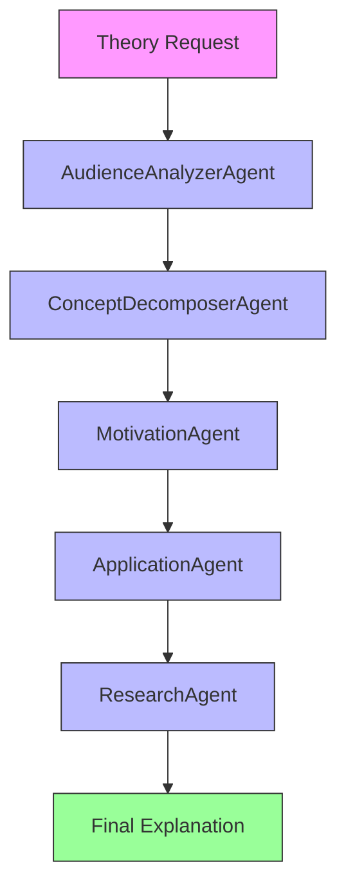

# MathTheories

`MathTheories` generates level-specific explanations for mathematical theories and saves them as Markdown.

## Agentic Approach

**Multi-agent system for adaptive mathematical explanations**

#### Agent Pipeline:


#### Agent Roles:

1. **AudienceAnalyzerAgent** - Determines the appropriate explanation level for the target audience
   - Role: Audience specialist
   - Responsibilities: Analyzes the requested level (general, undergrad, grad, phd, researcher) to determine depth and complexity
   - Output: Audience profile with recommended explanation depth and terminology level

2. **ConceptDecomposerAgent** - Breaks down the theory into fundamental components
   - Role: Theory analyst
   - Responsibilities: Identifies key concepts, definitions, and core principles of the mathematical theory
   - Output: Structured breakdown of the theory's essential elements

3. **MotivationAgent** - Explains why the theory matters and its historical context
   - Role: Mathematical historian
   - Responsibilities: Provides background on the problem or phenomenon that led to the theory's development
   - Output: Historical motivation and significance of the theory

4. **ApplicationAgent** - Identifies practical applications and connections to other fields
   - Role: Applied mathematics specialist
   - Responsibilities: Finds real-world applications, connections to other mathematical areas, and interdisciplinary uses
   - Output: List of applications and related fields where the theory is useful

5. **ResearchAgent** - Covers current developments and open questions
   - Role: Research mathematician
   - Responsibilities: Summarizes recent advances, open problems, and active research areas related to the theory
   - Output: Overview of current state and future directions in the field

## What It Does

- Accepts a theory name and an audience level.
- Generates an explanation covering introduction, key concepts, motivation, applications, and current research.
- Writes the result to `outputs/theories/`.

## Why It Matters

The same topic often needs different explanations for different audiences. This app provides one interface for that adaptation.

## What Distinguishes It

- Audience-aware generation from `general` through `researcher`.
- Markdown export suitable for notes or documentation.
- Uses typed models for the generated structure.

## Files

- `math_theory_cli.py`: CLI interface.
- `math_theory_element.py`: theory explanation logic.
- `math_theory_models.py`: schemas and enums.
- `assets/theories.txt`: list of supported theories.
- `tests/`: test files.

## Usage

```bash
python math_theory_cli.py --theory "Group theory"
python math_theory_cli.py --theory "Knot theory" --level general
python math_theory_cli.py --theory "Chaos theory" --level phd
```

Defaults:

- `--theory`: `Group theory`
- `--level`: `undergrad`
- `--model`: `ollama/gemma3:12b`
- `--output-dir`: `outputs/theories`

## Testing

This folder contains test files under `tests/`.

## Limitations

- Audience adaptation is prompt-based and may still be uneven across topics.
- The generated text is explanatory rather than source-cited.
- Formal accuracy should be reviewed for advanced mathematical use.
