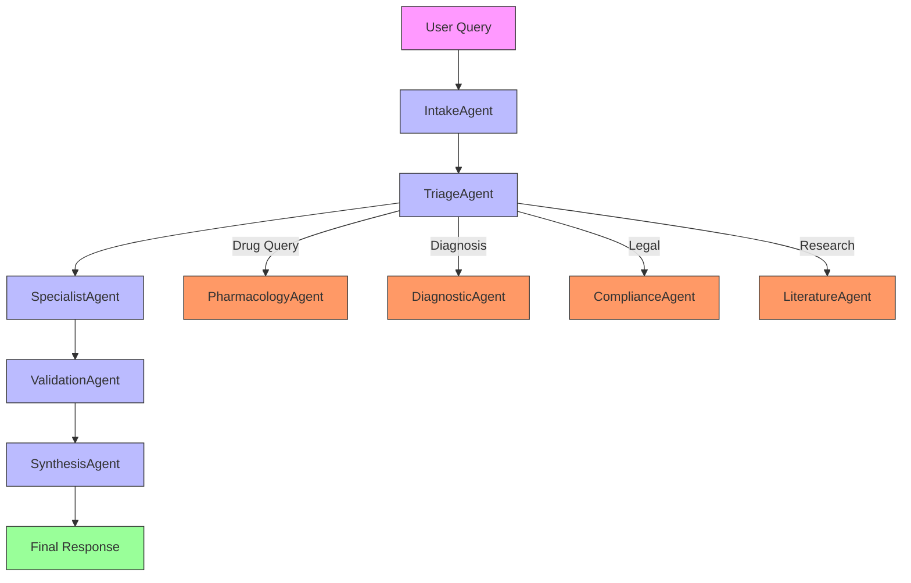
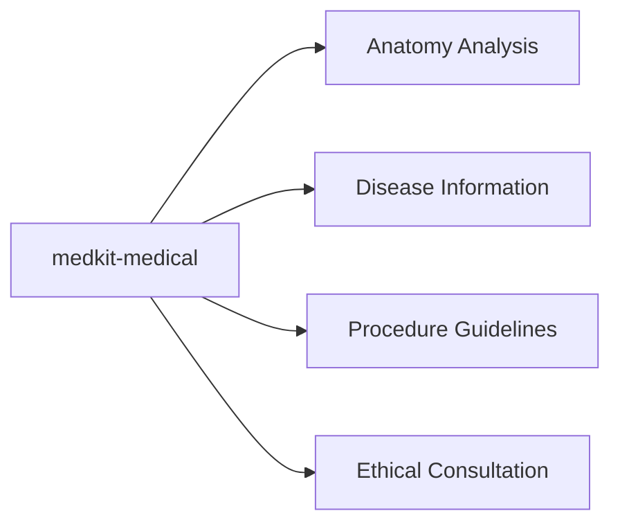
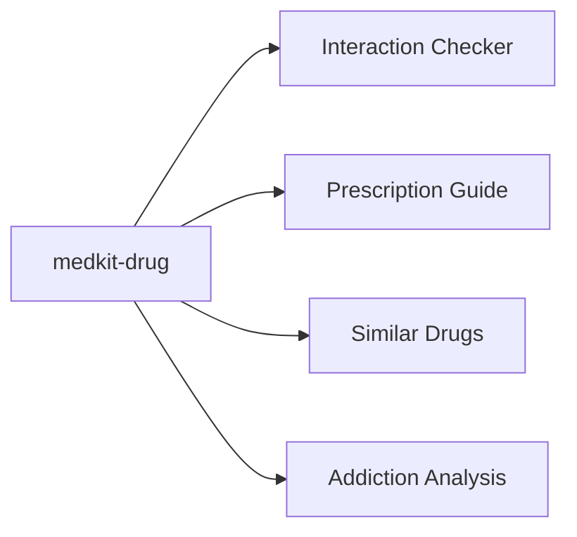
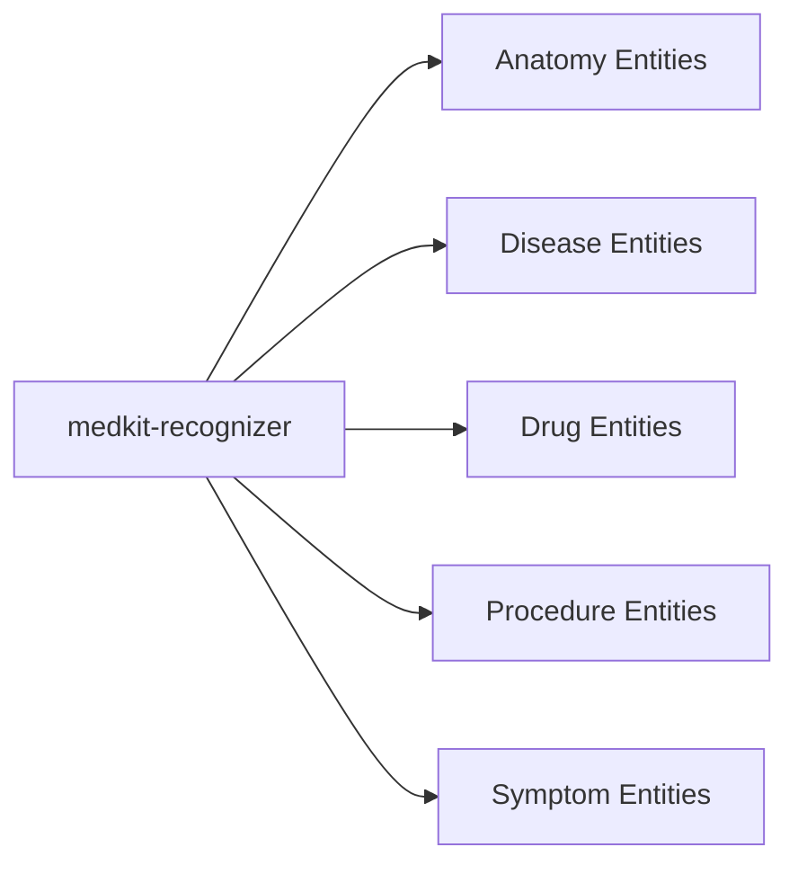

# MedKit - Comprehensive Medical AI Toolkit

## 🏥 Overview

**MedKit** is an advanced medical AI toolkit featuring both **agentic** and **non-agentic** approaches for medical information processing. It provides a comprehensive suite of tools for medical research, education, and clinical support workflows.

## 📚 Structure

```
MedKit/
├── medkit_article/          # Article analysis tools
├── medkit_diagnose/         # Diagnostic support
├── medkit_graph/            # Medical concept graphs
├── medkit_privacy/          # Privacy utilities
├── medkit_legal/            # Legal/ethical tools
├── medkit_exam/             # Physical exam workflows
├── medkit_agent/            # Multi-agent orchestration
├── medkit_sane/             # SANE interview tools
├── medkit_dictionary/       # Medical dictionary
├── medkit_codes/            # ICD-11 coding
├── medkit_mental/           # Mental health tools
├── medkit_media/            # Medical media workflows
├── drug/                    # Pharmacology tools
├── recognizers/             # Entity recognition
├── medical/                # General medical tools
└── utils/                   # Shared utilities
```

## 🔬 Approaches

### 1. Non-Agentic Approach

**Direct medical information processing**

- Single-class handling per tool
- Direct API calls for specific tasks
- Faster execution, lower overhead
- Ideal for focused, straightforward tasks

**Example Tools:**
- `medkit-medical anatomy "femur"` - Direct anatomy lookup
- `medkit-drug interact "Lisinopril" "Ibuprofen"` - Simple interaction check
- `medkit-recognizer disease "acute bronchitis"` - Entity recognition

### 2. Agentic Approach

**Multi-agent medical analysis system**

#### Core Agent Pipeline:



#### Specialist Agent Roles:

1. **IntakeAgent** - Query understanding
   - Role: Initial processor
   - Responsibilities: Parse query, determine intent, route appropriately
   - Output: Structured query analysis

2. **TriageAgent** - Task routing
   - Role: Workflow coordinator
   - Responsibilities: Assign to appropriate specialist agents
   - Output: Task routing decision

3. **SpecialistAgent** - Domain-specific processing
   - Role: Medical specialist
   - Responsibilities: Handle specific medical domains
   - Output: Domain-specific analysis

4. **ValidationAgent** - Quality assurance
   - Role: Medical validator
   - Responsibilities: Cross-check facts, verify sources
   - Output: Validation report

5. **SynthesisAgent** - Result integration
   - Role: Knowledge integrator
   - Responsibilities: Combine findings, resolve conflicts
   - Output: Integrated response

**Specialist Agents:**

- **PharmacologyAgent**: Drug interactions, prescriptions
- **DiagnosticAgent**: Disease analysis, symptoms
- **ComplianceAgent**: Legal/ethical compliance
- **LiteratureAgent**: Research paper analysis
- **AnatomyAgent**: Biological structure analysis

**Example Usage:**
```bash
medkit-agent "70yo on warfarin with new cough. Check interactions and referral."
```

## 🧪 Key Applications

### Medical Information Tools



### Pharmacology Tools



### Recognition System



## 🚀 Usage Examples

### Non-Agentic (Direct)

```bash
# Quick anatomy lookup
medkit-medical anatomy "femur"

# Drug interaction check
medkit-drug interact "Lisinopril" "Ibuprofen"

# Disease entity recognition
medkit-recognizer disease "Patient presents with acute bronchitis."

# Article search
medkit-article search "asthma inhaled corticosteroids"
```

### Agentic (Multi-Agent)

```bash
# Complex clinical scenario
medkit-agent "70yo on warfarin with new cough. Check interactions and referral."

# Comprehensive drug analysis
medkit-agent "Analyze metoprolol for 65yo with hypertension and diabetes"

# Research synthesis
medkit-agent "Summarize recent advances in immunotherapy for melanoma"
```

## 📦 Installation

```bash
# Install from MedKit directory
pip install -e .

# Verify installation
medkit-medical --help
medkit-agent --help
```

## 🔍 Agentic vs Non-Agentic Comparison

| Feature | Non-Agentic | Agentic |
|---------|------------|---------|
| **Speed** | ⚡ Fastest | 🐢 Slower |
| **Complexity** | Low | High |
| **Accuracy** | Basic | Comprehensive |
| **Use Case** | Simple lookups | Complex analysis |
| **Agents** | 1 | 5+ |
| **Overhead** | Minimal | Significant |

## 🎯 When to Use Each Approach

### **Use Non-Agentic When:**
- Quick fact checking needed
- Simple entity recognition required
- Performance is critical
- Single-domain queries

### **Use Agentic When:**
- Complex clinical scenarios
- Multi-domain analysis needed
- Comprehensive synthesis required
- Quality assurance is important

## 📚 Key Modules

### Medical Core
- **Anatomy**: Biological structure analysis
- **Disease**: Condition information and analysis
- **Procedure**: Medical procedure guidelines
- **Ethics**: Medical ethics consultation

### Pharmacology
- **Interactions**: Drug-drug interaction checking
- **Prescriptions**: Medication guidelines
- **Addiction**: Substance abuse analysis
- **Comparisons**: Drug alternative analysis

### Research Tools
- **Article Search**: Medical literature search
- **Review**: Paper review and analysis
- **Comparison**: Article comparison tools
- **Keywords**: Keyword extraction

### Recognition
- **Entity Recognition**: 15+ medical entity types
- **Named Entity Recognition**: Structured extraction
- **Concept Mapping**: Medical concept identification

## 🧪 Testing

Run comprehensive test suite:

```bash
# Test specific modules
python -m pytest medkit_article/tests/
python -m pytest drug/tests/

# Test recognizers
python -m pytest recognizers/*/test_*.py

# Full test suite
python -m pytest tests/ -v
```

## ⚠️ Limitations & Disclaimer

### Limitations:
- LLM-dependent output may contain inaccuracies
- Not clinically validated for diagnostic use
- Requires human oversight for critical decisions
- Privacy workflows need local compliance review

### Important Notes:
- **Research Tool Only**: For educational and research purposes
- **Not Medical Device**: Not FDA-approved or clinically validated
- **Human Oversight Required**: Always verify with licensed professionals
- **Ethical Use**: Follow institutional guidelines and regulations

## 📖 Examples by Domain

### Cardiology
```bash
medkit-agent "Analyze ECG findings for 55yo male with chest pain"
medkit-drug interact "Amlodipine" "Atorvastatin"
```

### Pharmacology
```bash
medkit-drug prescription "Amoxicillin" "500mg" "adult"
medkit-drug similar "Lisinopril" --include-mechanism
```

### Research
```bash
medkit-article search "CRISPR gene editing" --year 2023
medkit-article review "doi:10.1000/xyz123"
```

### Compliance
```bash
medkit-legal rights "patient data access"
medkit-privacy hipaa "data retention policies"
```

## 🔧 Advanced Features

### Knowledge Graphing
```bash
medkit-graph symptoms "diabetes mellitus"
medkit-graph relationships "hypertension" "stroke"
```

### Multi-Agent Orchestration
```bash
medkit-agent "Comprehensive analysis of Type 2 Diabetes treatment options"
  --agents 7
  --depth 3
```

### Custom Workflows
```bash
# Create custom agent pipelines
medkit-agent custom "drug-safety-pipeline.json"

# Save analysis templates
medkit-agent save-template "cardiology-workup"
```

## 📈 Performance Optimization

### Caching
```bash
# Enable result caching
medkit-agent --cache enable

# Set cache duration
medkit-agent --cache-ttl 3600  # 1 hour
```

### Parallel Processing
```bash
# Multi-threaded analysis
medkit-agent --parallel 4 "batch analysis"
```

### Model Selection
```bash
# Choose optimal model
medkit-agent --model "gpt-4-turbo" "high accuracy task"
medkit-agent --model "gemma3" "fast draft analysis"
```

## 🎓 Best Practices

1. **Start Simple**: Use non-agentic for initial exploration
2. **Scale Complexity**: Move to agentic for comprehensive analysis
3. **Validate Results**: Always cross-check critical findings
4. **Monitor Performance**: Adjust agent count based on task complexity
5. **Cache Frequently**: Store common query results
6. **Document Workflows**: Save successful analysis patterns
7. **Review Limits**: Understand model capabilities and constraints

## 🔮 Future Roadmap

- Expanded agent specialization
- Enhanced knowledge graphing
- Clinical trial analysis tools
- Multi-modal medical data processing
- Integration with EHR simulation

---

**MedKit** © 2024 - Research and Educational Toolkit
*Not for clinical use - Always consult licensed medical professionals*

