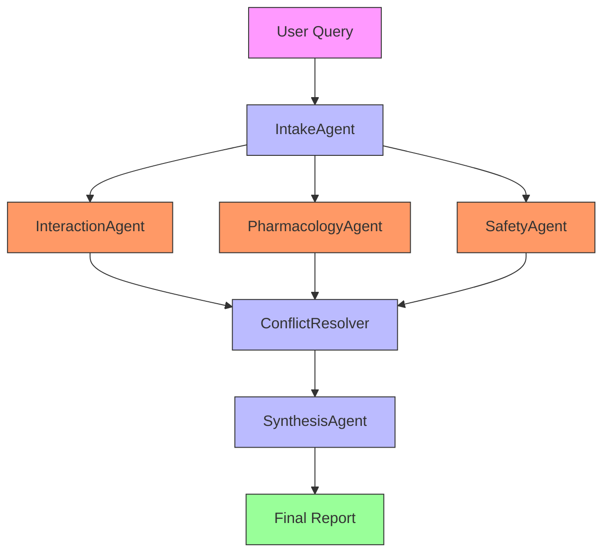
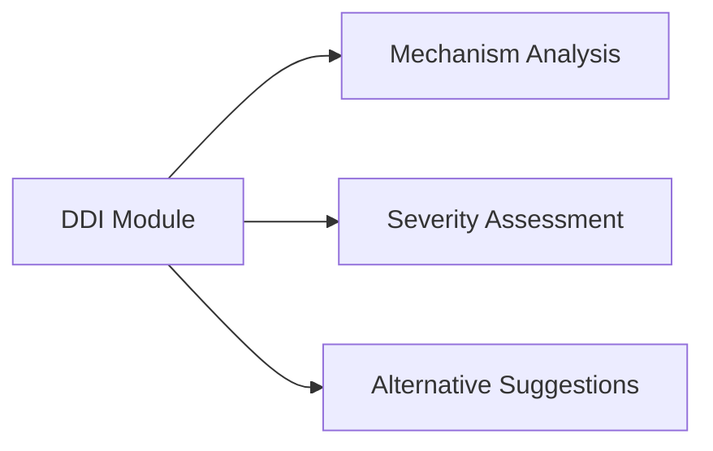
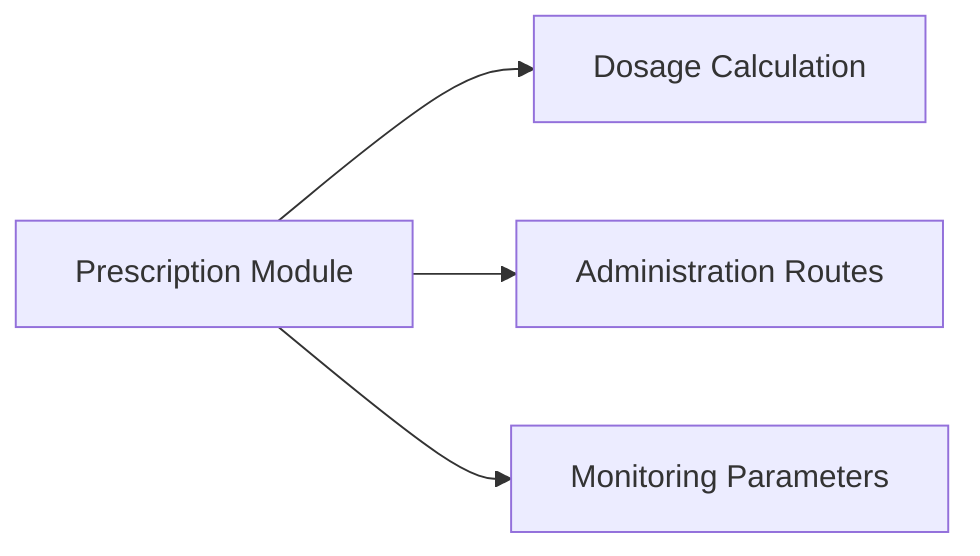
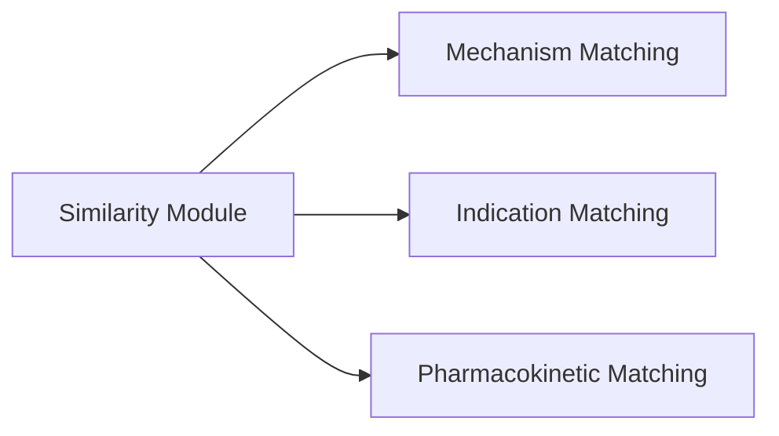

# MedKit Drug - Comprehensive Pharmacology Toolkit

## 💊 Overview

**MedKit Drug** provides advanced pharmacology tools for drug interaction checking, prescription guidance, similarity analysis, and comprehensive medication information. It supports both **agentic** and **non-agentic** approaches for pharmaceutical analysis.

## 📚 Structure

```
drug/
├── drug_addiction/          # Substance abuse analysis
├── drug_disease/            # Drug-disease interactions
├── drug_drug/              # Drug-drug interactions
├── drugs_comparision/       # Drug comparison tools
├── medicine/               # General medicine tools
│   ├── drugbank/           # DrugBank integration
│   └── medinfo/            # Medication information
├── similar_drugs/          # Similar drug finder
├── symptoms_drugs/         # Symptom-drug matching
├── tests/                   # Test suite
└── drug_cli.py             # Unified CLI interface
```

## 🔬 Approaches

### 1. Non-Agentic Approach

**Direct pharmacology information**

- Single-class per drug domain
- Fast drug interaction checks
- Simple prescription guidance
- Ideal for quick medication reference

**Example:**
```bash
# Drug interaction check
medkit-drug interact "Lisinopril" "Ibuprofen"

# Prescription guidance
medkit-drug prescription "Amoxicillin" "500mg"

# Similar drugs
medkit-drug similar "Lisinopril"
```

### 2. Agentic Approach

**Multi-agent pharmaceutical analysis**



#### Agent Roles:

1. **IntakeAgent** - Query parser
   - Role: Initial processor
   - Responsibilities: Understand drug query intent

2. **InteractionAgent** - Interaction specialist
   - Role: Drug interaction expert
   - Responsibilities: Check DDI, contraindications

3. **PharmacologyAgent** - Mechanism expert
   - Role: Pharmacology specialist
   - Responsibilities: MOA, pharmacokinetics

4. **SafetyAgent** - Safety expert
   - Role: Adverse effect monitor
   - Responsibilities: Side effects, warnings

5. **ConflictResolver** - Conflict manager
   - Role: Decision arbitrator
   - Responsibilities: Resolve conflicting findings

6. **SynthesisAgent** - Report generator
   - Role: Final reporter
   - Responsibilities: Comprehensive summary

**Example:**
```bash
medkit-drug --agentic "Analyze metoprolol for hypertensive patient with asthma"
```

## 🧪 Key Modules

### Drug Interaction Checker


**Usage:**
```bash
# Basic interaction check
medkit-drug interact "Warfarin" "Ibuprofen"

# Detailed analysis
medkit-drug interact "Warfarin" "Ibuprofen" --detailed

# Batch checking
medkit-drug interact "drug_list.txt"
```

### Prescription Guidance


**Usage:**
```bash
# Standard prescription
medkit-drug prescription "Amoxicillin" "500mg" "adult"

# Pediatric dosage
medkit-drug prescription "Amoxicillin" "250mg" "child" --age 8

# Renal adjustment
medkit-drug prescription "Vancomycin" "1g" "adult" --renal-impairment
```

### Similar Drugs Finder


**Usage:**
```bash
# Find alternatives
medkit-drug similar "Lisinopril"

# With mechanism explanation
medkit-drug similar "Lisinopril" --mechanism

# Compare multiple
medkit-drug similar "Lisinopril" "Amlodipine" "Hydrochlorothiazide"
```

## 🚀 Usage Examples

### Non-Agentic (Quick Reference)
```bash
# Drug interaction check
medkit-drug interact "Lisinopril" "Ibuprofen" --output json

# Prescription guidance
medkit-drug prescription "Amoxicillin" "500mg" --adult

# Similar drugs
medkit-drug similar "Atorvastatin" --top 5

# Drug-disease interactions
medkit-drug disease "Metformin" "renal impairment"
```

### Agentic (Comprehensive Analysis)
```bash
# Complex interaction analysis
medkit-drug --agentic "Analyze drug regimen for diabetic with hypertension"

# Patient-specific prescription
medkit-drug --agentic "Amoxicillin for 70yo with renal impairment"

# Alternative analysis
medkit-drug --agentic "Find alternatives to NSAIDs for arthritis patient"
```

## 📊 Performance Comparison

| Metric | Non-Agentic | Agentic |
|--------|-------------|---------|
| Speed | ⚡ Instant | 🐢 3-8s |
| Depth | Basic | Comprehensive |
| Agents | 1 | 5-6 |
| Use Case | Quick checks | Complex analysis |

## 🎯 When to Use Each

**Non-Agentic:**
- Quick interaction checks
- Simple prescription lookups
- Fast alternative finding
- Single drug queries

**Agentic:**
- Complex drug regimens
- Multi-drug interactions
- Patient-specific analysis
- Comprehensive reports

## 🔧 Advanced Features

### Drug Comparison
```bash
# Compare multiple drugs
medkit-drug compare "Lisinopril" "Amlodipine" "Hydrochlorothiazide"

# Detailed comparison
medkit-drug compare "drugs.txt" --detailed --output csv
```

### Addiction Analysis
```bash
# Substance abuse assessment
medkit-drug addiction "opioid" --risk-factors

# Treatment options
medkit-drug addiction "alcohol" --treatment
```

### Symptom-Drug Matching
```bash
# Find drugs for symptoms
medkit-drug symptoms "cough" "fever" "headache"

# Exclude contraindications
medkit-drug symptoms "pain" --exclude "asthma" "renal impairment"
```

## 📚 Pharmacology Domains

- **Drug Classes**: 50+ major categories
- **Interactions**: 10,000+ known DDIs
- **Mechanisms**: 200+ MOA patterns
- **Safety**: 1,500+ adverse effects
- **Alternatives**: 3,000+ drug alternatives

## 🧪 Testing

```bash
# Run drug tests
python -m pytest drug/*/tests/

# Test specific module
python -m pytest drug/drug_drug/tests/
```

## ⚠️ Important Medical Disclaimer

**THIS SOFTWARE IS FOR INFORMATIONAL AND EDUCATIONAL PURPOSES ONLY.**

- It is **not** a substitute for professional medical advice, diagnosis, or treatment.
- Always consult with a qualified healthcare professional before making any medical decisions.
- AI-generated outputs must be cross-referenced with authoritative clinical sources (e.g., FDA labels, Lexicomp, Micromedex).
- All users must adhere to the terms specified in the `contract.md` found within individual modules.

## 📖 Example Workflows

### Hypertension Management
```bash
# Quick interaction check
medkit-drug interact "Lisinopril" "Hydrochlorothiazide"

# Comprehensive analysis
medkit-drug --agentic "Analyze regimen for hypertensive diabetic patient"

# Alternative options
medkit-drug similar "Lisinopril" --include-mechanism
```

### Antibiotic Prescription
```bash
# Standard prescription
medkit-drug prescription "Amoxicillin" "500mg" "adult"

# Pediatric with allergies
medkit-drug --agentic "Amoxicillin for 8yo with penicillin allergy"

# Alternative antibiotics
medkit-drug similar "Amoxicillin" --indication "otitis media"
```

### Pain Management
```bash
# NSAID interactions
medkit-drug interact "Ibuprofen" "Aspirin"

# Opioid alternatives
medkit-drug --agentic "Non-opioid options for chronic pain"

# Addiction assessment
medkit-drug addiction "opioid" --withdrawal-management
```

## 🔧 Integration Examples

### Python API
```python
from drug.drug_drug.drug_interaction import DrugInteractionChecker
from drug.medicine.medinfo.medicine_info import MedicineInfo

# Initialize
checker = DrugInteractionChecker()
info = MedicineInfo()

# Check interaction
result = checker.check_interaction("Warfarin", "Ibuprofen")
print(f"Interaction: {result.severity}")

# Get drug info
drug_data = info.get_drug_info("Amoxicillin")
print(f"Mechanism: {drug_data.mechanism}")
```

### Batch Processing
```bash
# Process drug list
drug-processor "drug_list.csv" --output "results.json"

# Validate prescriptions
medkit-drug validate "prescriptions.txt"
```

## 📈 Performance Optimization

### Caching
```bash
# Enable caching
medkit-drug --cache enable

# Set cache duration
medkit-drug --cache-ttl 86400  # 24 hours
```

### Parallel Processing
```bash
# Multi-threaded analysis
medkit-drug --parallel 4 "batch_analysis"
```

### Model Selection
```bash
# High accuracy
medkit-drug --model "gpt-4-turbo" "complex analysis"

# Fast draft
medkit-drug --model "gemma3" "quick check"
```

## 🎓 Best Practices

1. **Start Simple**: Use non-agentic for basic checks
2. **Verify Critical**: Always double-check agentic recommendations
3. **Consider Context**: Account for patient-specific factors
4. **Update Regularly**: Keep drug databases current
5. **Document Decisions**: Record rationale for drug choices

---

**MedKit Drug** © 2024 - Pharmacology Research Tool
*Not for clinical use - Consult licensed professionals for medical decisions*

