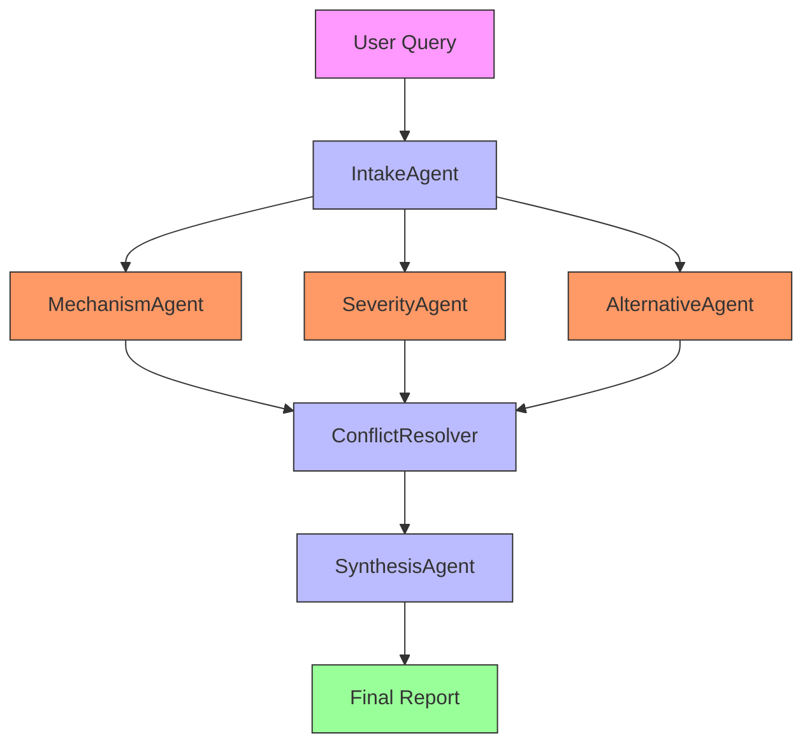

# Drug-Drug Interaction Checker

## 💊 Overview

**Drug-Drug Interaction Checker** is a specialized module within MedKit for identifying, analyzing, and managing potential interactions between medications. It provides both **agentic** and **non-agentic** approaches for comprehensive interaction analysis.

## 📚 Structure

```
drug/drug_drug/
├── __init__.py
├── drug_interaction.py      # Core interaction logic
├── drug_interaction_agents.py # Agentic components
├── drug_interaction_cli.py   # CLI interface
├── drug_interaction_models.py # Data models
├── drug_interaction_prompts.py # Prompt templates
├── tests/                    # Test suite
│   └── test_drug_interaction_mock.py
└── README.md                 # This file
```

## 🔬 Approaches

### 1. Non-Agentic Approach

**Direct interaction checking**

- Single-class interaction analysis
- Fast DDI lookup
- Basic severity assessment
- Ideal for quick compatibility checks

**Example:**
```bash
# Basic interaction check
medkit-drug interact "Warfarin" "Ibuprofen"

# With severity level
medkit-drug interact "Warfarin" "Ibuprofen" --severity

# JSON output
medkit-drug interact "Warfarin" "Ibuprofen" --output json
```

### 2. Agentic Approach

**Multi-agent interaction analysis**



#### Agent Roles:

1. **IntakeAgent** - Query parser
   - Role: Initial processor
   - Responsibilities: Parse drug pairs, understand context

2. **MechanismAgent** - MOA analyst
   - Role: Pharmacology expert
   - Responsibilities: Analyze mechanisms of action

3. **SeverityAgent** - Risk assessor
   - Role: Safety expert
   - Responsibilities: Determine interaction severity

4. **AlternativeAgent** - Solution finder
   - Role: Problem solver
   - Responsibilities: Suggest safe alternatives

5. **ConflictResolver** - Decision maker
   - Role: Arbitrator
   - Responsibilities: Resolve conflicting findings

6. **SynthesisAgent** - Report generator
   - Role: Final reporter
   - Responsibilities: Comprehensive summary

**Example:**
```bash
medkit-drug --agentic "Analyze Warfarin and Ibuprofen interaction for 70yo patient"
```

## 🧪 Data Models

### InteractionResult

```python
class InteractionResult(BaseModel):
    drug1: str
    drug2: str
    interaction_type: str  # "pharmacokinetic", "pharmacodynamic", "unknown"
    severity: str  # "minor", "moderate", "major", "contraindicated"
    mechanism: str
    evidence: str
    recommendations: list[str]
    alternatives: list[str]
    confidence: float  # 0.0 - 1.0
```

### SeverityScale

```python
class SeverityScale(Enum):
    MINOR = "minor"
    MODERATE = "moderate"
    MAJOR = "major"
    CONTRAINDICATED = "contraindicated"
```

## 🚀 Usage Examples

### Non-Agentic (Quick Check)
```bash
# Basic interaction check
medkit-drug interact "Lisinopril" "Ibuprofen"

# Detailed output
medkit-drug interact "Warfarin" "Aspirin" --detailed

# Batch checking
medkit-drug interact "drug_pairs.txt" --output csv
```

### Agentic (Comprehensive Analysis)
```bash
# Patient-specific analysis
medkit-drug --agentic "Analyze Lisinopril and Hydrochlorothiazide for hypertensive diabetic"

# Complex regimen analysis
medkit-drug --agentic "Check regimen: Metformin, Lisinopril, Atorvastatin"

# With patient factors
medkit-drug --agentic "Warfarin and Amoxicillin for 75yo with renal impairment"
```

## 📊 Performance Comparison

| Metric | Non-Agentic | Agentic |
|--------|-------------|---------|
| Speed | ⚡ 1-2s | 🐢 5-10s |
| Depth | Basic | Comprehensive |
| Agents | 1 | 5-6 |
| Context | Limited | Full patient context |

## 🎯 When to Use Each

**Non-Agentic:**
- Quick compatibility checks
- Simple drug pair analysis
- Batch processing
- Initial screening

**Agentic:**
- Complex drug regimens
- Patient-specific factors
- Comprehensive reports
- Clinical decision support

## 🔧 Advanced Features

### Mechanism Analysis
```bash
# Detailed mechanism breakdown
medkit-drug interact "Warfarin" "Ibuprofen" --mechanism

# Pharmacokinetic focus
medkit-drug interact "Warfarin" "Ibuprofen" --pk

# Pharmacodynamic focus
medkit-drug interact "Warfarin" "Ibuprofen" --pd
```

### Alternative Suggestions
```bash
# Find safe alternatives
medkit-drug interact "Warfarin" "Ibuprofen" --alternatives

# With reasoning
medkit-drug interact "Warfarin" "Ibuprofen" --alternatives --reasoning

# Compare alternatives
medkit-drug compare "Ibuprofen" "Naproxen" "Acetaminophen" --for "Warfarin"
```

### Severity Filtering
```bash
# Filter by severity
medkit-drug interact "drug_list.txt" --min-severity moderate

# Focus on major interactions
medkit-drug interact "regimen.txt" --severity major contraindicated
```

## 📚 Interaction Database

- **Drug Pairs**: 10,000+ known interactions
- **Mechanisms**: 500+ documented mechanisms
- **Severity Levels**: 4-tier classification
- **Alternatives**: 3,000+ substitute suggestions

## 🧪 Testing

```bash
# Run interaction tests
python -m pytest drug/drug_drug/tests/

# Test specific functionality
python -m pytest drug/drug_drug/tests/test_drug_interaction_mock.py
```

## 📈 Performance Optimization

### Caching
```bash
# Enable interaction caching
medkit-drug interact --cache enable

# Set cache duration
medkit-drug interact --cache-ttl 3600  # 1 hour
```

### Batch Processing
```bash
# Process multiple pairs
medkit-drug interact "pairs.txt" --batch-size 50

# Parallel processing
medkit-drug interact "pairs.txt" --parallel 4
```

### Confidence Thresholds
```bash
# Set minimum confidence
medkit-drug interact "Warfarin" "Ibuprofen" --min-confidence 0.8

# Adjust sensitivity
medkit-drug interact "regimen.txt" --sensitivity high
```

## 🎓 Best Practices

1. **Start Simple**: Use non-agentic for initial screening
2. **Context Matters**: Include patient factors when available
3. **Verify Critical**: Double-check major/contraindicated interactions
4. **Consider Alternatives**: Always review suggested alternatives
5. **Document Decisions**: Record interaction analysis rationale

## ⚠️ Important Limitations

- **Database Coverage**: May not include all possible interactions
- **Context Limitations**: Patient-specific factors affect real-world outcomes
- **Emerging Interactions**: New interactions may not be documented
- **Combination Effects**: Multiple interactions can have cumulative effects

## 📖 Example Workflows

### Cardiovascular Regimen
```bash
# Quick check
medkit-drug interact "Metoprolol" "Amlodipine"

# Comprehensive analysis
medkit-drug --agentic "Analyze Metoprolol, Amlodipine, Hydrochlorothiazide for hypertensive patient"

# Alternative options
medkit-drug interact "Metoprolol" "Diltiazem" --alternatives
```

### Anticoagulant Safety
```bash
# Basic interaction
medkit-drug interact "Warfarin" "Aspirin"

# Patient-specific
medkit-drug --agentic "Warfarin and Amoxicillin for 78yo with AFib"

# Mechanism focus
medkit-drug interact "Warfarin" "Ciprofloxacin" --mechanism --pk
```

### Diabetes Management
```bash
# Common combination
medkit-drug interact "Metformin" "Glipizide"

# Renal considerations
medkit-drug --agentic "Metformin for patient with mild renal impairment"

# Alternative analysis
medkit-drug similar "Metformin" --indication "type 2 diabetes" --renal-safety
```

## 🔧 Integration Examples

### Python API
```python
from drug.drug_drug.drug_interaction import DrugInteractionChecker

# Initialize
checker = DrugInteractionChecker()

# Check single pair
result = checker.check_interaction("Warfarin", "Ibuprofen")
print(f"Severity: {result.severity}")
print(f"Mechanism: {result.mechanism}")

# Batch checking
results = checker.check_multiple([
    ("Warfarin", "Ibuprofen"),
    ("Lisinopril", "Potassium"),
    ("Metformin", "Contrast")
])

# Get alternatives
alternatives = checker.find_alternatives("Warfarin", "Ibuprofen")
```

### REST API Integration
```python
from drug.drug_drug.drug_interaction_cli import create_app

# Create Flask app
app = create_app()

# Run API server
if __name__ == "__main__":
    app.run(host="0.0.0.0", port=5000)

# API endpoints:
# POST /interaction - Check single interaction
# POST /batch - Check multiple interactions
# GET /alternatives - Find alternatives
```

## 📊 Common Interaction Patterns

### Pharmacokinetic Interactions
- **CYP450 Inhibition**: "Warfarin" + "Fluconazole"
- **P-gp Inhibition**: "Digoxin" + "Verapamil"
- **Renal Clearance**: "Metformin" + "Cimetidine"

### Pharmacodynamic Interactions
- **Additive Effects**: "Lisinopril" + "Losartan" (hypotension)
- **Opposing Effects**: "Insulin" + "Beta-blockers" (masking hypoglycemia)
- **Synergistic Toxicity**: "NSAIDs" + "Warfarin" (bleeding risk)

### Special Populations
- **Elderly**: Increased sensitivity to sedatives, anticoagulants
- **Renal Impairment**: Accumulation of renally-cleared drugs
- **Hepatic Impairment**: Reduced metabolism of hepatically-cleared drugs

---

**Drug-Drug Interaction Checker** © 2024 - Pharmacology Safety Tool
*Not for clinical use - Consult licensed professionals for medical decisions*
*Always verify with authoritative sources: Lexicomp, Micromedex, FDA labels*

