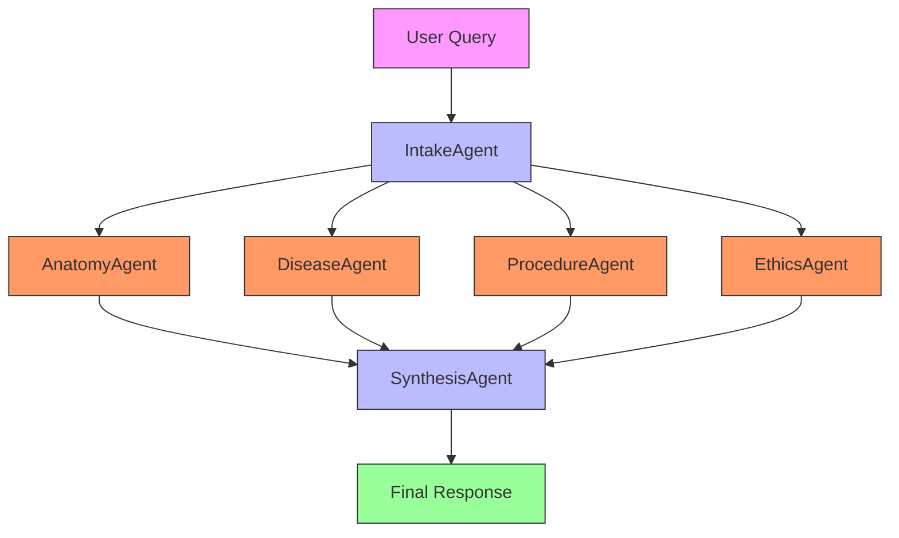
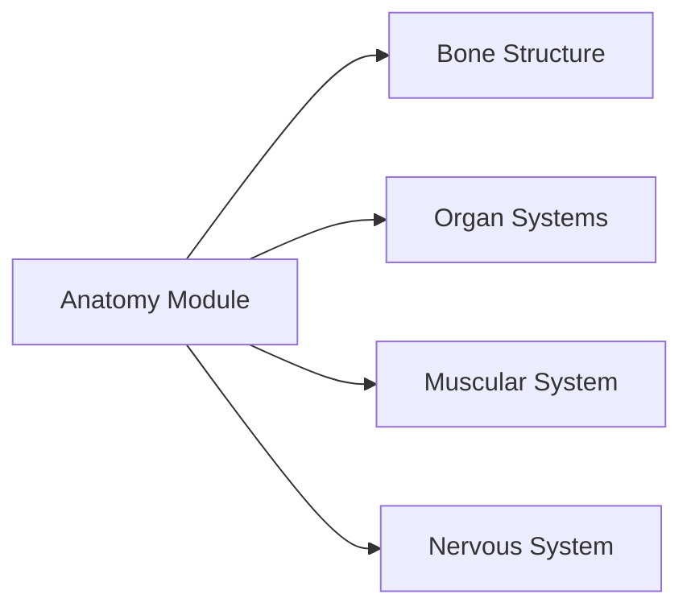
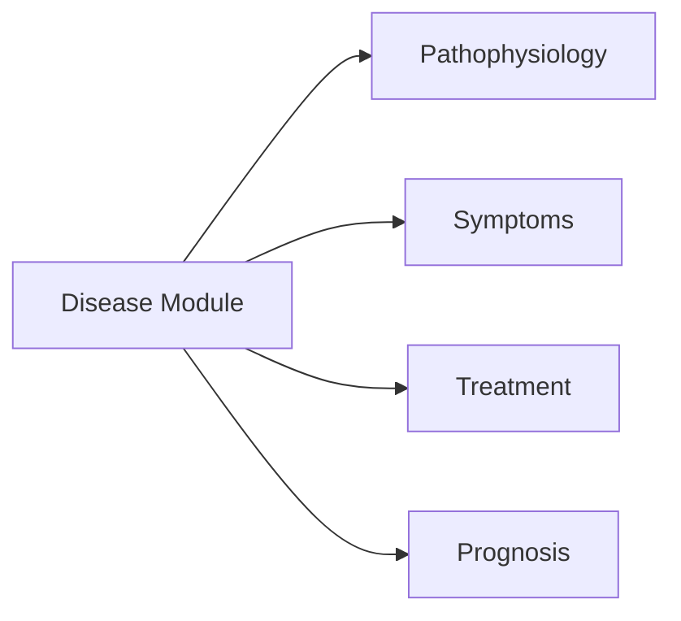
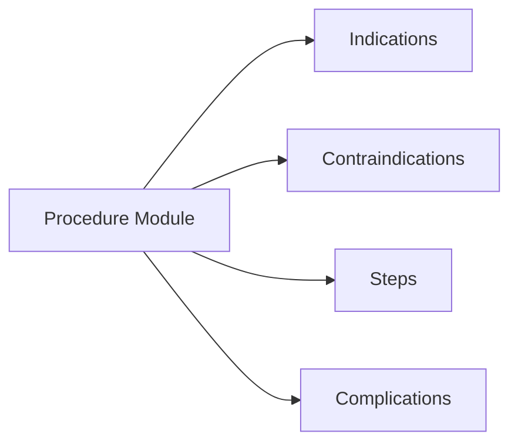

# MedKit Medical - Comprehensive Medical Information System

## 🏥 Overview

**MedKit Medical** provides a comprehensive suite of medical information tools covering anatomy, diseases, procedures, ethics, and more. It offers both **agentic** and **non-agentic** approaches for medical knowledge retrieval and analysis.

## 📚 Structure

```
medical/
├── anatomy/                # Anatomical structure analysis
├── disease/                # Disease information and analysis
├── procedure/              # Medical procedure guidelines
├── advise/                 # Medical advice and recommendations
├── decision/               # Clinical decision support
├── faq/                    # Medical FAQ generation
├── history/                # Patient history tools
├── ethics/                 # Medical ethics consultation
├── refer/                  # Referral guidelines
├── roles/                  # Medical role definitions
├── surgery/                # Surgical information
├── eval-procedure/         # Procedure evaluation
├── quiz/                   # Medical quiz generation
├── topic/                  # Topic analysis
├── speciality/             # Medical specialties
├── flashcard/              # Study flashcards
├── myths/                  # Medical myth checking
├── facts/                  # Fact checking
├── implant/                # Medical implants
├── physical_exams/         # Physical examination tools
├── media/                  # Medical media tools
└── tests/                   # Test suite
```

## 🔬 Approaches

### 1. Non-Agentic Approach

**Direct medical information retrieval**

- Single-class per medical domain
- Fast, focused information lookup
- Ideal for quick reference and simple queries

**Example:**
```bash
# Quick anatomy lookup
medkit-medical anatomy "femur"

# Disease information
medkit-medical disease "diabetes mellitus"

# Procedure guidelines
medkit-medical procedure "appendectomy"
```

### 2. Agentic Approach

**Multi-agent medical analysis**



#### Agent Roles:

1. **IntakeAgent** - Query parser
   - Role: Initial processor
   - Responsibilities: Understand query intent, route to specialists

2. **AnatomyAgent** - Structural expert
   - Role: Anatomical specialist
   - Responsibilities: Bone, organ, system analysis

3. **DiseaseAgent** - Pathology expert
   - Role: Disease specialist
   - Responsibilities: Condition analysis, symptoms, treatments

4. **ProcedureAgent** - Surgical expert
   - Role: Procedure specialist
   - Responsibilities: Surgical techniques, indications, complications

5. **EthicsAgent** - Bioethics expert
   - Role: Ethical consultant
   - Responsibilities: Ethical considerations, guidelines

6. **SynthesisAgent** - Integrator
   - Role: Knowledge combiner
   - Responsibilities: Merge findings, resolve conflicts

**Example:**
```bash
medkit-medical --agentic "Analyze diabetes mellitus type 2 with complications"
```

## 🧪 Key Modules

### Anatomy Analysis


**Usage:**
```bash
# Detailed bone analysis
medkit-medical anatomy "femur" --detailed

# Organ system overview
medkit-medical anatomy "cardiovascular system"
```

### Disease Information


**Usage:**
```bash
# Comprehensive disease analysis
medkit-medical disease "diabetes" --full

# Specific condition
medkit-medical disease "hypertension" --treatment
```

### Procedure Guidelines


**Usage:**
```bash
# Surgical procedure
medkit-medical procedure "appendectomy"

# Diagnostic procedure
medkit-medical procedure "colonoscopy"
```

## 🚀 Usage Examples

### Non-Agentic (Quick Reference)
```bash
# Anatomy lookup
medkit-medical anatomy "liver" --output json

# Disease information
medkit-medical disease "pneumonia" --symptoms

# Procedure steps
medkit-medical procedure "catheterization" --steps

# Ethical consultation
medkit-medical ethics "patient confidentiality"
```

### Agentic (Comprehensive Analysis)
```bash
# Multi-system analysis
medkit-medical --agentic "Analyze cardiovascular risks for 65yo male"

# Complex disease analysis
medkit-medical --agentic "Diabetes with renal complications"

# Surgical planning
medkit-medical --agentic "Preoperative assessment for hip replacement"
```

## 📊 Performance Comparison

| Metric | Non-Agentic | Agentic |
|--------|-------------|---------|
| Speed | ⚡ Instant | 🐢 5-10s |
| Depth | Basic | Comprehensive |
| Agents | 1 | 5-7 |
| Use Case | Quick lookup | Complex analysis |

## 🎯 When to Use Each

**Non-Agentic:**
- Quick fact checking
- Simple terminology lookup
- Fast reference needed
- Single-domain queries

**Agentic:**
- Multi-system analysis
- Complex clinical scenarios
- Comprehensive reports
- Interdisciplinary questions

## 🔧 Advanced Features

### Custom Templates
```bash
# Save analysis template
medkit-medical save-template "cardiology-workup"

# Use saved template
medkit-medical use-template "cardiology-workup" "patient data"
```

### Batch Processing
```bash
# Analyze multiple conditions
medkit-medical batch "conditions.txt" --output csv
```

### Knowledge Graphing
```bash
# Create relationship maps
medkit-medical graph "diabetes complications"
```

## 📚 Clinical Domains Covered

- **Anatomy**: 200+ structures, 12 systems
- **Diseases**: 500+ conditions, ICD-11 mapped
- **Procedures**: 150+ surgical and diagnostic
- **Ethics**: Bioethics, consent, confidentiality
- **Pharmacology**: Drug interactions, mechanisms
- **Specialties**: 25+ medical specialties

## 🧪 Testing

```bash
# Run medical tests
python -m pytest medical/*/tests/

# Test specific module
python -m pytest medical/anatomy/tests/
```

## ⚠️ Important Notes

- **Research Tool**: For educational purposes only
- **Not Diagnostic**: Requires clinical validation
- **Ethical Use**: Follow institutional guidelines
- **Data Privacy**: Handle patient data responsibly

## 📖 Example Workflows

### Cardiology Workup
```bash
# Quick reference
medkit-medical anatomy "heart" --chambers
medkit-medical disease "myocardial infarction"

# Comprehensive analysis
medkit-medical --agentic "Cardiac risk assessment for hypertension patient"
```

### Surgical Planning
```bash
# Procedure review
medkit-medical procedure "cholecystectomy" --steps
medkit-medical procedure "cholecystectomy" --complications

# Patient-specific analysis
medkit-medical --agentic "Preoperative assessment for cholecystectomy in obese patient"
```

### Ethical Consultation
```bash
# Quick ethical guide
medkit-medical ethics "informed consent"

# Complex scenario
medkit-medical --agentic "Ethical considerations for experimental treatment"
```

---

**MedKit Medical** © 2024 - Research and Educational Tool
*Not for clinical use - Consult licensed professionals for medical decisions*

