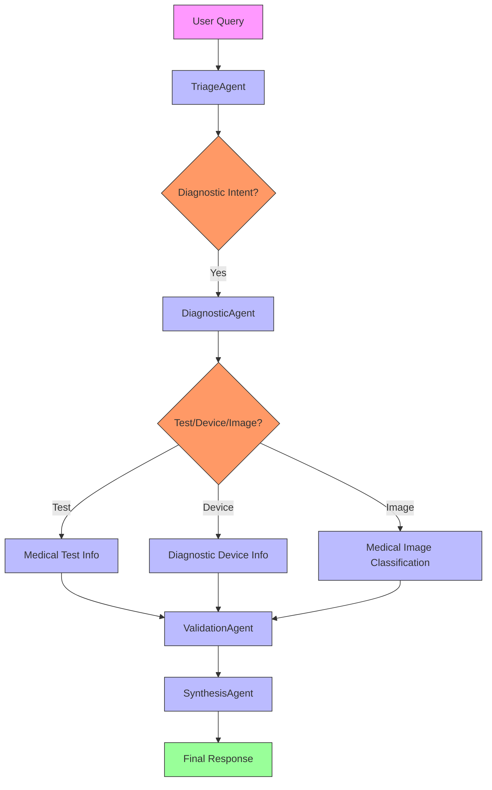

# MedKit Diagnose

This package groups diagnostic-reference and medical-image modules.

## What It Includes

- `test`: medical test information
- `device`: diagnostic device information
- `classify_image`: image classification

## Entry Point

- `diagnose_cli.py`: unified CLI used by `medkit-diagnose`

## Why It Matters

Diagnostic tests, devices, and images are related but operationally different tasks. This package keeps them under one command namespace.

## Agentic Approach Integration

These diagnostic modules can be utilized within the MedKit agentic framework as follows:

#### Integration Pipeline:

**DiagnosticAgent Integration:**
- When the MedKit agentic system identifies a diagnostic query, it routes to the DiagnosticAgent
- The DiagnosticAgent can leverage these sub-modules for specific diagnostic tasks:
  - Medical test information retrieval for lab results interpretation
  - Diagnostic device information for equipment specifications and usage
  - Medical image classification for preliminary analysis of radiological or pathological images

**Usage in Agentic Workflows:**
1. **TriageAgent** identifies diagnostic intent in user queries
2. **DiagnosticAgent** processes the query and determines which sub-module to use
3. **SpecialistAgent** (Diagnostic) applies the appropriate diagnostic reference or image analysis
4. **ValidationAgent** cross-checks diagnostic findings with established medical guidelines
5. **SynthesisAgent** integrates diagnostic information with other medical data

## Limitations

- Outputs are reference-oriented and model-dependent.
- Image classification results should not be used as clinical diagnosis.
