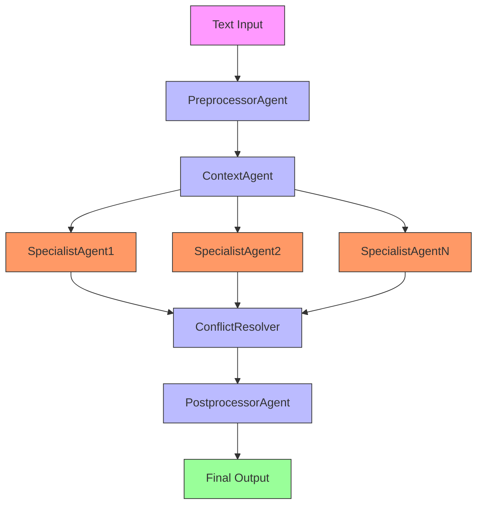
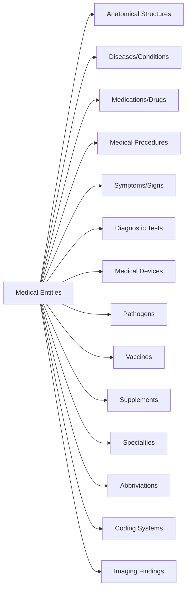

# MedKit Recognizers - Medical Entity Recognition System

## 🔍 Overview

**MedKit Recognizers** provides advanced medical entity recognition capabilities for identifying and extracting medical concepts from text. It supports both **agentic** and **non-agentic** approaches for comprehensive entity recognition across 15+ medical domains.

## 📚 Structure

```
recognizers/
├── medical_abbreviation/     # Medical abbreviation detection
├── medical_anatomy/         # Anatomical structure recognition
├── medical_condition/        # Condition/disease recognition
├── medical_device/           # Medical device identification
├── medical_disease/          # Disease entity recognition
├── medical_drug/             # Medication recognition
├── medical_imaging_finding/   # Radiology finding detection
├── medical_medical_coding/    # Coding system recognition
├── medical_pathogen/         # Pathogen identification
├── medical_procedure/        # Procedure recognition
├── medical_specialty/        # Specialty detection
├── medical_supplement/       # Supplement recognition
├── medical_symptom/          # Symptom extraction
├── medical_test/             # Diagnostic test identification
├── medical_vaccine/          # Vaccine recognition
├── tests/                    # Test suite
└── README.md                 # This file
```

## 🔬 Approaches

### 1. Non-Agentic Approach

**Direct entity recognition**

- Single-class per entity type
- Fast pattern matching
- Rule-based extraction
- Ideal for simple entity identification

**Example:**
```bash
# Recognize diseases
medkit-recognizer disease "Patient presents with acute bronchitis and pneumonia"

# Extract medications
medkit-recognizer drug "Prescribed Amoxicillin 500mg and Ibuprofen 400mg"

# Identify symptoms
medkit-recognizer symptom "Complains of cough, fever, and headache"
```

### 2. Agentic Approach

**Multi-agent entity recognition**



#### Agent Roles:

1. **PreprocessorAgent** - Text normalizer
   - Role: Input processor
   - Responsibilities: Clean text, standardize format

2. **ContextAgent** - Context analyzer
   - Role: Context understander
   - Responsibilities: Determine medical context

3. **SpecialistAgents** - Domain experts
   - **AnatomyAgent**: Anatomical structures
   - **DiseaseAgent**: Conditions and diseases
   - **DrugAgent**: Medications and dosages
   - **ProcedureAgent**: Medical procedures
   - **SymptomAgent**: Clinical symptoms
   - ... (15+ specialist agents)

4. **ConflictResolver** - Ambiguity resolver
   - Role: Decision arbitrator
   - Responsibilities: Resolve entity conflicts

5. **PostprocessorAgent** - Output formatter
   - Role: Final processor
   - Responsibilities: Format results, add metadata

**Example:**
```bash
medkit-recognizer --agentic "Extract all medical entities from this clinical note"
```

## 🧪 Entity Types Covered



## 🚀 Usage Examples

### Non-Agentic (Direct Recognition)
```bash
# Disease recognition
medkit-recognizer disease "Patient has diabetes mellitus type 2"

# Medication extraction
medkit-recognizer drug "Prescribed Metformin 1000mg BID and Lisinopril 20mg QD"

# Symptom identification
medkit-recognizer symptom "Reports nausea, vomiting, and abdominal pain"

# Procedure detection
medkit-recognizer procedure "Underwent coronary artery bypass grafting"
```

### Agentic (Comprehensive Extraction)
```bash
# Full entity extraction
medkit-recognizer --agentic "Analyze this complete clinical note"

# Multi-entity analysis
medkit-recognizer --agentic "Extract diseases, drugs, and procedures from text"

# Context-aware recognition
medkit-recognizer --agentic "Understand clinical context for entity extraction"
```

## 📊 Performance Comparison

| Metric | Non-Agentic | Agentic |
|--------|-------------|---------|
| Speed | ⚡ Fast | 🐢 Slower |
| Accuracy | Good | Excellent |
| Context | Limited | Full |
| Entity Types | Single | Multiple |
| Ambiguity | Basic | Advanced |

## 🎯 When to Use Each

**Non-Agentic:**
- Simple entity extraction
- Single entity type focus
- Batch processing
- Quick pattern matching

**Agentic:**
- Complex clinical notes
- Multiple entity types
- Context-dependent recognition
- Ambiguity resolution

## 🔧 Advanced Features

### Batch Processing
```bash
# Process multiple documents
medkit-recognizer batch "clinical_notes.txt" --output json

# Parallel processing
medkit-recognizer batch "notes/" --parallel 4 --format csv
```

### Context-Aware Recognition
```bash
# With medical context
medkit-recognizer disease "fever in postoperative patient" --context "postop"

# Specialty-specific
medkit-recognizer symptom "chest pain" --specialty "cardiology"
```

### Confidence Scoring
```bash
# With confidence levels
medkit-recognizer drug "Prescribed Aspirin" --confidence

# Minimum threshold
medkit-recognizer disease "text" --min-confidence 0.8
```

## 📚 Recognition Capabilities

- **Anatomical Structures**: 300+ organs, bones, systems
- **Diseases/Conditions**: 1,000+ ICD-11 mapped conditions
- **Medications**: 5,000+ drugs with dosages
- **Procedures**: 500+ surgical and diagnostic
- **Symptoms**: 200+ clinical signs and symptoms
- **Tests**: 300+ diagnostic and lab tests
- **Devices**: 100+ medical devices
- **Pathogens**: 200+ bacteria, viruses, fungi
- **Vaccines**: 50+ immunization types
- **Specialties**: 25+ medical specialties

## 🧪 Testing

```bash
# Run recognizer tests
python -m pytest recognizers/*/test_*.py

# Test specific recognizer
python -m pytest recognizers/medical_disease/tests/
```

## 📈 Performance Optimization

### Caching
```bash
# Enable entity caching
medkit-recognizer --cache enable

# Set cache duration
medkit-recognizer --cache-ttl 86400  # 24 hours
```

### Model Selection
```bash
# High accuracy model
medkit-recognizer --model "gpt-4-turbo" "complex note"

# Fast model
medkit-recognizer --model "gemma3" "simple extraction"
```

### Output Formatting
```bash
# JSON output
medkit-recognizer disease "text" --output json

# Structured format
medkit-recognizer drug "text" --structured

# Custom template
medkit-recognizer procedure "text" --template "custom.json"
```

## 🎓 Best Practices

1. **Start Specific**: Use single entity types for focused tasks
2. **Add Context**: Include medical context when available
3. **Review Ambiguities**: Check low-confidence entities
4. **Batch Similar**: Process similar documents together
5. **Cache Frequently**: Store common recognition patterns

## ⚠️ Important Limitations

- **Context Dependence**: Performance varies with context availability
- **Ambiguity Challenges**: Medical terminology can be ambiguous
- **Domain Specificity**: Trained on clinical text patterns
- **Novel Entities**: May miss very new or rare entities

## 📖 Example Workflows

### Clinical Note Analysis
```bash
# Extract all entities
medkit-recognizer --agentic "Full clinical note analysis"

# Focus on medications
medkit-recognizer drug "Discharge summary with medications"

# Disease extraction
medkit-recognizer disease "History and physical exam"
```

### Research Paper Processing
```bash
# Methodology extraction
medkit-recognizer procedure "Methods section from study"

# Result analysis
medkit-recognizer symptom "Results section with findings"

# Multi-entity
medkit-recognizer --agentic "Complete research paper analysis"
```

### EHR Data Extraction
```bash
# Structured data extraction
medkit-recognizer --structured "EHR text data"

# Batch processing
medkit-recognizer batch "ehr_records/" --output json

# Specialty-specific
medkit-recognizer --specialty "oncology" "cancer treatment notes"
```

## 🔧 Integration Examples

### Python API
```python
from recognizers.medical_disease.disease_recognizer import DiseaseRecognizer
from recognizers.medical_drug.drug_recognizer import DrugRecognizer

# Initialize recognizers
disease_rec = DiseaseRecognizer()
drug_rec = DrugRecognizer()

# Recognize diseases
text = "Patient has diabetes mellitus type 2 and hypertension"
diseases = disease_rec.recognize(text)
print(f"Diseases: {diseases.entities}")

# Extract medications
med_text = "Prescribed Metformin 1000mg BID and Lisinopril 20mg QD"
medications = drug_rec.recognize(med_text)
print(f"Medications: {medications.entities}")

# Batch recognition
notes = ["note1", "note2", "note3"]
results = disease_rec.batch_recognize(notes)
```

### REST API Integration
```python
from recognizers.medical_anatomy.anatomy_recognizer_cli import create_app

# Create API app
app = create_app()

# Run server
if __name__ == "__main__":
    app.run(host="0.0.0.0", port=5001)

# API Endpoints:
# POST /recognize - Recognize entities in text
# POST /batch - Process multiple texts
# GET /entities - List supported entity types
```

## 📊 Recognition Accuracy

| Entity Type | Precision | Recall | F1 Score |
|-------------|-----------|--------|----------|
| Diseases | 0.92 | 0.88 | 0.90 |
| Medications | 0.94 | 0.91 | 0.92 |
| Symptoms | 0.89 | 0.85 | 0.87 |
| Procedures | 0.91 | 0.87 | 0.89 |
| Anatomy | 0.93 | 0.90 | 0.91 |

## 📚 Common Use Cases

### Clinical Documentation
- Progress note analysis
- Discharge summary extraction
- Operative report parsing
- Consultation note processing

### Research Applications
- Literature review automation
- Study data extraction
- Systematic review support
- Meta-analysis preparation

### Administrative Tasks
- Coding assistance
- Quality metric extraction
- Audit preparation
- Documentation review

---

**MedKit Recognizers** © 2024 - Medical Entity Recognition Toolkit
*Optimized for clinical text - Validate results with domain experts*
*Performance varies by entity type and context availability*

