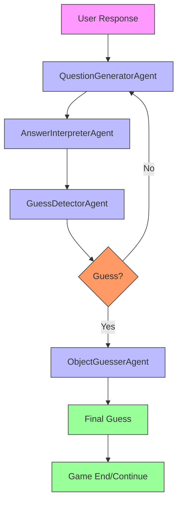

# ObjectGuesser

`ObjectGuesser` is an interactive CLI game in which the model asks questions and tries to infer the object chosen by the user.

## Agentic Approach

**Multi-agent system for interactive object guessing**

#### Agent Pipeline:


#### Agent Roles:

1. **QuestionGeneratorAgent** - Creates effective questions to narrow down possibilities
   - Role: Question strategist
   - Responsibilities: Generates questions that maximally reduce the space of possible objects
   - Output: Next best question to ask the user

2. **AnswerInterpreterAgent** - Understands and processes user responses
   - Role: Response analyzer
   - Responsibilities: Interprets user answers (yes/no/maybe) and updates knowledge state
   - Output: Updated belief state about possible objects

3. **GuessDetectorAgent** - Determines when to make a guess vs. ask another question
   - Role: Guessing strategist
   - Responsibilities: Analyzes conversation to decide if confidence is high enough for a guess
   - Output: Decision to either guess or continue questioning

4. **ObjectGuesserAgent** - Makes final guesses based on accumulated information
   - Role: Final guesser
   - Responsibilities: Forms a specific guess about the object when confidence is sufficient
   - Output: Object guess with reasoning

5. **ConversationManagerAgent** - Maintains game state and flow
   - Role: Game controller
   - Responsibilities: Tracks question count, manages turn-taking, and determines game end conditions
   - Output: Updated game state and continuation decision

## What It Does

- Runs a question-and-answer loop in the terminal.
- Tracks conversation history.
- Attempts to detect when the model is making a guess rather than asking another question.

## Why It Matters

Within this repository, this app is primarily useful as a compact example of stateful interactive prompting.

## What Distinguishes It

- Interactive loop rather than one-shot generation.
- Simple guess extraction logic over model responses.
- Minimal project structure suitable for experimentation.

## Files

- `object_guessing_cli.py`: CLI entrypoint.
- `object_guesser_game.py`: game state and guess extraction.
- `object_guessing_prompts.py`: prompts.
- `tests/test_object_guesser_mock.py`: tests.

## Usage

```bash
python object_guessing_cli.py
python object_guessing_cli.py --model ollama/llama3 --max-questions 15 --temperature 0.5
```

Defaults:

- `--model`: `ollama/gemma3`
- `--temperature`: `0.7`
- `--max-questions`: `20`

## Testing

```bash
python -m unittest tests/test_object_guesser_mock.py
```

## Limitations

- Gameplay quality depends heavily on the model.
- Guess extraction uses simple text heuristics and can miss or misread guesses.
- There is no ranking or scoring system beyond the terminal interaction.
