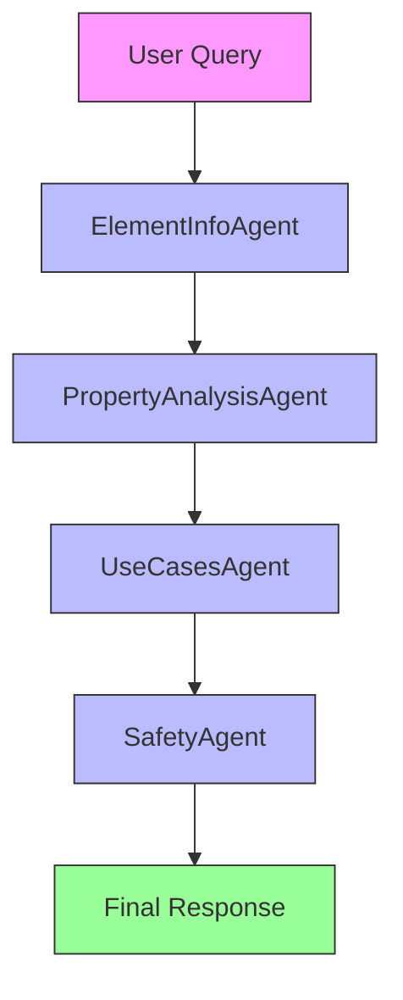
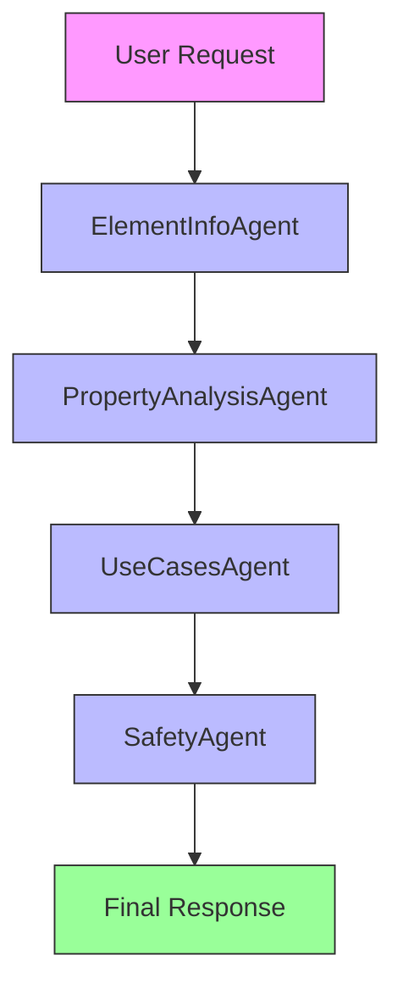

# PeriodicTable Application

## Overview

The PeriodicTable application provides detailed information about chemical elements from the periodic table. It supports both agentic and non-agentic approaches for fetching and analyzing element data.

## Agentic Approach

**Multi-agent system for comprehensive element analysis**

#### Agent Pipeline:


#### Agent Roles:

## Structure

```
PeriodicTable/
├── agentic/                  # Agentic approach
│   ├── __init__.py
│   ├── periodic_table_cli.py  # CLI interface
│   ├── periodic_table_element.py # Element analysis
│   └── periodic_table_models.py # Data models
│
├── nonagentic/               # Non-agentic approach
│   ├── __init__.py
│   ├── periodic_table_cli.py  # CLI interface
│   ├── periodic_table_element.py # Element analysis
│   └── periodic_table_models.py # Data models
│
└── tests/                    # Test suite
    └── test_periodic_table_mock.py
```

## Approaches

### 1. Non-Agentic Approach

**Simple, direct element information retrieval**

- Single `PeriodicTableElement` class handles all operations
- Direct API calls to fetch element data
- Suitable for straightforward element lookups
- Faster execution, less overhead

**Use Case:** Quick element property lookups, simple queries

### 2. Agentic Approach

**Multi-agent system for comprehensive element analysis**

#### Agent Roles:



**Agent Pipeline:**

1. **ElementInfoAgent** - Fetches basic element information
   - Role: Primary data collector
   - Responsibilities: Fetch atomic number, symbol, name, mass, etc.
   - Output: Basic element properties

2. **PropertyAnalysisAgent** - Analyzes chemical properties
   - Role: Property analyzer
   - Responsibilities: Examine electron configuration, oxidation states, etc.
   - Output: Detailed property analysis

3. **UseCasesAgent** - Identifies practical applications
   - Role: Application specialist
   - Responsibilities: Find industrial, medical, and scientific uses
   - Output: Use cases and applications

4. **SafetyAgent** - Assesses safety information
   - Role: Safety expert
   - Responsibilities: Evaluate toxicity, handling precautions, storage requirements
   - Output: Safety guidelines and warnings

**Use Case:** Comprehensive element analysis, detailed reports, safety assessments

## Data Models

### ElementInfo

```python
class ElementInfo(BaseModel):
    atomic_number: int
    symbol: str
    name: str
    atomic_mass: float
    period: int
    group: str
    block: str
    category: str
    electron_configuration: str
    physical_characteristics: PhysicalCharacteristics
    atomic_dimensions: AtomicDimensions
    chemical_characteristics: ChemicalCharacteristics
    uses: list[str]
    properties: list[str]
```

### PhysicalCharacteristics

```python
class PhysicalCharacteristics(BaseModel):
    standard_state: str
    melting_point: Optional[float] = None
    boiling_point: Optional[float] = None
    density: Optional[float] = None
    color: Optional[str] = None
```

## Usage Examples

### Non-Agentic Usage

```python
from PeriodicTable.nonagentic.periodic_table_element import PeriodicTableElement
from lite.lite_client import ModelConfig

# Initialize
config = ModelConfig(model="gemma3", temperature=0.2)
element_fetcher = PeriodicTableElement(config)

# Fetch element information
element_info = element_fetcher.fetch_element_info("Hydrogen")
print(f"Element: {element_info.name}")
print(f"Symbol: {element_info.symbol}")
print(f"Atomic Number: {element_info.atomic_number}")
```

### Agentic Usage

```python
from PeriodicTable.agentic.periodic_table_element import PeriodicTableElement
from lite.lite_client import ModelConfig

# Initialize
config = ModelConfig(model="gemma3", temperature=0.2)
element_analyzer = PeriodicTableElement(config)

# Comprehensive analysis
analysis = element_analyzer.analyze_element("Oxygen")
print(f"Element: {analysis.basic_info.name}")
print(f"Properties: {analysis.properties}")
print(f"Safety: {analysis.safety}")
```

## Testing

Run the test suite:

```bash
# From the PeriodicTable directory
PYTHONPATH=/path/to/project/root python -m pytest tests/test_periodic_table_mock.py
```

## Performance Comparison

| Metric | Non-Agentic | Agentic |
|--------|-------------|---------|
| Speed | ⚡ Fastest | 🐢 Slower |
| Complexity | Low | High |
| Detail Level | Basic | Comprehensive |
| Use Case | Quick lookups | Detailed analysis |

## When to Use Which Approach

**Use Non-Agentic when:**
- You need quick element property lookups
- Performance is critical
- Simple data retrieval is sufficient

**Use Agentic when:**
- Comprehensive element analysis is needed
- Safety information is required
- Detailed property breakdown is necessary
- Multiple perspectives on element usage are valuable

## CLI Usage

```bash
# Non-agentic CLI
python periodic_table_cli.py
python periodic_table_cli.py --element Gold
python periodic_table_cli.py --all

# Agentic CLI  
python periodic_table_cli.py --agentic --element Oxygen
python periodic_table_cli.py --agentic --all
```

Defaults:

- `--element`: `Hydrogen`
- `--model`: `ollama/gemma3:12b`
- `--temperature`: `0.2`
- `--output-dir`: `outputs`

## Limitations

- Generated element data may omit or misstate values
- `--all` can take substantial time and cost depending on the model backend
- Scientific facts should be verified before reuse in reference material
