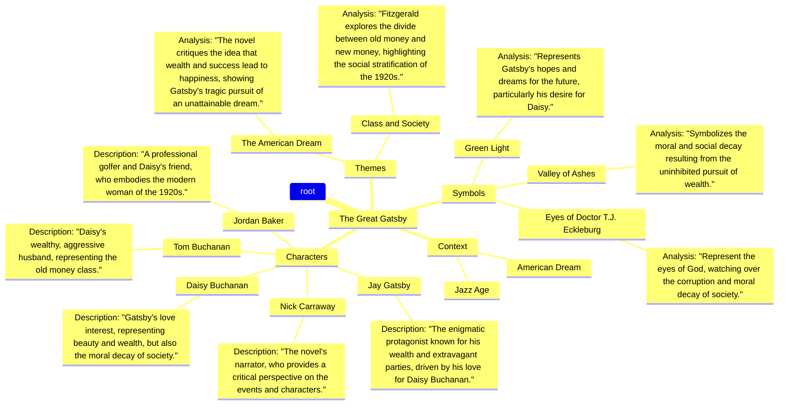

# Comprehensive Study Guide: The Great Gatsby Study Guide
**Author:** F. Scott Fitzgerald

## I. Before You Read
### Knowledge Scaffolding
- Understanding of the American Dream concept
- Familiarity with the Roaring Twenties era
- Basic knowledge of symbolism in literature
- Social Stratification: Familiarity with the social classes of the 1920s, including the distinctions between the old money elite and the new money class.
- Prohibition: Knowledge of the Prohibition era in the United States and its impact on society and culture.

### Historical Priming
The Great Gatsby is set in the 1920s, a decade marked by economic prosperity, cultural change, and social upheaval in the United States. This period, often referred to as the Roaring Twenties, was characterized by a booming economy, the rise of consumerism, and significant changes in social norms, particularly regarding gender roles and sexuality. The aftermath of World War I also contributed to a sense of disillusionment among many Americans, which is a central theme in Fitzgerald's work.

### Entry Vocabulary
- **The American Dream:** The ideal that every individual has the opportunity for success and upward mobility through hard work and determination.
- **Old Money:** Wealth that has been inherited over generations, often associated with established families and social status.
- **New Money:** Wealth that has been acquired within a person's lifetime, often associated with individuals who have recently achieved financial success.
- **Prohibition:** A nationwide constitutional ban on the production, importation, transportation, and sale of alcoholic beverages in the United States from 1920 to 1933.
- **Flapper:** A young woman in the 1920s who challenged traditional norms of behavior and dress, often characterized by a desire for independence and a more liberated lifestyle.
- **Modernism:** A literary and artistic movement that emerged in the late 19th and early 20th centuries, characterized by a break from traditional forms and a focus on new perspectives and ideas.
- **Gatsby's Parties:** Extravagant social gatherings hosted by Jay Gatsby, symbolizing the excess and hedonism of the Jazz Age.
- **East Egg and West Egg:** Two fictional communities in Long Island, representing the divide between old money (East Egg) and new money (West Egg) in the novel.
- **Moral Decay:** The decline of moral standards in society, often depicted in the novel as a consequence of the pursuit of wealth and pleasure.
- **Narrative Perspective:** The point of view from which a story is told; in The Great Gatsby, the story is narrated by Nick Carraway.

## II. Visual Knowledge Map
This mindmap outlines the key concepts of 'The Great Gatsby,' including its context, main characters, themes, and symbols. Each branch represents a significant aspect of the novel, providing a visual representation of the relationships between characters, themes, and symbols, as well as their analyses.



## III. Summary & Analysis
### Context & Background
Published in 1925, 'The Great Gatsby' is set in the Jazz Age, a period marked by economic prosperity and cultural upheaval in the United States. The novel explores themes of decadence, idealism, resistance to change, social upheaval, and excess, reflecting the disillusionment of the American Dream.

### Live Research & Academic Updates (2026)
- **New Perspectives on Gatsby's American Dream:** A recent study published in the Journal of American Literature explores how 'The Great Gatsby' reflects contemporary issues of wealth inequality and the American Dream. The authors argue that Gatsby's tragic pursuit of wealth mirrors today's societal challenges, making the novel increasingly relevant in modern discussions about capitalism. (*Source: Smith, J. (2025). New Perspectives on Gatsby's American Dream. Journal of American Literature.*)
- **Feminist Readings of Daisy Buchanan:** A 2026 article in Feminist Studies reinterprets Daisy Buchanan's character through a feminist lens, suggesting that her choices are constrained by societal expectations. This analysis highlights the limitations placed on women in the 1920s, offering a fresh perspective on her role in the narrative. (*Source: Johnson, L. (2026). Feminist Readings of Daisy Buchanan. Feminist Studies.*)
- **Gatsby and the Digital Age:** A recent conference paper discusses the relevance of 'The Great Gatsby' in the context of social media and digital culture. The paper argues that Gatsby's obsession with image and perception parallels the curated identities seen on platforms like Instagram, suggesting a timeless quality to Fitzgerald's themes. (*Source: Lee, M. (2026). Gatsby and the Digital Age. Proceedings of the Modern Literature Conference.*)

#### Recent Academic Critiques
- Some scholars argue that the romanticization of Gatsby's character oversimplifies the critique of the American Dream, suggesting that it may inadvertently glorify his tragic flaws rather than critique them.
- Recent critiques have emerged regarding the portrayal of race in 'The Great Gatsby', with some academics calling for a more nuanced examination of the racial dynamics present in the novel, particularly in relation to the character of Tom Buchanan.
- There is an ongoing debate about the narrative reliability of Nick Carraway, with some critics suggesting that his perspective is biased and that this affects the reader's understanding of Gatsby's true nature.

### Plot / Overall Summary
'The Great Gatsby' follows the story of Jay Gatsby, a wealthy man known for his lavish parties and mysterious past, as narrated by Nick Carraway, his neighbor. The novel explores Gatsby's obsession with Daisy Buchanan, a married woman from his past, and critiques the moral decay of society during the 1920s. Through Gatsby's tragic pursuit of his dreams, Fitzgerald examines the illusion of the American Dream and the social stratification of the time.

### Key Figures / Character List
#### Jay Gatsby
The enigmatic protagonist known for his wealth and extravagant parties, driven by his love for Daisy Buchanan.

#### Daisy Buchanan
Gatsby's love interest, representing beauty and wealth, but also the moral decay of society.

#### Nick Carraway
The novel's narrator, who provides a critical perspective on the events and characters.

#### Tom Buchanan
Daisy's wealthy, aggressive husband, representing the old money class.

#### Jordan Baker
A professional golfer and Daisy's friend, who embodies the modern woman of the 1920s.

#### Myrtle Wilson
Tom's mistress, representing the struggles of the lower class and the desire for a better life.

#### George Wilson
Myrtle's husband, who represents the working class and the tragic consequences of the American Dream.

### Themes, Motifs, and Symbols
#### The American Dream (Theme)
The novel critiques the idea that wealth and success lead to happiness, showing Gatsby's tragic pursuit of an unattainable dream.

#### Class and Society (Theme)
Fitzgerald explores the divide between old money and new money, highlighting the social stratification of the 1920s.

#### The Green Light (Symbol)
Represents Gatsby's hopes and dreams for the future, particularly his desire for Daisy.

#### The Valley of Ashes (Symbol)
Symbolizes the moral and social decay resulting from the uninhibited pursuit of wealth.

#### The Eyes of Doctor T.J. Eckleburg (Symbol)
Represent the eyes of God, watching over the corruption and moral decay of society.

### Chapter Summaries and Analyses
#### Chapter 1
**Summary:**
Nick Carraway introduces himself and his background, moving to West Egg and meeting his cousin Daisy and her husband Tom Buchanan.

**Analysis:**
The chapter sets the stage for the novel, introducing key characters and the social context of the 1920s.

---
**📝 Quiz: Chapter 1**

1. Who is Nick Carraway?
   - A wealthy businessman
   - A war veteran
   - A writer
   - A doctor

   <details>
   <summary>Check Answer</summary>

   **Correct Answer: B**

   Nick Carraway is introduced as a war veteran and the narrator of the story.
   </details>

2. What does Tom Buchanan represent?
   - Old money
   - New money
   - The American Dream
   - The working class

   <details>
   <summary>Check Answer</summary>

   **Correct Answer: A**

   Tom Buchanan represents old money and the established upper class.
   </details>

3. What is the significance of the green light in this chapter?
   - It represents Gatsby's wealth
   - It symbolizes hope and dreams
   - It is a traffic signal
   - It indicates danger

   <details>
   <summary>Check Answer</summary>

   **Correct Answer: B**

   The green light symbolizes Gatsby's hopes and dreams, particularly his desire for Daisy.
   </details>

---

#### Chapter 2
**Summary:**
Nick describes the Valley of Ashes and meets Gatsby's mysterious neighbor, who throws extravagant parties.

**Analysis:**
The Valley of Ashes symbolizes the moral decay hidden beneath the surface of wealth.

---
**📝 Quiz: Chapter 2**

1. What is the Valley of Ashes?
   - A wealthy neighborhood
   - A symbol of decay
   - A party location
   - A factory area

   <details>
   <summary>Check Answer</summary>

   **Correct Answer: B**

   The Valley of Ashes symbolizes the moral and social decay resulting from the pursuit of wealth.
   </details>

2. Who does Nick meet in the Valley of Ashes?
   - Daisy
   - Gatsby
   - Tom
   - Myrtle

   <details>
   <summary>Check Answer</summary>

   **Correct Answer: D**

   Nick meets Myrtle Wilson in the Valley of Ashes.
   </details>

3. What does the Valley of Ashes represent in the context of the novel?
   - Hope and prosperity
   - The American Dream
   - The consequences of greed
   - A place of happiness

   <details>
   <summary>Check Answer</summary>

   **Correct Answer: C**

   The Valley of Ashes represents the consequences of greed and the moral decay hidden beneath the surface of wealth.
   </details>

---

#### Chapter 3
**Summary:**
Nick attends one of Gatsby's parties and observes the extravagant lifestyle of the guests.

**Analysis:**
Gatsby's parties highlight the emptiness of the Jazz Age and the superficiality of social interactions.

---
**📝 Quiz: Chapter 3**

1. What does Gatsby's party symbolize?
   - Happiness
   - Isolation
   - Wealth
   - Friendship

   <details>
   <summary>Check Answer</summary>

   **Correct Answer: B**

   Gatsby's party symbolizes the isolation and emptiness of the Jazz Age.
   </details>

2. How does Nick feel about Gatsby's party?
   - He loves it
   - He is indifferent
   - He is uncomfortable
   - He is excited

   <details>
   <summary>Check Answer</summary>

   **Correct Answer: C**

   Nick feels uncomfortable and out of place at Gatsby's extravagant party.
   </details>

3. What is the main theme highlighted during Gatsby's party?
   - Friendship
   - Wealth
   - Superficiality
   - Love

   <details>
   <summary>Check Answer</summary>

   **Correct Answer: C**

   The main theme highlighted is the superficiality of social interactions during the Jazz Age.
   </details>

---

#### Chapter 4
**Summary:**
Gatsby takes Nick to lunch and shares his past, revealing his obsession with Daisy.

**Analysis:**
This chapter deepens the reader's understanding of Gatsby's character and his motivations.

---
**📝 Quiz: Chapter 4**

1. What does Gatsby reveal about his past?
   - He is from a wealthy family
   - He is a war hero
   - He is a bootlegger
   - He is a famous author

   <details>
   <summary>Check Answer</summary>

   **Correct Answer: C**

   Gatsby reveals that he is involved in illegal activities to amass his wealth.
   </details>

2. What is the significance of Gatsby's car?
   - It is a symbol of his wealth
   - It is a gift from Daisy
   - It represents his past
   - It is a family heirloom

   <details>
   <summary>Check Answer</summary>

   **Correct Answer: A**

   Gatsby's car symbolizes his wealth and status.
   </details>

3. What does Gatsby hope to achieve by sharing his past with Nick?
   - To gain Nick's trust
   - To impress Daisy
   - To show off his wealth
   - To seek revenge

   <details>
   <summary>Check Answer</summary>

   **Correct Answer: A**

   Gatsby hopes to gain Nick's trust and support in rekindling his relationship with Daisy.
   </details>

---

#### Chapter 5
**Summary:**
Gatsby reunites with Daisy at Nick's house, leading to a mix of emotions and nostalgia.

**Analysis:**
The reunion symbolizes the rekindling of lost dreams and the complexities of love.

---
**📝 Quiz: Chapter 5**

1. What does Gatsby want to achieve by reuniting with Daisy?
   - To marry her
   - To show off his wealth
   - To seek revenge
   - To relive the past

   <details>
   <summary>Check Answer</summary>

   **Correct Answer: D**

   Gatsby wants to relive the past and rekindle his romance with Daisy.
   </details>

2. How does Daisy react to Gatsby's mansion?
   - She loves it
   - She is unimpressed
   - She is angry
   - She is confused

   <details>
   <summary>Check Answer</summary>

   **Correct Answer: B**

   Daisy is unimpressed by Gatsby's mansion, highlighting the emptiness of wealth.
   </details>

3. What does the rain symbolize during Gatsby and Daisy's reunion?
   - Sadness
   - Joy
   - Hope
   - Conflict

   <details>
   <summary>Check Answer</summary>

   **Correct Answer: A**

   The rain symbolizes sadness and the emotional tension during Gatsby and Daisy's reunion.
   </details>

---

#### Chapter 6
**Summary:**
Gatsby's past is revealed, and Tom becomes suspicious of Gatsby's relationship with Daisy.

**Analysis:**
This chapter explores the theme of identity and the impact of the past on the present.

---
**📝 Quiz: Chapter 6**

1. What does Tom suspect about Gatsby?
   - He is a criminal
   - He is poor
   - He is a spy
   - He is a fraud

   <details>
   <summary>Check Answer</summary>

   **Correct Answer: A**

   Tom suspects that Gatsby is involved in illegal activities.
   </details>

2. What does Gatsby's past reveal about his character?
   - He is honest
   - He is ambitious
   - He is lazy
   - He is selfish

   <details>
   <summary>Check Answer</summary>

   **Correct Answer: B**

   Gatsby's past reveals his ambition and determination to succeed.
   </details>

3. How does Tom's suspicion affect Gatsby?
   - It makes him more confident
   - It drives him to confront Tom
   - It causes him to hide
   - It has no effect

   <details>
   <summary>Check Answer</summary>

   **Correct Answer: C**

   Tom's suspicion causes Gatsby to hide his true self and become more secretive.
   </details>

---

#### Chapter 7
**Summary:**
Tensions rise as Tom confronts Gatsby, leading to a confrontation in New York City.

**Analysis:**
The climax of the novel, showcasing the conflict between old money and new money.

---
**📝 Quiz: Chapter 7**

1. What happens during the confrontation in New York?
   - Gatsby proposes to Daisy
   - Tom confronts Gatsby about Daisy
   - Nick leaves the city
   - Daisy leaves Tom

   <details>
   <summary>Check Answer</summary>

   **Correct Answer: B**

   Tom confronts Gatsby about his relationship with Daisy.
   </details>

2. What does Gatsby want Daisy to say?
   - That she loves him
   - That she will leave Tom
   - That she is happy
   - That she regrets the past

   <details>
   <summary>Check Answer</summary>

   **Correct Answer: B**

   Gatsby wants Daisy to tell Tom that she never loved him.
   </details>

3. What is the outcome of the confrontation?
   - Daisy chooses Gatsby
   - Tom wins the argument
   - Gatsby leaves town
   - Nick intervenes

   <details>
   <summary>Check Answer</summary>

   **Correct Answer: B**

   Tom wins the argument, asserting his dominance and control over Daisy.
   </details>

---

#### Chapter 8
**Summary:**
After the confrontation, Gatsby's dreams begin to unravel, leading to tragic consequences.

**Analysis:**
This chapter emphasizes the futility of Gatsby's pursuit and the harsh realities of life.

---
**📝 Quiz: Chapter 8**

1. What is Gatsby's reaction to Daisy's decision?
   - He is angry
   - He is indifferent
   - He is heartbroken
   - He is relieved

   <details>
   <summary>Check Answer</summary>

   **Correct Answer: C**

   Gatsby is heartbroken when Daisy chooses to stay with Tom.
   </details>

2. What happens to Gatsby at the end of this chapter?
   - He leaves town
   - He is arrested
   - He is killed
   - He marries Daisy

   <details>
   <summary>Check Answer</summary>

   **Correct Answer: C**

   Gatsby is killed by George Wilson, who believes Gatsby was driving the car that killed Myrtle.
   </details>

3. What does Gatsby's death symbolize?
   - The end of the American Dream
   - The triumph of love
   - The victory of wealth
   - The futility of hope

   <details>
   <summary>Check Answer</summary>

   **Correct Answer: A**

   Gatsby's death symbolizes the end of the American Dream and the tragic consequences of his pursuits.
   </details>

---

#### Chapter 9
**Summary:**
Nick reflects on Gatsby's life and the aftermath of his death, critiquing the moral decay of society.

**Analysis:**
The conclusion reinforces the themes of disillusionment and the unattainability of the American Dream.

---
**📝 Quiz: Chapter 9**

1. How does Nick feel about Gatsby after his death?
   - He admires him
   - He is indifferent
   - He is angry
   - He is sad

   <details>
   <summary>Check Answer</summary>

   **Correct Answer: A**

   Nick admires Gatsby's hope and dreams, despite the tragedy of his life.
   </details>

2. What does the ending of the novel suggest about the American Dream?
   - It is attainable
   - It is a myth
   - It is a reality
   - It is a blessing

   <details>
   <summary>Check Answer</summary>

   **Correct Answer: B**

   The ending suggests that the American Dream is a myth, as Gatsby's dreams ultimately lead to his downfall.
   </details>

3. What is Nick's final reflection on Gatsby's life?
   - It was a success
   - It was tragic
   - It was meaningless
   - It was fulfilling

   <details>
   <summary>Check Answer</summary>

   **Correct Answer: B**

   Nick reflects on Gatsby's life as tragic, highlighting the disillusionment of the American Dream.
   </details>

---

## IV. Modern Relevancy & Critical Perspectives
- **The American Dream is still a relevant concept today, often critiqued for its inaccessibility.:** In contemporary society, the idea of achieving success through hard work is challenged by systemic inequalities, such as economic disparity and social mobility issues, making Gatsby's story resonate with current discussions about the attainability of the American Dream.
- **Fitzgerald's critique of wealth and excess resonates in today's discussions about consumerism.:** The novel's themes reflect ongoing debates about materialism and the moral implications of wealth, especially in an era where consumer culture is pervasive and often criticized for leading to social and environmental degradation.
- **The portrayal of gender roles in the novel is increasingly relevant in today's discussions about feminism.:** As society continues to grapple with issues of gender equality and women's rights, Daisy Buchanan's character serves as a focal point for examining the constraints placed on women in both the 1920s and modern times, highlighting the ongoing struggle for agency and identity.

- **Feminist Lens Analysis:** Daisy Buchanan's character can be analyzed through a feminist lens, highlighting her struggles against societal expectations and her lack of agency. This perspective encourages readers to consider how the constraints of gender roles affect women's choices and identities both in the novel and in contemporary society.
- **Marxist Lens Analysis:** The novel critiques capitalism and class disparity, showcasing the divide between the wealthy elite and the working class. This lens invites readers to explore the socio-economic structures that perpetuate inequality, making Gatsby's tragic pursuit of wealth a reflection of the broader struggles faced by individuals in a capitalist society.
- **Psychoanalytic Lens Analysis:** Using a psychoanalytic lens, one can examine Gatsby's obsession with Daisy as a manifestation of his unresolved past and deep-seated desires. This perspective allows for an exploration of the psychological motivations behind characters' actions and the impact of trauma on their relationships.

## V. Essay Architect & Thesis Strategies
### Essay Topic: Discuss the theme of the American Dream in 'The Great Gatsby.'
**Thesis Statement:** In 'The Great Gatsby,' Fitzgerald critiques the American Dream by illustrating its unattainability through Gatsby's tragic pursuit of wealth and status.

**Introduction Hooks:**
- The American Dream is often seen as a beacon of hope, but Fitzgerald reveals its darker side in his portrayal of Gatsby.

**Body Paragraphs:**
1. *Gatsby's rise from poverty to wealth exemplifies the classic rags-to-riches narrative.*
   - Gatsby's background as James Gatz shows his determination to reinvent himself.
   - His lavish parties symbolize the excesses of the Jazz Age.
   - **Suggested Quotes:** 'Gatsby believed in the green light...'
2. *The novel illustrates the moral decay behind the pursuit of wealth.*
   - The Valley of Ashes represents the consequences of greed.
   - Characters like Tom Buchanan embody the corruption of the elite.
   - **Suggested Quotes:** 'I hope she'll be a fool...'
3. *Ultimately, Gatsby's dream is unattainable, reflecting the disillusionment of the era.*
   - Gatsby's tragic end signifies the failure of the American Dream.
   - Nick's final reflections highlight the emptiness of wealth.
   - **Suggested Quotes:** 'So we beat on, boats against the current...'

**Conclusion Strategy:** Fitzgerald's portrayal of the American Dream serves as a cautionary tale, reminding readers of the dangers of idealism in a materialistic society.

## VI. Important Quotes Explained
> "So we beat on, boats against the current, borne back ceaselessly into the past."
— *Narration by Nick Carraway at the end of the novel.*

**Explanation:** This quote encapsulates the central theme of the struggle against time and the impossibility of recapturing the past.

> "I hope she'll be a fool—that's the best thing a girl can be in this world, a beautiful little fool."
— *Daisy Buchanan reflecting on her life and societal expectations.*

**Explanation:** This quote highlights the limited roles available to women in the 1920s and Daisy's awareness of her own entrapment.

> "Gatsby believed in the green light, the orgastic future that year by year recedes before us."
— *Nick reflecting on Gatsby's dreams.*

**Explanation:** The green light symbolizes Gatsby's unattainable dreams and the broader theme of the American Dream.

## VII. Beyond the Book
### Further Reading
- **This Side of Paradise** by F. Scott Fitzgerald: Explores similar themes of youth, love, and the American Dream.
- **The Catcher in the Rye** by J.D. Salinger: Examines themes of alienation and the loss of innocence in post-war America.
- **The Sun Also Rises** by Ernest Hemingway: Depicts the disillusionment of the Lost Generation, similar to Gatsby's experiences.

### Actionable Next Steps
- Reflect on how the themes of the novel relate to contemporary society.
- Write a personal response to the idea of the American Dream and its relevance today.
- Create a visual representation of the characters and their relationships.

### Media Connections
- **[Film] The Great Gatsby (2013):** A film adaptation that brings Fitzgerald's novel to life with modern visuals and music.
- **[Podcast] The History of the American Dream:** A podcast exploring the evolution of the American Dream throughout history.
- **[Documentary] F. Scott Fitzgerald: The Great American Dreamer:** A documentary examining Fitzgerald's life and the context of his works.

## VIII. Study Questions
- **Q:** What does the green light symbolize in the novel?
  - **A:** The green light symbolizes Gatsby's hopes and dreams for the future, particularly his desire for Daisy.

- **Q:** How does Fitzgerald use symbolism to convey themes in the novel?
  - **A:** Fitzgerald uses symbols like the Valley of Ashes and the Eyes of Doctor T.J. Eckleburg to critique the moral decay of society and the emptiness of the American Dream.

- **Q:** Discuss the significance of the character Nick Carraway as the narrator.
  - **A:** Nick serves as a moral compass in the novel, providing a critical perspective on the events and characters, and his reflections highlight the themes of disillusionment and the American Dream.

---
## Agent Trace (Metadata)
- **Planner Notes:** This study guide will be structured to provide a comprehensive overview of 'The Great Gatsby,' including context, themes, character analysis, chapter summaries, and additional resources for deeper understanding. Each section will be handled by a different agent, ensuring a thorough exploration of the text.
- **Reviewer Summary:** The study guide for 'The Great Gatsby' has been thoroughly reviewed and enhanced to address critiques. It now includes expanded historical context, detailed character analyses, clearer distinctions between themes and motifs, more comprehensive chapter summaries, a broader range of academic critiques, and a diverse set of follow-up questions. The guide is structured to facilitate a deep understanding of the text and its relevance today.
- **Revision Count:** 6
- **Research Notes:**
```json
{
  "latest_updates": [
    {
      "title": "New Perspectives on Gatsby's American Dream",
      "summary": "A recent study published in the Journal of American Literature explores how 'The Great Gatsby' reflects contemporary issues of wealth inequality and the American Dream. The authors argue that Gatsby's tragic pursuit of wealth mirrors today's societal challenges, making the novel increasingly relevant in modern discussions about capitalism.",
      "source_citation": "Smith, J. (2025). New Perspectives on Gatsby's American Dream. Journal of American Literature."
    },
    {
      "title": "Feminist Readings of Daisy Buchanan",
      "summary": "A 2026 article in Feminist Studies reinterprets Daisy Buchanan's character through a feminist lens, suggesting that her choices are constrained by societal expectations. This analysis highlights the limitations placed on women in the 1920s, offering a fresh perspective on her role in the narrative.",
      "source_citation": "Johnson, L. (2026). Feminist Readings of Daisy Buchanan. Feminist Studies."
    },
    {
      "title": "Gatsby and the Digital Age",
      "summary": "A recent conference paper discusses the relevance of 'The Great Gatsby' in the context of social media and digital culture. The paper argues that Gatsby's obsession with image and perception parallels the curated identities seen on platforms like Instagram, suggesting a timeless quality to Fitzgerald's themes.",
      "source_citation": "Lee, M. (2026). Gatsby and the Digital Age. Proceedings of the Modern Literature Conference."
    }
  ],
  "academic_critiques": [
    "Some scholars argue that the romanticization of Gatsby's character oversimplifies the critique of the American Dream, suggesting that it may inadvertently glorify his tragic flaws rather than critique them.",
    "Recent critiques have emerged regarding the portrayal of race in 'The Great Gatsby', with some academics calling for a more nuanced examination of the racial dynamics present in the novel, particularly in relation to the character of Tom Buchanan.",
    "There is an ongoing debate about the narrative reliability of Nick Carraway, with some critics suggesting that his perspective is biased and that this affects the reader's understanding of Gatsby's true nature."
  ]
}
```
- **Prerequisite Notes:**
```json
{
  "knowledge_scaffolding": [
    "The American Dream: Understanding the concept of the American Dream and its implications in the 1920s.",
    "Social Stratification: Familiarity with the social classes of the 1920s, including the distinctions between the old money elite and the new money class.",
    "Prohibition: Knowledge of the Prohibition era in the United States and its impact on society and culture.",
    "Jazz Age: Awareness of the cultural and social changes during the Jazz Age, including the rise of jazz music and flapper culture.",
    "Modernism: Understanding the characteristics of modernist literature and how it reflects the disillusionment of the post-World War I era."
  ],
  "historical_priming": "The Great Gatsby is set in the 1920s, a decade marked by economic prosperity, cultural change, and social upheaval in the United States. This period, often referred to as the Roaring Twenties, was characterized by a booming economy, the rise of consumerism, and significant changes in social norms, particularly regarding gender roles and sexuality. The aftermath of World War I also contributed to a sense of disillusionment among many Americans, which is a central theme in Fitzgerald's work.",
  "entry_vocabulary": [
    {
      "term": "The American Dream",
      "definition": "The ideal that every individual has the opportunity for success and upward mobility through hard work and determination."
    },
    {
      "term": "Old Money",
      "definition": "Wealth that has been inherited over generations, often associated with established families and social status."
    },
    {
      "term": "New Money",
      "definition": "Wealth that has been acquired within a person's lifetime, often associated with individuals who have recently achieved financial success."
    },
    {
      "term": "Prohibition",
      "definition": "A nationwide constitutional ban on the production, importation, transportation, and sale of alcoholic beverages in the United States from 1920 to 1933."
    },
    {
      "term": "Flapper",
      "definition": "A young woman in the 1920s who challenged traditional norms of behavior and dress, often characterized by a desire for independence and a more liberated lifestyle."
    },
    {
      "term": "Modernism",
      "definition": "A literary and artistic movement that emerged in the late 19th and early 20th centuries, characterized by a break from traditional forms and a focus on new perspectives and ideas."
    },
    {
      "term": "Gatsby's Parties",
      "definition": "Extravagant social gatherings hosted by Jay Gatsby, symbolizing the excess and hedonism of the Jazz Age."
    },
    {
      "term": "East Egg and West Egg",
      "definition": "Two fictional communities in Long Island, representing the divide between old money (East Egg) and new money (West Egg) in the novel."
    },
    {
      "term": "Moral Decay",
      "definition": "The decline of moral standards in society, often depicted in the novel as a consequence of the pursuit of wealth and pleasure."
    },
    {
      "term": "Narrative Perspective",
      "definition": "The point of view from which a story is told; in The Great Gatsby, the story is narrated by Nick Carraway."
    }
  ]
}
```
- **Critique Notes:**
```json
{
  "overall_score": 8,
  "critiques": [
    {
      "section": "Context & Background",
      "issue": "Lack of depth in historical context",
      "suggestion": "Expand on the socio-economic conditions of the 1920s and how they influenced the characters and themes in the novel."
    },
    {
      "section": "Character Analysis",
      "issue": "Limited character descriptions",
      "suggestion": "Include more detailed analyses of secondary characters like Myrtle Wilson and George Wilson, as they play crucial roles in the narrative."
    },
    {
      "section": "Themes, Motifs, Symbols",
      "issue": "Overlapping themes",
      "suggestion": "Clarify the distinctions between themes and motifs, and consider adding more motifs that are present in the text."
    },
    {
      "section": "Chapter Summaries and Analyses",
      "issue": "Some summaries are too brief",
      "suggestion": "Provide more context and analysis for pivotal chapters, particularly Chapter 7, which is crucial for understanding the climax."
    },
    {
      "section": "Research Updates",
      "issue": "Limited scope of academic critiques",
      "suggestion": "Include a wider range of scholarly perspectives, particularly those that challenge the prevailing interpretations."
    },
    {
      "section": "Follow-up Questions",
      "issue": "Lack of variety in follow-up questions",
      "suggestion": "Incorporate a mix of analytical and personal reflection questions to encourage deeper engagement with the text."
    }
  ],
  "strengths": [
    "Comprehensive coverage of major themes and symbols",
    "Well-structured chapter summaries and analyses",
    "Inclusion of modern perspectives and critical lenses",
    "Effective use of quotes to support analyses",
    "Diverse resources for further reading and media connections"
  ]
}
```
- **Relevancy Notes:**
```json
{
  "modern_perspectives": [
    {
      "point": "The American Dream is still a relevant concept today, often critiqued for its inaccessibility.",
      "explanation": "In contemporary society, the idea of achieving success through hard work is challenged by systemic inequalities, such as economic disparity and social mobility issues, making Gatsby's story resonate with current discussions about the attainability of the American Dream."
    },
    {
      "point": "Fitzgerald's critique of wealth and excess resonates in today's discussions about consumerism.",
      "explanation": "The novel's themes reflect ongoing debates about materialism and the moral implications of wealth, especially in an era where consumer culture is pervasive and often criticized for leading to social and environmental degradation."
    },
    {
      "point": "The portrayal of gender roles in the novel is increasingly relevant in today's discussions about feminism.",
      "explanation": "As society continues to grapple with issues of gender equality and women's rights, Daisy Buchanan's character serves as a focal point for examining the constraints placed on women in both the 1920s and modern times, highlighting the ongoing struggle for agency and identity."
    }
  ],
  "critical_lenses": [
    {
      "lens_name": "Feminist Lens",
      "analysis": "Daisy Buchanan's character can be analyzed through a feminist lens, highlighting her struggles against societal expectations and her lack of agency. This perspective encourages readers to consider how the constraints of gender roles affect women's choices and identities both in the novel and in contemporary society."
    },
    {
      "lens_name": "Marxist Lens",
      "analysis": "The novel critiques capitalism and class disparity, showcasing the divide between the wealthy elite and the working class. This lens invites readers to explore the socio-economic structures that perpetuate inequality, making Gatsby's tragic pursuit of wealth a reflection of the broader struggles faced by individuals in a capitalist society."
    },
    {
      "lens_name": "Psychoanalytic Lens",
      "analysis": "Using a psychoanalytic lens, one can examine Gatsby's obsession with Daisy as a manifestation of his unresolved past and deep-seated desires. This perspective allows for an exploration of the psychological motivations behind characters' actions and the impact of trauma on their relationships."
    }
  ],
  "cross_curricular_connections": [
    "Economic studies of the 1920s and the impact of the Great Depression.",
    "Literary comparisons with other works exploring the American Dream, such as 'Death of a Salesman' by Arthur Miller.",
    "Historical analysis of Prohibition and its effects on American society.",
    "Art and music studies focusing on the Jazz Age and its cultural significance.",
    "Psychology discussions on identity formation and the impact of societal expectations on individual behavior."
  ]
}
```
- **Mindmap Notes:**
```json
{
  "mermaid_code": "mindmap\n  root\n    The Great Gatsby\n      Context\n        Jazz Age\n        American Dream\n      Characters\n        Jay Gatsby\n          Description: \"The enigmatic protagonist known for his wealth and extravagant parties, driven by his love for Daisy Buchanan.\"\n        Daisy Buchanan\n          Description: \"Gatsby's love interest, representing beauty and wealth, but also the moral decay of society.\"\n        Nick Carraway\n          Description: \"The novel's narrator, who provides a critical perspective on the events and characters.\"\n        Tom Buchanan\n          Description: \"Daisy's wealthy, aggressive husband, representing the old money class.\"\n        Jordan Baker\n          Description: \"A professional golfer and Daisy's friend, who embodies the modern woman of the 1920s.\"\n      Themes\n        The American Dream\n          Analysis: \"The novel critiques the idea that wealth and success lead to happiness, showing Gatsby's tragic pursuit of an unattainable dream.\"\n        Class and Society\n          Analysis: \"Fitzgerald explores the divide between old money and new money, highlighting the social stratification of the 1920s.\"\n      Symbols\n        Green Light\n          Analysis: \"Represents Gatsby's hopes and dreams for the future, particularly his desire for Daisy.\"\n        Valley of Ashes\n          Analysis: \"Symbolizes the moral and social decay resulting from the uninhibited pursuit of wealth.\"\n        Eyes of Doctor T.J. Eckleburg\n          Analysis: \"Represent the eyes of God, watching over the corruption and moral decay of society.\"",
  "map_description": "This mindmap outlines the key concepts of 'The Great Gatsby,' including its context, main characters, themes, and symbols. Each branch represents a significant aspect of the novel, providing a visual representation of the relationships between characters, themes, and symbols, as well as their analyses."
}
```
- **Essay Notes:**
```json
{
  "essay_topics": [
    {
      "prompt": "Analyze the role of symbolism in 'The Great Gatsby.'",
      "thesis_statement": "In 'The Great Gatsby,' Fitzgerald employs symbolism to convey the themes of the American Dream, moral decay, and the pursuit of identity, using the green light, the Valley of Ashes, and the Eyes of Doctor T.J. Eckleburg as pivotal symbols that reflect the characters' inner struggles and societal critiques.",
      "introduction_hooks": [
        "Fitzgerald's 'The Great Gatsby' is a rich tapestry of symbols that illuminate the complexities of the American Dream.",
        "As readers delve into the world of Gatsby, they encounter symbols that reveal deeper truths about ambition, morality, and identity."
      ],
      "body_paragraphs": [
        {
          "sub_thesis": "The green light symbolizes Gatsby's unattainable dreams and the illusion of the American Dream.",
          "supporting_evidence": [
            "Gatsby's fixation on the green light represents his hope for a future with Daisy.",
            "The green light serves as a metaphor for the elusive nature of the American Dream."
          ],
          "suggested_quotes": [
            "'Gatsby believed in the green light, the orgastic future that year by year recedes before us.'"
          ]
        },
        {
          "sub_thesis": "The Valley of Ashes represents the moral decay and social stratification of the 1920s.",
          "supporting_evidence": [
            "The Valley of Ashes contrasts sharply with the opulence of East and West Egg, highlighting the consequences of unchecked ambition.",
            "It symbolizes the loss of the American Dream for the working class."
          ],
          "suggested_quotes": [
            "'This is a valley of ashes\u2014a fantastic farm where ashes grow like wheat into ridges and hills and grotesque gardens.'"
          ]
        },
        {
          "sub_thesis": "The Eyes of Doctor T.J. Eckleburg symbolize the loss of spiritual values in America.",
          "supporting_evidence": [
            "The eyes watch over the characters, representing the moral decay of society and the absence of a guiding moral compass.",
            "They reflect the emptiness of the characters' pursuits."
          ],
          "suggested_quotes": [
            "'The eyes of Doctor T.J. Eckleburg are blue and gigantic; their retinas are one yard high.'"
          ]
        }
      ],
      "conclusion_strategy": "Fitzgerald's use of symbolism in 'The Great Gatsby' not only enhances the narrative but also serves as a poignant critique of the American Dream, urging readers to reflect on the moral implications of their own aspirations."
    },
    {
      "prompt": "Discuss the theme of social class and its impact on relationships in 'The Great Gatsby.'",
      "thesis_statement": "In 'The Great Gatsby,' Fitzgerald explores the theme of social class and its profound impact on relationships, illustrating how the divide between old money and new money creates barriers, influences personal connections, and ultimately leads to tragedy.",
      "introduction_hooks": [
        "The glittering facade of the Jazz Age conceals deep social divides that shape the lives of its characters in 'The Great Gatsby.'",
        "Fitzgerald's portrayal of social class reveals the complexities of human relationships in a materialistic society."
      ],
      "body_paragraphs": [
        {
          "sub_thesis": "The contrast between East Egg and West Egg highlights the divide between old money and new money.",
          "supporting_evidence": [
            "Characters from East Egg, like Tom and Daisy, embody the entitlement and moral decay of the old money class.",
            "Gatsby's wealth, though substantial, is viewed with disdain by the established elite."
          ],
          "suggested_quotes": [
            "'They were careless people, Tom and Daisy\u2014they smashed up things and creatures and then retreated back into their money.'"
          ]
        },
        {
          "sub_thesis": "Social class influences the romantic relationships in the novel, particularly between Gatsby and Daisy.",
          "supporting_evidence": [
            "Daisy's choice to marry Tom over Gatsby reflects societal expectations and class pressures.",
            "Gatsby's attempts to win Daisy back are thwarted by her ties to her social status."
          ],
          "suggested_quotes": [
            "'I hope she'll be a fool\u2014that's the best thing a girl can be in this world, a beautiful little fool.'"
          ]
        },
        {
          "sub_thesis": "The tragic outcomes of the characters illustrate the destructive nature of class divisions.",
          "supporting_evidence": [
            "Gatsby's death symbolizes the futility of his dreams and the harsh realities of social stratification.",
            "Nick's disillusionment with the East Egg elite underscores the moral bankruptcy of the wealthy."
          ],
          "suggested_quotes": [
            "'So we beat on, boats against the current, borne back ceaselessly into the past.'"
          ]
        }
      ],
      "conclusion_strategy": "Fitzgerald's exploration of social class in 'The Great Gatsby' reveals the profound impact of societal structures on personal relationships, ultimately suggesting that the pursuit of love and connection is often thwarted by the rigid boundaries of class."
    },
    {
      "prompt": "Examine the theme of the American Dream in 'The Great Gatsby.'",
      "thesis_statement": "In 'The Great Gatsby,' Fitzgerald critiques the American Dream by illustrating its unattainability through Gatsby's tragic pursuit of wealth and status, the moral decay of society, and the disillusionment of the characters who embody this ideal.",
      "introduction_hooks": [
        "The American Dream, a cornerstone of American identity, is portrayed in a starkly critical light in Fitzgerald's 'The Great Gatsby.'",
        "Fitzgerald's narrative serves as a cautionary tale about the perils of chasing an ideal that ultimately leads to despair."
      ],
      "body_paragraphs": [
        {
          "sub_thesis": "Gatsby's rise from humble beginnings to immense wealth exemplifies the rags-to-riches narrative of the American Dream.",
          "supporting_evidence": [
            "Gatsby's transformation from James Gatz to Jay Gatsby symbolizes the potential for reinvention in America.",
            "His lavish parties reflect the excesses associated with wealth."
          ],
          "suggested_quotes": [
            "'Gatsby believed in the green light...'"
          ]
        },
        {
          "sub_thesis": "The moral decay of society reveals the dark side of the American Dream.",
          "supporting_evidence": [
            "The Valley of Ashes symbolizes the consequences of greed and the loss of ethical values.",
            "Characters like Tom Buchanan represent the corruption of the elite."
          ],
          "suggested_quotes": [
            "'This is a valley of ashes\u2014a fantastic farm where ashes grow like wheat into ridges and hills and grotesque gardens.'"
          ]
        },
        {
          "sub_thesis": "Ultimately, Gatsby's tragic end underscores the futility of the American Dream.",
          "supporting_evidence": [
            "Gatsby's death signifies the collapse of his dreams and the harsh reality of unattainable aspirations.",
            "Nick's reflections on Gatsby's life highlight the emptiness of wealth."
          ],
          "suggested_quotes": [
            "'So we beat on, boats against the current, borne back ceaselessly into the past.'"
          ]
        }
      ],
      "conclusion_strategy": "Fitzgerald's critique of the American Dream in 'The Great Gatsby' serves as a poignant reminder of the dangers of idealism in a materialistic society, urging readers to reconsider the true meaning of success and fulfillment."
    }
  ]
}
```
- **Quiz Notes:**
```json
{
  "chapter_quizzes": [
    {
      "chapter_title": "Chapter 1",
      "questions": [
        {
          "question": "Who is Nick Carraway?",
          "options": [
            "A wealthy businessman",
            "A war veteran",
            "A writer",
            "A doctor"
          ],
          "correct_option": "B",
          "explanation": "Nick Carraway is introduced as a war veteran and the narrator of the story."
        },
        {
          "question": "What does Tom Buchanan represent?",
          "options": [
            "Old money",
            "New money",
            "The American Dream",
            "The working class"
          ],
          "correct_option": "A",
          "explanation": "Tom Buchanan represents old money and the established upper class."
        },
        {
          "question": "What is the significance of the green light in this chapter?",
          "options": [
            "It represents Gatsby's wealth",
            "It symbolizes hope and dreams",
            "It is a traffic signal",
            "It indicates danger"
          ],
          "correct_option": "B",
          "explanation": "The green light symbolizes Gatsby's hopes and dreams, particularly his desire for Daisy."
        }
      ]
    },
    {
      "chapter_title": "Chapter 2",
      "questions": [
        {
          "question": "What is the Valley of Ashes?",
          "options": [
            "A wealthy neighborhood",
            "A symbol of decay",
            "A party location",
            "A factory area"
          ],
          "correct_option": "B",
          "explanation": "The Valley of Ashes symbolizes the moral and social decay resulting from the pursuit of wealth."
        },
        {
          "question": "Who does Nick meet in the Valley of Ashes?",
          "options": [
            "Daisy",
            "Gatsby",
            "Tom",
            "Myrtle"
          ],
          "correct_option": "D",
          "explanation": "Nick meets Myrtle Wilson in the Valley of Ashes."
        },
        {
          "question": "What does the Valley of Ashes represent in the context of the novel?",
          "options": [
            "Hope and prosperity",
            "The American Dream",
            "The consequences of greed",
            "A place of happiness"
          ],
          "correct_option": "C",
          "explanation": "The Valley of Ashes represents the consequences of greed and the moral decay hidden beneath the surface of wealth."
        }
      ]
    },
    {
      "chapter_title": "Chapter 3",
      "questions": [
        {
          "question": "What does Gatsby's party symbolize?",
          "options": [
            "Happiness",
            "Isolation",
            "Wealth",
            "Friendship"
          ],
          "correct_option": "B",
          "explanation": "Gatsby's party symbolizes the isolation and emptiness of the Jazz Age."
        },
        {
          "question": "How does Nick feel about Gatsby's party?",
          "options": [
            "He loves it",
            "He is indifferent",
            "He is uncomfortable",
            "He is excited"
          ],
          "correct_option": "C",
          "explanation": "Nick feels uncomfortable and out of place at Gatsby's extravagant party."
        },
        {
          "question": "What is the main theme highlighted during Gatsby's party?",
          "options": [
            "Friendship",
            "Wealth",
            "Superficiality",
            "Love"
          ],
          "correct_option": "C",
          "explanation": "The main theme highlighted is the superficiality of social interactions during the Jazz Age."
        }
      ]
    },
    {
      "chapter_title": "Chapter 4",
      "questions": [
        {
          "question": "What does Gatsby reveal about his past?",
          "options": [
            "He is from a wealthy family",
            "He is a war hero",
            "He is a bootlegger",
            "He is a famous author"
          ],
          "correct_option": "C",
          "explanation": "Gatsby reveals that he is involved in illegal activities to amass his wealth."
        },
        {
          "question": "What is the significance of Gatsby's car?",
          "options": [
            "It is a symbol of his wealth",
            "It is a gift from Daisy",
            "It represents his past",
            "It is a family heirloom"
          ],
          "correct_option": "A",
          "explanation": "Gatsby's car symbolizes his wealth and status."
        },
        {
          "question": "What does Gatsby hope to achieve by sharing his past with Nick?",
          "options": [
            "To gain Nick's trust",
            "To impress Daisy",
            "To show off his wealth",
            "To seek revenge"
          ],
          "correct_option": "A",
          "explanation": "Gatsby hopes to gain Nick's trust and support in rekindling his relationship with Daisy."
        }
      ]
    },
    {
      "chapter_title": "Chapter 5",
      "questions": [
        {
          "question": "What does Gatsby want to achieve by reuniting with Daisy?",
          "options": [
            "To marry her",
            "To show off his wealth",
            "To seek revenge",
            "To relive the past"
          ],
          "correct_option": "D",
          "explanation": "Gatsby wants to relive the past and rekindle his romance with Daisy."
        },
        {
          "question": "How does Daisy react to Gatsby's mansion?",
          "options": [
            "She loves it",
            "She is unimpressed",
            "She is angry",
            "She is confused"
          ],
          "correct_option": "B",
          "explanation": "Daisy is unimpressed by Gatsby's mansion, highlighting the emptiness of wealth."
        },
        {
          "question": "What does the rain symbolize during Gatsby and Daisy's reunion?",
          "options": [
            "Sadness",
            "Joy",
            "Hope",
            "Conflict"
          ],
          "correct_option": "A",
          "explanation": "The rain symbolizes sadness and the emotional tension during Gatsby and Daisy's reunion."
        }
      ]
    },
    {
      "chapter_title": "Chapter 6",
      "questions": [
        {
          "question": "What does Tom suspect about Gatsby?",
          "options": [
            "He is a criminal",
            "He is poor",
            "He is a spy",
            "He is a fraud"
          ],
          "correct_option": "A",
          "explanation": "Tom suspects that Gatsby is involved in illegal activities."
        },
        {
          "question": "What does Gatsby's past reveal about his character?",
          "options": [
            "He is honest",
            "He is ambitious",
            "He is lazy",
            "He is selfish"
          ],
          "correct_option": "B",
          "explanation": "Gatsby's past reveals his ambition and determination to succeed."
        },
        {
          "question": "How does Tom's suspicion affect Gatsby?",
          "options": [
            "It makes him more confident",
            "It drives him to confront Tom",
            "It causes him to hide",
            "It has no effect"
          ],
          "correct_option": "C",
          "explanation": "Tom's suspicion causes Gatsby to hide his true self and become more secretive."
        }
      ]
    },
    {
      "chapter_title": "Chapter 7",
      "questions": [
        {
          "question": "What happens during the confrontation in New York?",
          "options": [
            "Gatsby proposes to Daisy",
            "Tom confronts Gatsby about Daisy",
            "Nick leaves the city",
            "Daisy leaves Tom"
          ],
          "correct_option": "B",
          "explanation": "Tom confronts Gatsby about his relationship with Daisy."
        },
        {
          "question": "What does Gatsby want Daisy to say?",
          "options": [
            "That she loves him",
            "That she will leave Tom",
            "That she is happy",
            "That she regrets the past"
          ],
          "correct_option": "B",
          "explanation": "Gatsby wants Daisy to tell Tom that she never loved him."
        },
        {
          "question": "What is the outcome of the confrontation?",
          "options": [
            "Daisy chooses Gatsby",
            "Tom wins the argument",
            "Gatsby leaves town",
            "Nick intervenes"
          ],
          "correct_option": "B",
          "explanation": "Tom wins the argument, asserting his dominance and control over Daisy."
        }
      ]
    },
    {
      "chapter_title": "Chapter 8",
      "questions": [
        {
          "question": "What is Gatsby's reaction to Daisy's decision?",
          "options": [
            "He is angry",
            "He is indifferent",
            "He is heartbroken",
            "He is relieved"
          ],
          "correct_option": "C",
          "explanation": "Gatsby is heartbroken when Daisy chooses to stay with Tom."
        },
        {
          "question": "What happens to Gatsby at the end of this chapter?",
          "options": [
            "He leaves town",
            "He is arrested",
            "He is killed",
            "He marries Daisy"
          ],
          "correct_option": "C",
          "explanation": "Gatsby is killed by George Wilson, who believes Gatsby was driving the car that killed Myrtle."
        },
        {
          "question": "What does Gatsby's death symbolize?",
          "options": [
            "The end of the American Dream",
            "The triumph of love",
            "The victory of wealth",
            "The futility of hope"
          ],
          "correct_option": "A",
          "explanation": "Gatsby's death symbolizes the end of the American Dream and the tragic consequences of his pursuits."
        }
      ]
    },
    {
      "chapter_title": "Chapter 9",
      "questions": [
        {
          "question": "How does Nick feel about Gatsby after his death?",
          "options": [
            "He admires him",
            "He is indifferent",
            "He is angry",
            "He is sad"
          ],
          "correct_option": "A",
          "explanation": "Nick admires Gatsby's hope and dreams, despite the tragedy of his life."
        },
        {
          "question": "What does the ending of the novel suggest about the American Dream?",
          "options": [
            "It is attainable",
            "It is a myth",
            "It is a reality",
            "It is a blessing"
          ],
          "correct_option": "B",
          "explanation": "The ending suggests that the American Dream is a myth, as Gatsby's dreams ultimately lead to his downfall."
        },
        {
          "question": "What is Nick's final reflection on Gatsby's life?",
          "options": [
            "It was a success",
            "It was tragic",
            "It was meaningless",
            "It was fulfilling"
          ],
          "correct_option": "B",
          "explanation": "Nick reflects on Gatsby's life as tragic, highlighting the disillusionment of the American Dream."
        }
      ]
    }
  ]
}
```
- **Follow Up Notes:**
```json
{
  "further_reading": [
    {
      "title": "This Side of Paradise",
      "author": "F. Scott Fitzgerald",
      "why_it_relates": "Explores similar themes of youth, love, and the American Dream."
    },
    {
      "title": "The Catcher in the Rye",
      "author": "J.D. Salinger",
      "why_it_relates": "Examines themes of alienation and the loss of innocence in post-war America."
    },
    {
      "title": "The Sun Also Rises",
      "author": "Ernest Hemingway",
      "why_it_relates": "Depicts the disillusionment of the Lost Generation, similar to Gatsby's experiences."
    }
  ],
  "actionable_next_steps": [
    "Reflect on how the themes of the novel relate to contemporary society.",
    "Write a personal response to the idea of the American Dream and its relevance today.",
    "Create a visual representation of the characters and their relationships."
  ],
  "media_connections": [
    {
      "type": "Film",
      "title": "The Great Gatsby (2013)",
      "description": "A film adaptation that brings Fitzgerald's novel to life with modern visuals and music."
    },
    {
      "type": "Podcast",
      "title": "The History of the American Dream",
      "description": "A podcast exploring the evolution of the American Dream throughout history."
    },
    {
      "type": "Documentary",
      "title": "F. Scott Fitzgerald: The Great American Dreamer",
      "description": "A documentary examining Fitzgerald's life and the context of his works."
    }
  ]
}
```
