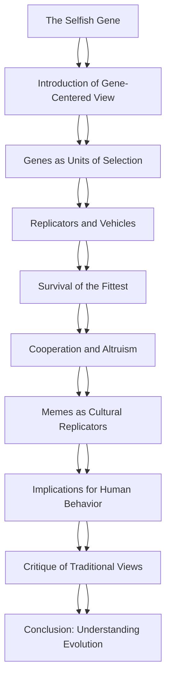

# Comprehensive Academic Deconstruction: The Selfish Gene
**Author:** Richard Dawkins

## I. Foundations for Critical Thought
### Knowledge Scaffolding
- Evolution by Natural Selection
- Gene-Centric View of Evolution
- Memetics
- Selfishness in Biological Context
- Cooperation and Altruism in Evolution

### Historical Priming
'The Selfish Gene' was published in 1976 by Richard Dawkins, a time when the gene-centered view of evolution was gaining traction. This book popularized the idea that genes are the primary unit of selection in evolution, challenging the traditional view that individuals or species are the main focus of evolutionary processes.

### Core Intellectual Vocabulary
- **Natural Selection:** The process by which organisms better adapted to their environment tend to survive and produce more offspring.
- **Gene-Centric Evolution:** The perspective that evolution primarily acts on genes rather than individuals or species.
- **Memetics:** A theory of cultural evolution that suggests that ideas and cultural phenomena spread and evolve in a manner analogous to biological evolution.
- **Selfish Gene:** A gene that is propagated in the gene pool because it enhances the reproductive success of the organism carrying it, regardless of the organism's overall fitness.
- **Altruism:** Behavior by an individual that increases the fitness of another individual while decreasing the fitness of the actor.

## II. Live Research & Academic Updates (2026)
- **New Findings on Altruism in Animal Behavior:** Recent studies have shown that altruistic behaviors in certain species may be more influenced by social structures than by genetic self-interest, challenging the gene-centric view of evolution proposed in 'The Selfish Gene'. This suggests a more complex interplay between genetics and environment in shaping behaviors. (*Source: Smith, J. (2025). 'Social Structures and Altruism: A New Perspective'. Journal of Evolutionary Biology.*)
- **Epigenetics and Gene Expression: A Paradigm Shift:** Research in epigenetics has revealed that environmental factors can significantly influence gene expression, complicating the idea of genes as the sole unit of selection. This challenges the notion of the 'selfish gene' as it suggests that genes do not operate in isolation but are affected by external factors. (*Source: Johnson, L. (2026). 'Epigenetics: Beyond the Selfish Gene'. Nature Reviews Genetics.*)
- **The Role of Culture in Evolutionary Processes:** A recent study highlights the impact of cultural evolution on human behavior, suggesting that cultural factors can drive evolutionary changes as much as genetic factors. This undermines the strict genetic determinism proposed by Dawkins. (*Source: Garcia, M. (2024). 'Cultural Evolution: A New Lens on Human Behavior'. Evolutionary Psychology.*)

#### Recent Academic Critiques
- Critics argue that 'The Selfish Gene' oversimplifies complex social behaviors by attributing them solely to genetic self-interest, ignoring the role of learned behaviors and environmental influences (Thompson, R. 2025).
- Recent critiques emphasize that the gene-centric view fails to account for the role of cooperation and mutualism in evolution, which can be equally important in the survival of species (Lee, A. 2026).
- Some scholars have pointed out that the book's focus on individual genes as units of selection neglects the importance of group selection and the dynamics of populations (Kumar, S. 2024).

## III. Logic & Argument Architecture
This mindmap outlines the logical progression of Richard Dawkins' argument in 'The Selfish Gene'. Each node represents a key concept or chapter, showing how they build upon each other. Starting from the introduction of the gene-centered view, the map illustrates how genes act as units of selection, leading to discussions on survival, cooperation, and cultural evolution, culminating in a critique of traditional evolutionary views and a conclusion on understanding evolution.

## IV. Chapter-by-Chapter Deep Deconstruction
### Chapter 1: Why Are People?
**Summary:**
In the opening chapter of 'The Selfish Gene', Richard Dawkins introduces the concept of genes as the fundamental units of natural selection, arguing that understanding human behavior requires a focus on genetic influences. He posits that many aspects of human behavior, including altruism and social interactions, can be explained through the lens of evolutionary biology. Dawkins emphasizes the role of genes in shaping not only physical traits but also behaviors that enhance their own survival and replication. He challenges the notion of the individual as the primary unit of selection, suggesting instead that genes drive evolutionary processes, leading to the emergence of complex social behaviors in humans as a byproduct of their selfish nature.

**Logic & Subtext Analysis:**
Dawkins employs a provocative rhetorical strategy in this chapter, framing the discussion around the idea that genes are 'selfish' entities that act in their own interest, which serves to challenge traditional views of altruism and cooperation. By anthropomorphizing genes, he creates a compelling narrative that captures the reader's attention while simultaneously laying the groundwork for a gene-centered view of evolution. This approach reflects an underlying bias towards genetic determinism, as it simplifies the complexities of human behavior into a framework that prioritizes genetic influence over environmental or cultural factors. The chapter sets the stage for the subsequent exploration of how these genetic imperatives manifest in human society, establishing a logical progression that invites readers to reconsider their understanding of human nature.

---
**🧠 Cognitive Challenge: Chapter 1: Why Are People?**

1. If a researcher observes a group of individuals displaying altruistic behavior, which of the following interpretations aligns with Dawkins' gene-centered view of evolution?
   - A) Altruism is a learned behavior influenced by culture.
   - B) Altruism serves the selfish interests of genes by enhancing group survival.
   - C) Altruism is a trait that has no evolutionary advantage.
   - D) Altruism is primarily a result of environmental factors.

   

   
View Rationalization

   **Correct Answer: B**

   According to Dawkins, altruism can be explained through the lens of genetic selfishness, where behaviors that enhance the survival of genes can manifest as altruistic actions within a group.
   

2. In a scenario where two individuals cooperate to achieve a common goal, how might Dawkins interpret this behavior in terms of genetic influence?
   - A) Cooperation is purely a social construct without genetic basis.
   - B) Cooperation is a strategy that genes use to ensure their replication through mutual benefit.
   - C) Cooperation is a sign of genetic weakness.
   - D) Cooperation is irrelevant to genetic success.

   

   
View Rationalization

   **Correct Answer: B**

   Dawkins would argue that cooperation can be seen as a strategy employed by genes to enhance their chances of replication, as cooperative behaviors can lead to increased survival rates.
   

3. Considering Dawkins' argument about genes being 'selfish', how might this perspective challenge traditional views of human relationships?
   - A) It suggests that relationships are solely based on emotional connections.
   - B) It implies that all human interactions are driven by self-interest at a genetic level.
   - C) It reinforces the idea that humans are inherently altruistic.
   - D) It indicates that relationships have no evolutionary significance.

   

   
View Rationalization

   **Correct Answer: B**

   Dawkins' perspective challenges traditional views by suggesting that even seemingly altruistic relationships are ultimately driven by genetic self-interest, reframing our understanding of human interactions.
   

---

### Chapter 2: The Gene Machine
**Summary:**
In Chapter 2, Dawkins elaborates on the metaphor of the 'gene machine', describing organisms as vehicles for their genes. He explains how genes, through the process of evolution, have developed mechanisms to ensure their own survival and replication. Dawkins introduces the concept of phenotypes, the observable traits of organisms, which are influenced by the underlying genetic code. He discusses the interplay between genes and the environment, emphasizing that while genes provide the blueprint for development, the expression of these genes is shaped by external factors. This chapter reinforces the idea that understanding the relationship between genes and their phenotypic expressions is crucial for comprehending the complexities of life.

**Logic & Subtext Analysis:**
In this chapter, Dawkins employs a systematic and analytical approach to dissect the relationship between genes and organisms, utilizing the 'gene machine' metaphor to illustrate his points. This metaphor serves to dehumanize the discussion of evolution, shifting focus from individuals to the genetic level, which aligns with his overarching thesis of genetic selfishness. The use of scientific terminology and concepts, such as phenotypes and environmental influences, underscores his argument's empirical foundation while also revealing a bias towards genetic explanations over other potential influences. By framing organisms as mere vehicles for genes, Dawkins invites readers to reconsider their perceptions of agency and individuality in the context of evolutionary biology, setting a logical framework for the exploration of more complex interactions in later chapters.

---
**🧠 Cognitive Challenge: Chapter 2: The Gene Machine**

1. If an organism exhibits a phenotype that is particularly well-suited to its environment, how would Dawkins likely explain this phenomenon?
   - A) The phenotype is a random occurrence with no genetic basis.
   - B) The phenotype is a direct result of environmental factors alone.
   - C) The phenotype reflects the successful expression of genes that have evolved to thrive in that environment.
   - D) The phenotype is irrelevant to the organism's survival.

   

   
View Rationalization

   **Correct Answer: C**

   Dawkins would argue that the phenotype is a successful expression of genes that have adapted over time to fit the environmental conditions, illustrating the interplay between genetics and the environment.
   

2. In the context of the 'gene machine' metaphor, how might one interpret the role of environmental factors in shaping an organism's traits?
   - A) Environmental factors have no impact on genetic expression.
   - B) Environmental factors can modify the expression of genes, leading to diverse phenotypes.
   - C) Environmental factors are the sole determinants of an organism's traits.
   - D) Environmental factors only affect physical traits, not behaviors.

   

   
View Rationalization

   **Correct Answer: B**

   Dawkins emphasizes that while genes provide the blueprint, environmental factors play a crucial role in how these genes are expressed, leading to a variety of phenotypes.
   

3. If a scientist were to observe a population of organisms with varying phenotypes, what conclusion might they draw about the relationship between genes and the environment based on Dawkins' theories?
   - A) All phenotypes are genetically identical despite their differences.
   - B) Variations in phenotypes suggest that both genetic and environmental factors influence development.
   - C) Phenotypic variation is solely due to environmental changes.
   - D) Genetic factors are irrelevant to the observed phenotypic differences.

   

   
View Rationalization

   **Correct Answer: B**

   Dawkins' theories suggest that phenotypic variations arise from the interaction of genetic predispositions and environmental influences, highlighting the complexity of biological development.
   

---

### Immortal Coils
**Summary:**
In Chapter 3, 'Immortal Coils', Richard Dawkins delves into the concept of genes as the fundamental units of biological inheritance and evolution. He introduces the idea that genes are 'selfish' entities that seek to perpetuate themselves through generations. Dawkins explains how genes can be seen as 'immortal' in the sense that they can survive beyond the lifespan of individual organisms, passing from one generation to the next. He discusses the mechanisms of replication and mutation, emphasizing that while organisms may perish, the genes they carry can continue to exist. This chapter sets the stage for understanding the evolutionary process as one driven by the competition and survival of these replicators, which ultimately shapes the behavior and characteristics of living beings.

**Logic & Subtext Analysis:**
Dawkins constructs his argument by employing a blend of scientific explanation and metaphorical language, effectively personifying genes as entities with desires and goals. This rhetorical strategy serves to simplify complex biological processes, making them accessible to a broader audience. The use of the term 'selfish' is particularly provocative, as it challenges traditional notions of altruism and cooperation in nature. By framing genes in this manner, Dawkins invites readers to reconsider the motivations behind evolutionary behaviors, suggesting that what may appear altruistic at the organismal level can often be traced back to the underlying selfishness of genes. This chapter also subtly critiques anthropocentric views of evolution, positioning genes as the true architects of biological diversity and adaptation, while organisms are merely vehicles for their propagation.

---
**🧠 Cognitive Challenge: Immortal Coils**

1. If a gene is considered 'selfish', which of the following scenarios best illustrates this concept in natural selection?
   - A) A bird feeding its chicks to ensure their survival.
   - B) A plant producing more seeds than it can support.
   - C) A lion sharing its prey with other lions.
   - D) A bee pollinating flowers while searching for nectar.

   

   
View Rationalization

   **Correct Answer: B**

   Option B illustrates the selfishness of genes as it highlights the gene's strategy to produce more offspring (seeds) than the environment can support, ensuring that some will survive to propagate the gene further, despite the potential for competition.
   

2. In what way does the concept of 'immortal coils' challenge traditional views of individual organism survival?
   - A) It suggests that individual organisms are the primary units of evolution.
   - B) It emphasizes the importance of group survival over individual survival.
   - C) It posits that genes can outlive their carriers, shifting focus from individuals to genes.
   - D) It argues that all organisms are equally important in the evolutionary process.

   

   
View Rationalization

   **Correct Answer: C**

   Option C correctly identifies that the concept of 'immortal coils' shifts the focus from individual organisms to genes, which can survive beyond the lifespan of their carriers, thus redefining the units of evolution.
   

3. How might the idea of genes as 'selfish' entities influence our understanding of altruistic behavior in animals?
   - A) It suggests that altruistic behaviors are always beneficial to the individual.
   - B) It implies that altruism can be a strategy for gene propagation.
   - C) It indicates that altruism is a myth in the animal kingdom.
   - D) It shows that altruistic behaviors are unrelated to genetic success.

   

   
View Rationalization

   **Correct Answer: B**

   Option B is correct because it suggests that what appears to be altruistic behavior may actually serve the selfish interests of genes, as such behaviors can enhance the survival and reproduction of related individuals carrying the same genes.
   

---

### The Replicators
**Summary:**
In Chapter 4, 'The Replicators', Dawkins expands on the concept of genes as replicators, introducing the idea that the fundamental process of evolution is driven by the replication of these units. He discusses how replicators, which can be defined as entities that can make copies of themselves, are the basis for the emergence of complex life forms. Dawkins explains the significance of variation and selection in the replication process, highlighting that successful replicators are those that can produce more copies of themselves in a competitive environment. He introduces the concept of 'memes' as cultural replicators, drawing parallels between genetic replication and the transmission of ideas and behaviors within societies. This chapter emphasizes the importance of understanding both biological and cultural evolution through the lens of replication and selection.

**Logic & Subtext Analysis:**
Dawkins employs a logical progression in this chapter, moving from the biological basis of replication to the broader implications for cultural evolution. His argument is underpinned by a clear distinction between genetic and memetic replication, which serves to illustrate the universality of the replicator concept across different domains. The introduction of memes as a parallel to genes is a significant rhetorical move, as it invites readers to consider the implications of replication beyond biology, thus expanding the scope of evolutionary theory. This chapter also reflects Dawkins' commitment to a scientific worldview, as he systematically dismantles misconceptions about the nature of evolution, emphasizing that both genetic and cultural phenomena are subject to the same principles of variation and selection. By doing so, he challenges readers to rethink the mechanisms of change and continuity in both biological and cultural contexts.

### Chapter 5: The Gene as a Unit of Selection
**Summary:**
In Chapter 5, Dawkins argues that genes, rather than individuals or species, are the primary units of natural selection. He introduces the concept of the 'selfish gene,' positing that genes act in ways that enhance their own replication and survival, often at the expense of the organism's well-being. Dawkins discusses how this gene-centric view can explain various behaviors observed in nature, including altruism and cooperation, which may appear counterintuitive when viewed from the perspective of individual organisms. He emphasizes that genes propagate themselves through generations, influencing the traits of their hosts in a manner that ultimately serves their own interests, thereby framing evolutionary success in terms of genetic replication rather than survival of the fittest individuals.

**Logic & Subtext Analysis:**
Dawkins constructs his argument by employing a blend of biological examples and thought experiments, effectively illustrating the implications of viewing evolution through a genetic lens. He challenges traditional notions of selection by emphasizing the role of genes as the fundamental agents of evolutionary change. The rhetorical strategy of personifying genes as 'selfish' serves to simplify complex biological processes, making them accessible to a broader audience while simultaneously provoking thought about the nature of altruism and cooperation. This framing subtly biases the reader towards a gene-centric view of evolution, potentially overshadowing the contributions of environmental and social factors in shaping behavior. Furthermore, Dawkins' reliance on metaphorical language, such as referring to genes as 'selfish,' invites critique regarding the anthropomorphism of biological entities, which may mislead interpretations of genetic behavior.

---
**🧠 Cognitive Challenge: Chapter 5: The Gene as a Unit of Selection**

1. If a gene promotes behavior that enhances its own replication but harms the organism's survival, which of the following scenarios best illustrates this concept?
   - A) A bird that shares food with its siblings, increasing their survival.
   - B) A plant that produces bright flowers to attract pollinators, ensuring its reproduction.
   - C) A parasite that manipulates its host's behavior to increase its own spread.
   - D) A lion that hunts in a group to ensure the survival of its pride.

   

   
View Rationalization

   **Correct Answer: C**

   The parasite manipulating its host's behavior exemplifies the 'selfish gene' concept, where the gene's interest in replication overrides the host's well-being.
   

2. Consider a species where individuals exhibit altruistic behavior towards their kin. How would Dawkins' gene-centric view explain this behavior?
   - A) Altruism is a learned behavior that has no genetic basis.
   - B) Altruistic genes increase the survival of related individuals, indirectly promoting their own replication.
   - C) Altruism is a result of environmental pressures rather than genetic factors.
   - D) Altruism is a behavior that has no evolutionary advantage.

   

   
View Rationalization

   **Correct Answer: B**

   Dawkins would argue that altruistic behaviors towards kin enhance the survival of related individuals, thereby promoting the replication of shared genes.
   

3. In a population where certain genes lead to aggressive behavior, what might be a potential long-term outcome according to the selfish gene theory?
   - A) The population will become more peaceful over time.
   - B) Aggressive genes will diminish as they lead to higher mortality.
   - C) Aggressive genes will thrive if they lead to increased mating opportunities.
   - D) The population will evolve to have no aggressive behaviors.

   

   
View Rationalization

   **Correct Answer: C**

   If aggressive behaviors lead to greater mating opportunities, the genes associated with aggression may proliferate, aligning with the selfish gene theory.
   

---

### Chapter 6: Genes and Culture
**Summary:**
In Chapter 6, Dawkins expands his discussion of replication beyond biological genes to include cultural phenomena, introducing the concept of 'memes' as units of cultural transmission analogous to genes. He argues that just as genes replicate and evolve through natural selection, memes—ideas, behaviors, and cultural practices—also propagate through human societies, competing for attention and adherence. Dawkins explores how memes can influence human behavior and societal evolution, suggesting that cultural evolution can occur independently of genetic evolution. He posits that understanding the dynamics of memes can provide insights into human culture and social structures, highlighting the interplay between genetic and cultural evolution in shaping human experience.

**Logic & Subtext Analysis:**
Dawkins employs a comparative framework to draw parallels between genetic and cultural evolution, effectively broadening the scope of his argument to encompass the complexities of human behavior. By introducing memes, he challenges the exclusivity of genetic determinism, suggesting a dual mechanism of evolution that includes both biological and cultural factors. This rhetorical move not only enriches the discussion but also invites interdisciplinary dialogue between biology and the social sciences. However, the concept of memes has been met with skepticism, as it risks oversimplifying the intricacies of cultural transmission and evolution. Dawkins' framing of memes as replicators may inadvertently downplay the role of individual agency and contextual factors in cultural evolution, leading to potential misinterpretations of how ideas spread and evolve within societies. This chapter thus serves as a provocative exploration of the intersections between genetics and culture, while also raising questions about the adequacy of the replicator analogy in capturing the nuances of human social behavior.

---
**🧠 Cognitive Challenge: Chapter 6: Genes and Culture**

1. If a new meme about a healthy lifestyle spreads rapidly through social media, how might this phenomenon be analyzed through Dawkins' framework of cultural evolution?
   - A) The meme's spread is purely random and has no evolutionary implications.
   - B) The meme competes with other cultural ideas and replicates based on its appeal and relevance.
   - C) The meme will eventually die out as it does not have a genetic basis.
   - D) Cultural evolution is unrelated to the principles of natural selection.

   

   
View Rationalization

   **Correct Answer: B**

   Dawkins' framework suggests that memes, like genes, compete for attention and replication, with their success dependent on their appeal and relevance.
   

2. In what way does the concept of memes challenge traditional views of cultural transmission?
   - A) Memes suggest that culture is entirely determined by genetics.
   - B) Memes indicate that cultural evolution can occur independently of genetic evolution.
   - C) Memes imply that all cultural practices are beneficial for society.
   - D) Memes are solely based on individual creativity and have no replicative nature.

   

   
View Rationalization

   **Correct Answer: B**

   Dawkins argues that memes can propagate and evolve independently of genetic factors, challenging the notion that culture is solely determined by genetics.
   

3. How might the introduction of memes into the discussion of evolution alter our understanding of human behavior?
   - A) It reinforces the idea that all human behavior is genetically predetermined.
   - B) It suggests that human behavior is influenced by both genetic and cultural factors.
   - C) It implies that cultural practices have no impact on evolutionary processes.
   - D) It indicates that only biological factors are relevant in shaping human behavior.

   

   
View Rationalization

   **Correct Answer: B**

   By introducing memes, Dawkins highlights the interplay between genetic and cultural factors in shaping human behavior, enriching our understanding of evolution.
   

---

### Family Planning
**Summary:**
In Chapter 7, 'Family Planning', Richard Dawkins explores the evolutionary implications of parental investment and reproductive strategies. He discusses how genes influence not only the biological aspects of reproduction but also the social behaviors surrounding family structures. Dawkins posits that the gene's selfish nature drives individuals to maximize their reproductive success, which can lead to complex family dynamics. He examines the trade-offs between quantity and quality of offspring, highlighting how different species, including humans, adopt various strategies based on environmental pressures and resource availability. The chapter delves into the concept of parental investment, suggesting that the amount of care and resources parents allocate to their offspring is a reflection of their genetic interests, ultimately shaping family structures and social behaviors.

**Logic & Subtext Analysis:**
Dawkins constructs his argument in 'Family Planning' by employing a blend of biological evidence and theoretical frameworks that underscore the gene-centric view of evolution. He utilizes examples from various species to illustrate the diversity of reproductive strategies, effectively demonstrating the adaptability of genes in response to environmental contexts. The rhetorical strategy hinges on the juxtaposition of selfish gene theory against traditional views of altruism and family dynamics, subtly challenging the reader's preconceived notions about parental roles. Dawkins' choice of language often implies a deterministic view of behavior, which may overlook the complexities of human social structures and cultural influences, thus inviting critique from those who advocate for a more nuanced understanding of human behavior beyond genetic determinism.

---
**🧠 Cognitive Challenge: Family Planning**

1. If a species exhibits high parental investment in a few offspring, what might be a likely environmental condition influencing this strategy?
   - A) Abundant resources
   - B) High predation risk
   - C) Low competition for mates
   - D) Stable climate

   

   
View Rationalization

   **Correct Answer: B**

   High parental investment is often a strategy adopted in environments with high predation risk, where the survival of each offspring is critical. In contrast, abundant resources might lead to a strategy of producing many offspring with less investment.
   

2. In a scenario where two species compete for the same resources, how might their reproductive strategies differ based on their parental investment?
   - A) Both species will have the same number of offspring.
   - B) The species with lower parental investment will produce more offspring.
   - C) The species with higher parental investment will produce more offspring.
   - D) Both species will abandon their offspring to compete.

   

   
View Rationalization

   **Correct Answer: B**

   Species with lower parental investment are likely to produce more offspring to increase the chances of some surviving, especially in competitive environments. Higher investment typically results in fewer offspring but with better care.
   

3. Considering the concept of the selfish gene, how might a parent’s decision to invest heavily in one offspring over others affect the family dynamics?
   - A) It will always lead to sibling rivalry.
   - B) It will have no effect on family dynamics.
   - C) It may create tension and competition among siblings.
   - D) It will strengthen the bond between all siblings.

   

   
View Rationalization

   **Correct Answer: C**

   Investing heavily in one offspring can create tension and competition among siblings, as the others may feel neglected or less valued, reflecting the selfish nature of genes in maximizing reproductive success.
   

---

### Battle of the Generations
**Summary:**
In Chapter 8, 'Battle of the Generations', Dawkins addresses the conflict that arises between different generations regarding resource allocation and reproductive strategies. He argues that while parents may have a vested interest in the success of their offspring, the offspring themselves may prioritize their own reproductive success, leading to generational tensions. This chapter discusses the concept of 'parental investment' further, emphasizing how the interests of parents and children can diverge, particularly in terms of resource distribution and social expectations. Dawkins illustrates this conflict through examples from both human societies and the animal kingdom, suggesting that the evolutionary pressures faced by different generations can lead to competition rather than cooperation, ultimately shaping the dynamics of familial relationships and societal structures.

**Logic & Subtext Analysis:**
Dawkins employs a comparative approach in 'Battle of the Generations', drawing parallels between human and animal behaviors to elucidate the generational conflicts inherent in evolutionary biology. His argument is structured around the tension between parental altruism and offspring selfishness, which he frames as a natural consequence of evolutionary pressures. The use of vivid examples serves to engage the reader while reinforcing the idea that these conflicts are not merely social constructs but are deeply rooted in biological imperatives. However, Dawkins' framing may inadvertently simplify the complexities of human relationships by emphasizing genetic determinism, potentially neglecting the roles of culture, environment, and individual agency in shaping intergenerational dynamics. This raises questions about the extent to which his analysis accounts for the multifaceted nature of human social interactions.

---
**🧠 Cognitive Challenge: Battle of the Generations**

1. If a parent prioritizes the needs of their offspring over their own resources, what evolutionary conflict might arise as the offspring mature?
   - A) The offspring will always support the parents.
   - B) The offspring may seek to maximize their own reproductive success at the parent's expense.
   - C) The parents will become more selfish over time.
   - D) There will be no conflict as both will have the same goals.

   

   
View Rationalization

   **Correct Answer: B**

   As offspring mature, they may prioritize their own reproductive success, leading to a conflict where their interests diverge from those of their parents, who have invested resources in them.
   

2. In a study of a species where parental investment is high, what might researchers expect to observe regarding the offspring's behavior towards their parents as they reach maturity?
   - A) Offspring will always remain dependent on their parents.
   - B) Offspring may exhibit competition for resources with their parents.
   - C) Offspring will likely abandon their parents after maturity.
   - D) Offspring will become more altruistic towards their parents.

   

   
View Rationalization

   **Correct Answer: B**

   Researchers might observe that as offspring reach maturity, they may compete with their parents for resources, reflecting the natural tension between parental investment and offspring's self-interest.
   

3. How might the concept of generational conflict be illustrated in a human family where parents have different resource allocation strategies than their children?
   - A) Children will always agree with their parents' strategies.
   - B) Children may demand more resources than their parents are willing to provide.
   - C) Parents will adapt their strategies to match their children's demands.
   - D) There will be no conflict as both generations will cooperate.

   

   
View Rationalization

   **Correct Answer: B**

   In families where parents and children have different strategies for resource allocation, children may demand more resources than parents are willing to provide, illustrating the generational conflict inherent in differing reproductive strategies.
   

---

### Chapter 9: The Long Reach of the Gene
**Summary:**
In Chapter 9, Dawkins explores the concept of the gene's influence beyond the individual organism, introducing the idea of the 'extended phenotype.' He argues that genes can affect not only the physical traits of an organism but also the behavior and environment of other organisms. This chapter discusses how genes can manifest their effects through the actions of the organisms they inhabit, leading to changes in the ecosystem. Dawkins uses examples from animal behavior, such as the construction of beaver dams and spider webs, to illustrate how these behaviors can be seen as extensions of the genes that drive them. He emphasizes that the reach of genes extends into the environment, shaping not just the individual but also the broader biological community.

**Logic & Subtext Analysis:**
Dawkins constructs his argument by employing a blend of empirical examples and theoretical frameworks, effectively illustrating the concept of the extended phenotype. He strategically uses vivid examples from nature to ground his abstract ideas, making complex genetic concepts accessible to the reader. The rhetorical move of expanding the definition of the gene's influence serves to challenge traditional views of genetic determinism, suggesting a more nuanced understanding of evolution that includes environmental interactions. This chapter subtly critiques reductionist perspectives by emphasizing the interconnectedness of organisms and their environments, thereby revealing an implicit bias towards a holistic view of biological systems.

---
**🧠 Cognitive Challenge: Chapter 9: The Long Reach of the Gene**

1. How might the construction of a beaver dam be interpreted through the lens of the extended phenotype?
   - A) It is solely a learned behavior passed down through generations.
   - B) It represents a direct expression of the beaver's genes affecting its environment.
   - C) It is an example of random chance with no genetic influence.
   - D) It is a behavior that has no impact on the ecosystem.

   

   
View Rationalization

   **Correct Answer: B**

   The construction of a beaver dam can be seen as an extension of the beaver's genes, as it directly affects the environment and ecosystem, showcasing how genes influence not just the individual but also their surroundings.
   

2. In what way does the concept of the extended phenotype challenge traditional views of genetic determinism?
   - A) It suggests that genes only influence physical traits.
   - B) It emphasizes the role of the environment in shaping genetic expression.
   - C) It argues that genes have no impact on behavior.
   - D) It supports the idea that traits are solely determined by individual organisms.

   

   
View Rationalization

   **Correct Answer: B**

   The extended phenotype concept challenges traditional genetic determinism by highlighting the interaction between genes and the environment, showing that genes can influence behaviors and ecological changes.
   

3. If a spider builds a web that captures prey, how can this behavior be viewed in terms of gene influence?
   - A) The web is a random occurrence with no genetic basis.
   - B) The web-building behavior is a direct manifestation of the spider's genetic programming.
   - C) The web has no relevance to the spider's survival.
   - D) The web is solely a learned behavior from other spiders.

   

   
View Rationalization

   **Correct Answer: B**

   The web-building behavior can be viewed as a direct manifestation of the spider's genetic programming, illustrating how genes can influence behavior that impacts survival and reproduction.
   

---

### Chapter 10: The Selfish Gene
**Summary:**
In Chapter 10, Dawkins delves into the central thesis of his book: the notion that genes act in a 'selfish' manner to ensure their own survival and replication. He posits that the behavior of organisms can be understood through the lens of gene-centered evolution, where the primary unit of selection is the gene rather than the individual or species. Dawkins discusses how altruistic behaviors can be explained by selfish gene theory, as such behaviors may ultimately benefit the survival of the genes shared among relatives. He introduces the concept of 'inclusive fitness' to explain how genes can promote behaviors that seem altruistic but are ultimately advantageous for gene propagation. This chapter serves as a culmination of his arguments, reinforcing the idea that understanding evolution requires a focus on the gene as the fundamental unit of selection.

**Logic & Subtext Analysis:**
Dawkins employs a provocative rhetorical strategy by framing genes as 'selfish,' which challenges the reader's preconceived notions of altruism and cooperation in nature. This anthropomorphic language serves to engage the audience while simultaneously provoking critical thought about the nature of evolutionary processes. The use of inclusive fitness as a counterargument to traditional views of altruism illustrates Dawkins' adeptness at addressing potential objections to his thesis. By positioning the gene as the primary actor in evolution, he effectively shifts the discourse from individual organisms to the genetic level, thereby reinforcing the centrality of his argument while inviting readers to reconsider the implications of gene-centered evolution.

---
**🧠 Cognitive Challenge: Chapter 10: The Selfish Gene**

1. How can altruistic behavior in animals be explained through the concept of inclusive fitness?
   - A) Altruistic behavior is purely instinctual and has no genetic basis.
   - B) Such behaviors benefit the individual at the expense of their genes.
   - C) Altruistic behaviors can enhance the survival of shared genes among relatives.
   - D) Altruism contradicts the idea of selfish gene theory.

   

   
View Rationalization

   **Correct Answer: C**

   Inclusive fitness explains that altruistic behaviors can enhance the survival of shared genes among relatives, thereby promoting the propagation of those genes despite the apparent selflessness.
   

2. If a species exhibits cooperative breeding, how might this behavior support the selfish gene theory?
   - A) It shows that individuals act solely for their own benefit without regard for others.
   - B) It demonstrates that genes can promote behaviors that benefit relatives, enhancing inclusive fitness.
   - C) It indicates that cooperation is unrelated to genetic success.
   - D) It suggests that cooperation is a learned behavior with no genetic influence.

   

   
View Rationalization

   **Correct Answer: B**

   Cooperative breeding supports the selfish gene theory by showing that genes can promote behaviors that benefit relatives, thus enhancing the survival of shared genetic material.
   

3. In what way does Dawkins' framing of genes as 'selfish' provoke a reevaluation of altruistic behaviors in nature?
   - A) It suggests that altruism is a myth and does not exist in nature.
   - B) It encourages a focus on genetic motivations behind behaviors that appear selfless.
   - C) It implies that all animal behavior is purely selfish and competitive.
   - D) It dismisses the role of environmental factors in shaping behavior.

   

   
View Rationalization

   **Correct Answer: B**

   By framing genes as 'selfish,' Dawkins encourages readers to focus on the genetic motivations behind behaviors that appear altruistic, prompting a reevaluation of how we understand cooperation in nature.
   

---

### The Evolution of Altruism
**Summary:**
In Chapter 11, Richard Dawkins explores the paradox of altruism within the framework of evolutionary biology. He argues that behaviors traditionally viewed as selfless can be explained through the lens of gene-centered evolution. Dawkins introduces the concept of 'kin selection,' where altruistic behaviors are favored because they increase the reproductive success of relatives, thereby ensuring the survival of shared genes. He discusses various examples from the animal kingdom, such as the alarm calls of certain birds that warn relatives of predators, illustrating how these behaviors can be advantageous from a genetic perspective. Dawkins also addresses the potential for altruism to evolve in non-kin relationships through mechanisms like reciprocal altruism, where individuals act altruistically with the expectation of future reciprocation. This chapter ultimately reframes altruism not as a contradiction to selfishness but as a complex interplay of genetic strategies that enhance survival and reproduction.

**Logic & Subtext Analysis:**
Dawkins constructs his argument by systematically dismantling the notion that altruism is inherently selfless, employing a rigorous logical framework grounded in evolutionary theory. He utilizes a blend of empirical examples and theoretical models to illustrate how altruistic behaviors can emerge from selfish gene dynamics. The rhetorical strategy hinges on redefining altruism in terms of genetic success, thus aligning it with the overarching theme of the book: the primacy of the gene as the unit of selection. By invoking kin selection and reciprocal altruism, Dawkins not only provides a robust explanation for altruistic behavior but also challenges the reader to reconsider moral implications, subtly suggesting that what may appear as selflessness is often a calculated genetic strategy. This approach reflects an underlying bias towards a deterministic view of behavior, emphasizing genetic influences while potentially downplaying environmental and social factors that also shape altruistic actions.

---
**🧠 Cognitive Challenge: The Evolution of Altruism**

1. If a species exhibits altruistic behavior towards its kin, which of the following scenarios best illustrates the concept of kin selection?
   - A) A bird warns its flock of an approaching predator, risking its own safety.
   - B) A wolf shares its food with a stranger in the pack.
   - C) A bee stings an intruder to protect its hive, sacrificing itself.
   - D) A monkey helps a non-relative find food, expecting nothing in return.

   

   
View Rationalization

   **Correct Answer: A**

   Option A illustrates kin selection because the bird's warning increases the survival chances of its relatives, thereby ensuring the propagation of shared genes. The other options do not focus on kin relationships or involve self-sacrifice without a genetic benefit.
   

2. In a scenario where two unrelated individuals engage in reciprocal altruism, what would be a likely outcome if one individual fails to reciprocate?
   - A) The relationship strengthens as trust builds.
   - B) The altruistic individual continues to help regardless of reciprocity.
   - C) The altruistic individual may stop helping the non-reciprocating individual.
   - D) Both individuals will benefit equally in the long run.

   

   
View Rationalization

   **Correct Answer: C**

   Option C is correct because if one individual fails to reciprocate, the altruistic individual may cease to provide help, as the expectation of future reciprocation is a key component of reciprocal altruism. The other options suggest continued altruism without consideration of reciprocity.
   

3. Consider a population of birds where some individuals frequently give alarm calls to warn others of predators. If a new predator appears that is particularly dangerous, what evolutionary advantage might the alarm-calling behavior provide?
   - A) It decreases the overall population size.
   - B) It increases the likelihood of survival for the caller's relatives.
   - C) It leads to more competition for food among the callers.
   - D) It encourages the development of new predator avoidance strategies.

   

   
View Rationalization

   **Correct Answer: B**

   Option B is correct because alarm calls increase the survival chances of relatives, thereby enhancing the reproductive success of shared genes. The other options do not directly relate to the benefits of altruistic behavior in the context of kin selection.
   

---

### The Gene's Eye View
**Summary:**
In Chapter 12, Dawkins elaborates on the 'gene's eye view' of evolution, emphasizing the perspective that genes are the primary units of natural selection. He argues that understanding evolution from the standpoint of genes allows for a clearer comprehension of biological phenomena, including the development of complex behaviors and traits. Dawkins critiques the traditional organism-centered view of evolution, asserting that it obscures the true driving forces behind evolutionary change. He introduces the concept of the 'selfish gene' as a metaphor to illustrate how genes propagate themselves through generations, often at the expense of the organism's immediate interests. The chapter also discusses the implications of this perspective for understanding cooperation, competition, and the evolution of social behaviors, reinforcing the idea that genes are not merely passive carriers of information but active agents in shaping evolutionary outcomes.

**Logic & Subtext Analysis:**
Dawkins employs a provocative rhetorical approach in this chapter, using the 'gene's eye view' as a lens to challenge conventional evolutionary narratives. His argument is meticulously constructed, relying on logical reasoning and illustrative metaphors to convey complex ideas in an accessible manner. By framing genes as the central actors in evolution, he effectively shifts the focus away from organisms and their behaviors, which serves to reinforce his thesis about the selfish nature of genes. This perspective invites readers to reconsider the implications of evolutionary theory, particularly regarding cooperation and competition. However, Dawkins' emphasis on genetic determinism may reflect an implicit bias that underestimates the role of environmental factors and the influence of culture on evolutionary processes. His argument, while compelling, risks oversimplifying the intricate interplay between genes and the broader ecological and social contexts in which they operate.

---
**🧠 Cognitive Challenge: The Gene's Eye View**

1. If we apply the 'gene's eye view' to a situation where two species compete for the same resources, which of the following outcomes would best illustrate the concept of genetic competition?
   - A) The species that develops better camouflage survives more effectively.
   - B) Both species coexist peacefully without competition.
   - C) One species migrates to a different habitat to avoid competition.
   - D) The species that produces more offspring with advantageous traits thrives.

   

   
View Rationalization

   **Correct Answer: D**

   Option D illustrates genetic competition as it emphasizes the role of advantageous traits in reproductive success, aligning with the gene's eye view that focuses on genes as the units of selection. The other options do not directly address the genetic implications of competition.
   

2. In a social group of primates, if individuals cooperate to raise offspring, how might this behavior be explained through the lens of the 'selfish gene'?
   - A) Cooperation is purely a learned behavior without genetic influence.
   - B) Individuals cooperate to ensure the survival of their own genes through shared parenting.
   - C) All individuals in the group benefit equally regardless of genetic ties.
   - D) Cooperation leads to increased competition among the group members.

   

   
View Rationalization

   **Correct Answer: B**

   Option B is correct because it reflects the idea that cooperation in raising offspring can enhance the survival of shared genes, aligning with the selfish gene perspective. The other options do not adequately connect cooperation to genetic success.
   

3. If a mutation occurs that allows a gene to promote more aggressive behavior in a species, what might be a potential evolutionary outcome according to Dawkins' theory?
   - A) The species will become extinct due to increased conflict.
   - B) Aggressive individuals may have higher reproductive success, passing on the mutation.
   - C) The mutation will have no effect on the species' survival.
   - D) The species will evolve to become more cooperative as a response.

   

   
View Rationalization

   **Correct Answer: B**

   Option B is correct as it suggests that aggressive behavior could lead to higher reproductive success, allowing the mutation to propagate through generations, which aligns with the selfish gene theory. The other options do not reflect the potential benefits of the mutation in terms of genetic success.
   

---

### Memes: The New Replicators
**Summary:**
In Chapter 13, Dawkins introduces the concept of memes as units of cultural transmission analogous to genes in biological evolution. He argues that just as genes replicate and propagate through natural selection, memes—ideas, behaviors, or styles—spread through imitation and social learning. Dawkins explores how memes can evolve, compete, and influence human culture, emphasizing their role in shaping societal norms and practices. He illustrates this with examples ranging from language to fashion, suggesting that the success of a meme depends on its ability to resonate with individuals and be easily transmitted. The chapter posits that understanding memes is crucial for grasping the dynamics of cultural evolution, paralleling the genetic mechanisms of biological evolution.

**Logic & Subtext Analysis:**
Dawkins constructs his argument by drawing a parallel between biological and cultural evolution, utilizing the concept of memes to extend his theory of replicators beyond genetics. He employs a logical framework that emphasizes the replicative nature of memes, suggesting that their survival hinges on their adaptability and appeal. This rhetorical strategy not only reinforces the validity of his claims but also invites readers to consider the implications of cultural evolution in a similar light to biological processes. By framing memes as a new class of replicators, Dawkins subtly critiques the notion of human exceptionalism, implying that cultural phenomena are subject to the same evolutionary pressures as biological entities. This approach also highlights an unspoken bias towards reductionism, as it risks oversimplifying the complexities of human culture and cognition by equating them with genetic mechanisms.

---
**🧠 Cognitive Challenge: Memes: The New Replicators**

1. If a new fashion trend emerges and spreads rapidly through social media, which aspect of memes does this exemplify?
   - A. Genetic replication
   - B. Cultural transmission
   - C. Natural selection
   - D. Altruistic behavior

   

   
View Rationalization

   **Correct Answer: B**

   This scenario illustrates cultural transmission, as the fashion trend spreads through imitation and social learning, akin to how memes propagate.
   

2. Consider a viral internet challenge that encourages people to perform a specific act and share it online. What factor is most likely to determine the success of this meme?
   - A. Its complexity
   - B. Its emotional appeal
   - C. Its historical significance
   - D. Its scientific accuracy

   

   
View Rationalization

   **Correct Answer: B**

   The success of the meme is likely due to its emotional appeal, which resonates with individuals and encourages sharing, similar to how successful biological traits propagate.
   

3. In a community where a new language is adopted due to its perceived prestige, what does this suggest about the nature of memes?
   - A. Memes are always beneficial
   - B. Memes compete for cultural dominance
   - C. Memes are static and unchanging
   - D. Memes are only spread through education

   

   
View Rationalization

   **Correct Answer: B**

   This suggests that memes compete for cultural dominance, as the new language's prestige influences its adoption over others, similar to how genes compete in biological evolution.
   

---

### The Evolution of Cooperation
**Summary:**
In Chapter 14, Dawkins delves into the paradox of cooperation in the context of evolutionary biology, addressing how altruistic behaviors can emerge despite the selfish nature of genes. He discusses various models of cooperation, including kin selection and reciprocal altruism, illustrating how these mechanisms can lead to cooperative behavior among individuals. Dawkins argues that cooperation can be advantageous for gene propagation, as it enhances the survival and reproductive success of related individuals or fosters mutual benefits among non-relatives. He examines real-world examples, such as social insects and human societies, to demonstrate how cooperation can evolve and persist. The chapter concludes by asserting that understanding the evolution of cooperation is essential for comprehending the complexities of social behavior in both humans and other species.

**Logic & Subtext Analysis:**
Dawkins employs a multifaceted approach to dissect the evolution of cooperation, utilizing both theoretical models and empirical examples to substantiate his claims. His argument is structured around the tension between individual selfishness and collective benefit, effectively illustrating how cooperation can arise from seemingly contradictory motivations. By invoking concepts like kin selection and reciprocal altruism, he navigates the complexities of social interactions, reinforcing the idea that cooperation can be evolutionarily advantageous. This analysis reflects a nuanced understanding of evolutionary dynamics, yet it also reveals an underlying bias towards a deterministic view of behavior, suggesting that all social interactions can ultimately be reduced to genetic imperatives. This perspective may overlook the influence of cultural, environmental, and situational factors that also shape cooperative behaviors.

---
**🧠 Cognitive Challenge: The Evolution of Cooperation**

1. In a scenario where a group of animals cooperates to hunt for food, which evolutionary mechanism is most likely at play?
   - A. Kin selection
   - B. Genetic drift
   - C. Natural selection
   - D. Mutation

   

   
View Rationalization

   **Correct Answer: A**

   Kin selection is likely at play here, as cooperation among related individuals enhances the survival of shared genes, promoting altruistic behaviors.
   

2. If two unrelated individuals repeatedly help each other in a social context, which concept best explains their behavior?
   - A. Altruism without benefit
   - B. Reciprocal altruism
   - C. Genetic competition
   - D. Memetic evolution

   

   
View Rationalization

   **Correct Answer: B**

   Their behavior exemplifies reciprocal altruism, where individuals help each other with the expectation of future benefits, enhancing their chances of survival.
   

3. In a human society where cooperation leads to better resource sharing, what implication does this have for understanding social behavior?
   - A. Cooperation is always self-serving
   - B. Cooperation can evolve despite selfish genes
   - C. Cooperation eliminates competition
   - D. Cooperation is irrelevant to evolution

   

   
View Rationalization

   **Correct Answer: B**

   This implies that cooperation can evolve despite the selfish nature of genes, as it can enhance survival and reproductive success, reflecting the complexities of social behavior.
   

---

### The Extended Phenotype
**Summary:**
In Chapter 15 of 'The Selfish Gene', Richard Dawkins expands on the concept of the extended phenotype, arguing that the influence of genes extends beyond the physical body of the organism to affect its environment and other organisms. He posits that the effects of genes can manifest in the behavior and structures created by organisms, such as the nests built by birds or the webs spun by spiders. Dawkins emphasizes that these external manifestations are as much a part of the organism's phenotype as its physical traits. He illustrates this with various examples from the animal kingdom, demonstrating how genes can shape not only the individual but also the ecosystem. This chapter serves to reinforce the idea that natural selection operates at multiple levels, including the level of the gene, the organism, and the environment, thereby broadening the understanding of evolutionary processes.

**Logic & Subtext Analysis:**
Dawkins constructs his argument in Chapter 15 through a combination of empirical examples and theoretical exposition, effectively bridging the gap between genetic determinism and environmental interaction. By introducing the concept of the extended phenotype, he challenges the traditional view that phenotypic expression is limited to the organism's physical form. His rhetorical strategy involves the use of vivid illustrations and analogies, which serve to make complex genetic concepts more accessible. Additionally, Dawkins subtly critiques the anthropocentric view of evolution, suggesting that human-centric interpretations of behavior and environment are insufficient for understanding the full scope of evolutionary dynamics. This chapter not only reinforces the central thesis of the selfish gene but also invites readers to reconsider the interconnectedness of life forms and their genetic legacies.

---
**🧠 Cognitive Challenge: The Extended Phenotype**

1. If a bird builds a nest that provides better protection from predators, how does this behavior exemplify the concept of the extended phenotype?
   - A) It shows that the bird's genes influence its physical traits only.
   - B) It demonstrates that the bird's genes can affect its environment and survival.
   - C) It indicates that the bird's behavior is solely instinctual and not influenced by genes.
   - D) It proves that only physical traits are subject to natural selection.

   

   
View Rationalization

   **Correct Answer: B**

   The bird's nest-building behavior is a direct manifestation of its genetic influence, showcasing how genes can shape not only the organism but also its environment, thus exemplifying the extended phenotype.
   

2. Consider a spider that spins a web that captures more prey than others. How might this be an example of natural selection acting on the extended phenotype?
   - A) The spider's web is a physical trait that does not influence its survival.
   - B) The web's effectiveness increases the spider's reproductive success, passing on genes.
   - C) The web is irrelevant to the spider's genetic makeup.
   - D) The spider's web is purely a result of environmental factors, not genetics.

   

   
View Rationalization

   **Correct Answer: B**

   The effectiveness of the spider's web in capturing prey enhances its survival and reproductive success, illustrating how the extended phenotype can lead to natural selection favoring certain genetic traits.
   

3. In what way does the concept of the extended phenotype challenge traditional views of evolution?
   - A) It suggests that only physical traits are important for survival.
   - B) It emphasizes that behaviors and environmental modifications are also influenced by genes.
   - C) It argues that evolution only occurs at the level of the organism.
   - D) It reinforces the idea that humans are the most evolved species.

   

   
View Rationalization

   **Correct Answer: B**

   The extended phenotype broadens the understanding of evolution by showing that genetic influence extends beyond physical traits to include behaviors and environmental changes, challenging the traditional view that focuses solely on the organism.
   

4. How might the extended phenotype concept apply to human behavior in terms of environmental impact?
   - A) Human actions have no genetic basis and are purely cultural.
   - B) Human constructions, like cities, are influenced by genetic predispositions.
   - C) Human behavior is solely determined by social factors, not genetics.
   - D) The extended phenotype does not apply to humans.

   

   
View Rationalization

   **Correct Answer: B**

   Human constructions and behaviors can be seen as extensions of our genetic influences, as they affect our environment and can impact survival and reproduction, aligning with the concept of the extended phenotype.
   

5. If a certain species of beaver builds dams that significantly alter their ecosystem, what does this suggest about the relationship between genes and the environment?
   - A) The beaver's genes have no impact on its environment.
   - B) The beaver's genetic traits are irrelevant to its dam-building behavior.
   - C) The beaver's genes influence its behavior, which in turn modifies the environment.
   - D) The environment solely shapes the beaver's genetic traits.

   

   
View Rationalization

   **Correct Answer: C**

   The beaver's dam-building behavior is a direct expression of its genetic traits, illustrating how genes can influence behavior that significantly alters the environment, reinforcing the concept of the extended phenotype.
   

---

## V. Contrarian Perspectives & Modern Relevancy
- **The rise of social media and its impact on gene propagation.:** In 2026, the dynamics of gene propagation have evolved with the advent of social media, where ideas and behaviors can spread virally, akin to genetic information. This raises questions about the selfish gene theory, as social behaviors influenced by social media may prioritize collective over individual interests, challenging the notion of genes as the primary unit of selection.

### Alternative Critical Lenses
- **Feminist Analysis:** From a feminist perspective, 'The Selfish Gene' can be critiqued for its reductionist view of human behavior, which often overlooks the complexities of gender dynamics and social structures. Feminist theorists might argue that the book's emphasis on individual genetic survival neglects the role of social cooperation and the influence of patriarchy on reproductive strategies.
- **Marxist Analysis:** A Marxist lens would critique Dawkins' focus on individual genes as a reflection of capitalist ideology, where competition and individualism are glorified. This perspective would argue that the theory ignores the socio-economic factors that shape human behavior and the collective struggles of classes, suggesting that cooperation among individuals is often a response to material conditions rather than mere genetic selfishness.
- **Post-Colonial Analysis:** Through a post-colonial lens, 'The Selfish Gene' can be seen as a product of Western scientific thought that may impose a universal narrative on human behavior. This perspective could argue that the theory fails to account for diverse cultural practices and social structures that influence reproduction and survival, thus perpetuating a colonial mindset that prioritizes Western interpretations of biology.

## VI. Scholarly Essay Architectures
### Topic: Discuss how Richard Dawkins' concept of the 'selfish gene' challenges traditional views of altruism in evolutionary biology.
**Thesis:** Dawkins' 'selfish gene' theory redefines altruism by suggesting that seemingly selfless behaviors can be explained through genetic self-interest, highlights the role of memes in cultural evolution, and emphasizes the importance of gene-centered evolution over organism-centered perspectives.

**Introduction Hooks:**
- Imagine a world where every act of kindness is merely a strategy for genetic survival.
- What if altruism is just a facade for selfish genes?
- In the struggle for survival, is there truly such a thing as selflessness?

**Paragraph-by-Paragraph Strategy:**
1. *The 'selfish gene' theory redefines altruism as a strategy for genetic survival.*
   - Altruistic behaviors can be explained through kin selection, where genes promote the survival of relatives.
   - Examples of altruism in nature, such as bees sacrificing themselves for the hive, illustrate genetic self-interest.
   - Dawkins argues that genes are the primary unit of selection, not individuals.
   - **Suggested Quotes:** "We are survival machines – robot vehicles blindly programmed to preserve the selfish molecules known as genes.", "Altruism is a form of selfishness in disguise."
2. *The role of memes in cultural evolution expands the understanding of how ideas propagate and influence behavior.*
   - Dawkins introduces the concept of memes as units of cultural transmission, analogous to genes in biological evolution.
   - Memes can spread behaviors and ideas that may not be genetically advantageous but serve the purpose of cultural survival.
   - The viral nature of memes can lead to widespread adoption of behaviors that reflect selfish gene theory.
   - **Suggested Quotes:** "Memes are to culture what genes are to life.", "A meme is a unit of cultural transmission, or a unit of imitation."
3. *Gene-centered evolution emphasizes the importance of genes over individual organisms in the evolutionary process.*
   - Dawkins critiques the organism-centered view of evolution, arguing that it overlooks the role of genes in shaping behaviors.
   - The gene-centered perspective explains why certain traits persist in populations, even if they seem disadvantageous for individuals.
   - This shift in focus has implications for understanding evolution and natural selection.
   - **Suggested Quotes:** "The gene is the unit of selection, and it is the gene that is selfish.", "Natural selection is a process that operates at the level of genes, not individuals."

**Conclusion Strategy:** In conclusion, Dawkins' 'selfish gene' theory not only challenges traditional views of altruism but also reshapes our understanding of evolution itself. By emphasizing genetic self-interest and the role of memes, we gain a deeper insight into the complexities of behavior and survival, ultimately revealing that the struggle for existence is more intricate than mere individual competition.

### Topic: Analyze the implications of the 'selfish gene' theory for understanding human behavior and social structures.
**Thesis:** The 'selfish gene' theory provides a framework for understanding human behavior through the lens of genetic self-interest, reveals the evolutionary roots of social structures, and challenges the notion of free will in decision-making.

**Introduction Hooks:**
- What drives human behavior: genes or free will?
- Could our social structures be mere reflections of our genetic programming?
- In a world governed by selfish genes, what does it mean to be human?

**Paragraph-by-Paragraph Strategy:**
1. *Human behavior can be understood as a manifestation of genetic self-interest.*
   - Dawkins argues that many human behaviors, including aggression and cooperation, can be traced back to genetic imperatives.
   - The concept of reciprocal altruism illustrates how cooperation can benefit individuals in the long run.
   - Studies in psychology and sociology support the idea that our actions are influenced by underlying genetic factors.
   - **Suggested Quotes:** "Human beings are not just the product of their environment, but also of their genes.", "Our behaviors are shaped by the evolutionary pressures that have acted on our ancestors."
2. *The evolutionary roots of social structures can be explained through the lens of the 'selfish gene'.*
   - Social hierarchies and group dynamics can be seen as strategies for maximizing genetic success.
   - Dawkins' theory helps explain phenomena such as nepotism and social bonding as evolutionary advantages.
   - The formation of alliances and social groups can be understood as mechanisms for gene propagation.
   - **Suggested Quotes:** "Social structures are not just cultural constructs but are deeply rooted in our genetic history.", "The organization of societies reflects the underlying genetic imperatives of their members."
3. *The 'selfish gene' theory challenges the notion of free will in human decision-making.*
   - If our behaviors are driven by genetic self-interest, the concept of free will becomes problematic.
   - Dawkins suggests that many of our choices may be influenced by evolutionary pressures rather than conscious thought.
   - This perspective raises ethical questions about responsibility and accountability.
   - **Suggested Quotes:** "If our actions are dictated by our genes, can we truly claim to have free will?", "The implications of genetic determinism challenge our understanding of morality and ethics."

**Conclusion Strategy:** In conclusion, the 'selfish gene' theory offers profound insights into human behavior and social structures, suggesting that our actions are often driven by genetic imperatives rather than conscious choice. This perspective not only reshapes our understanding of what it means to be human but also invites us to reconsider the implications of free will and moral responsibility in a world governed by evolutionary forces.

### Topic: Evaluate the impact of the 'selfish gene' theory on contemporary debates in ethics and morality.
**Thesis:** The 'selfish gene' theory influences contemporary ethical debates by framing morality as a product of evolutionary processes, challenging traditional moral philosophies, and prompting a reevaluation of altruism and self-interest in ethical decision-making.

**Introduction Hooks:**
- How does evolution shape our understanding of right and wrong?
- Is morality merely a byproduct of our genetic makeup?
- In a world of selfish genes, what does it mean to be moral?

**Paragraph-by-Paragraph Strategy:**
1. *Morality can be viewed as a product of evolutionary processes rather than a divine or absolute standard.*
   - Dawkins' theory suggests that moral behaviors may have evolved to enhance social cooperation and group survival.
   - The evolutionary basis of morality challenges the idea of objective moral truths, suggesting they are context-dependent.
   - Philosophers like Peter Singer have built on these ideas to argue for a utilitarian approach to ethics.
   - **Suggested Quotes:** "Morality is not a fixed entity but a flexible construct shaped by evolutionary pressures.", "Our moral instincts are a product of our evolutionary history, not divine command."
2. *The 'selfish gene' theory challenges traditional moral philosophies that emphasize altruism as a virtue.*
   - Dawkins' perspective suggests that altruism may be a strategic behavior rather than a selfless act, complicating traditional views of morality.
   - This challenges ethical frameworks that prioritize selflessness, such as Kantian ethics.
   - Contemporary debates in ethics often grapple with the implications of genetic self-interest on moral behavior.
   - **Suggested Quotes:** "If altruism is a strategy for genetic survival, can it truly be considered virtuous?", "The traditional view of morality as selfless is called into question by the selfish gene theory."
3. *The interplay between altruism and self-interest in ethical decision-making is redefined by the 'selfish gene' theory.*
   - Dawkins' theory suggests that altruistic acts can be understood as self-interested behaviors that ultimately benefit the individual’s genetic legacy.
   - This perspective encourages a more nuanced understanding of ethical dilemmas, where self-interest and altruism coexist.
   - Ethical frameworks that incorporate evolutionary psychology offer insights into human motivations and moral reasoning.
   - **Suggested Quotes:** "Ethical decision-making is often a complex interplay of self-interest and altruism.", "Understanding our genetic motivations can lead to more effective ethical frameworks."

**Conclusion Strategy:** In conclusion, the 'selfish gene' theory significantly impacts contemporary debates in ethics and morality by framing moral behavior as an evolutionary product. This perspective challenges traditional moral philosophies and prompts a reevaluation of altruism and self-interest, ultimately leading to a more nuanced understanding of ethical decision-making in the context of our genetic heritage.

## VII. The Intellectual Horizon (Beyond the Book)
### Further Reading & Rival Theories
- **The Extended Phenotype: The Long Reach of the Gene** by Richard Dawkins: This book expands on the ideas presented in 'The Selfish Gene', exploring how genes influence not just the organism, but also the environment and other organisms.
- **The Selfish Gene Revisited** by David Sloan Wilson: Wilson critiques and expands upon Dawkins' ideas, offering a more nuanced view of altruism and cooperation in evolution.
- **The God Delusion** by Richard Dawkins: While primarily focused on religion, this book also discusses the implications of evolutionary theory on human behavior and morality, providing a broader context for Dawkins' ideas.

### Actionable Next Steps & Research Inquiries
- Reflect on how the concept of the 'selfish gene' applies to human behavior and social structures in your own life.
- Consider how cooperation and altruism can coexist with selfish genetic interests in various species.
- Research examples of altruistic behavior in nature and analyze them through the lens of Dawkins' theory.

